<div align="center">

# ĐẠI HỌC PHENIKAA
## TRƯỜNG CÔNG NGHỆ THÔNG TIN PHENIKAA

---

<br>

### PHÂN TÍCH VÀ THIẾT KẾ HỆ THỐNG
# HỆ THỐNG QUẢN LÝ QUÁN INTERNET — CYBERNET

<br>

**Giảng viên hướng dẫn:** *(Ghi rõ học hàm, học vị, họ và tên GVHD)*

**Sinh viên thực hiện:**

| Họ và tên | Mã sinh viên |
|-----------|-------------|
| Thành viên 1 (Nhóm trưởng) | *(MSV)* |
| Thành viên 2 | *(MSV)* |
| Thành viên 3 | *(MSV)* |
| Thành viên 4 | *(MSV)* |

**Khóa:** K__ - 20__ - 20__

**Lớp tín chỉ:** *(Điền lớp)*

**Chương trình đào tạo:** Công nghệ Thông tin

<br>

**Hà Nội, tháng __ năm 2025**

</div>

---

<div style="page-break-after: always;"></div>

# PHÂN CÔNG NHIỆM VỤ ĐỒ ÁN

## Danh sách các công việc/nhiệm vụ

| STT | Mô tả tóm tắt công việc |
|-----|--------------------------|
| CV1 | Viết Chương 1 — Tổng quan đề tài, tổng hợp & chỉnh sửa báo cáo, phần kết luận |
| CV2 | Viết Chương 2 — Cơ sở lý thuyết, môi trường triển khai & đánh giá hệ thống |
| CV3 | Viết Chương 3 — Phân tích hệ thống (Use Case, Activity, Sequence, Class Diagram) |
| CV4 | Viết Chương 4 — Thiết kế hệ thống (Kiến trúc, CSDL, giao diện) & Cài đặt chức năng |

## Bảng phân công chi tiết

| TT | Mã sinh viên | Họ và tên | Nhiệm vụ phân công | Nội dung đã thực hiện | Đánh giá |
|----|-------------|-----------|---------------------|----------------------|----------|
| 1 | *(MSV)* | Thành viên 1 | CV1 | Chương 1, Chương 4 (4.4–4.6), Kết luận, Tổng hợp | 28% |
| 2 | *(MSV)* | Thành viên 2 | CV2 | Chương 2, Chương 5 (5.1, 5.3, 5.4) | 25% |
| 3 | *(MSV)* | Thành viên 3 | CV3 | Chương 3 (3.1–3.5) | 25% |
| 4 | *(MSV)* | Thành viên 4 | CV4 | Chương 4 (4.1–4.3), Chương 5 (5.2) | 22% |

---

<div style="page-break-after: always;"></div>

# MỤC LỤC

- [CHƯƠNG 1. TỔNG QUAN ĐỀ TÀI](#chương-1-tổng-quan-đề-tài)
  - [1.1. Lý do chọn đề tài](#11-lý-do-chọn-đề-tài)
  - [1.2. Mục tiêu và phạm vi nghiên cứu](#12-mục-tiêu-và-phạm-vi-nghiên-cứu)
  - [1.3. Đối tượng và phương pháp nghiên cứu](#13-đối-tượng-và-phương-pháp-nghiên-cứu)
  - [1.4. Ý nghĩa khoa học và thực tiễn](#14-ý-nghĩa-khoa-học-và-thực-tiễn)
  - [1.5. Bố cục đồ án](#15-bố-cục-đồ-án)
- [CHƯƠNG 2. CƠ SỞ LÝ THUYẾT](#chương-2-cơ-sở-lý-thuyết)
  - [2.1. Tổng quan lĩnh vực](#21-tổng-quan-lĩnh-vực)
  - [2.2. Các khái niệm và mô hình liên quan](#22-các-khái-niệm-và-mô-hình-liên-quan)
  - [2.3. Các công trình, nghiên cứu liên quan](#23-các-công-trình-nghiên-cứu-liên-quan)
  - [2.4. Công nghệ, ngôn ngữ và công cụ sử dụng](#24-công-nghệ-ngôn-ngữ-và-công-cụ-sử-dụng)
- [CHƯƠNG 3. PHÂN TÍCH HỆ THỐNG](#chương-3-phân-tích-hệ-thống)
  - [3.1. Khảo sát hiện trạng](#31-khảo-sát-hiện-trạng)
  - [3.2. Phân tích yêu cầu](#32-phân-tích-yêu-cầu)
  - [3.3. Mô hình ca sử dụng (Use Case Model)](#33-mô-hình-ca-sử-dụng-use-case-model)
  - [3.4. Phân tích hành vi và cấu trúc hệ thống](#34-phân-tích-hành-vi-và-cấu-trúc-hệ-thống)
  - [3.5. Kết luận chương](#35-kết-luận-chương)
- [CHƯƠNG 4. THIẾT KẾ HỆ THỐNG](#chương-4-thiết-kế-hệ-thống)
  - [4.1. Kiến trúc tổng thể](#41-kiến-trúc-tổng-thể)
  - [4.2. Thiết kế cơ sở dữ liệu](#42-thiết-kế-cơ-sở-dữ-liệu)
  - [4.3. Thiết kế cấu trúc phần mềm](#43-thiết-kế-cấu-trúc-phần-mềm)
  - [4.4. Thiết kế giao diện người dùng](#44-thiết-kế-giao-diện-người-dùng)
  - [4.5. Thiết kế hành vi hệ thống](#45-thiết-kế-hành-vi-hệ-thống)
  - [4.6. Kết luận chương](#46-kết-luận-chương)
- [CHƯƠNG 5. CÀI ĐẶT VÀ THỬ NGHIỆM](#chương-5-cài-đặt-và-thử-nghiệm)
  - [5.1. Môi trường triển khai](#51-môi-trường-triển-khai)
  - [5.2. Cài đặt các chức năng chính](#52-cài-đặt-các-chức-năng-chính)
  - [5.3. Kết quả thực nghiệm](#53-kết-quả-thực-nghiệm)
  - [5.4. Đánh giá hệ thống](#54-đánh-giá-hệ-thống)
- [KẾT LUẬN VÀ HƯỚNG PHÁT TRIỂN](#kết-luận-và-hướng-phát-triển)

---

<div style="page-break-after: always;"></div>

# CHƯƠNG 1. TỔNG QUAN ĐỀ TÀI

> 📌 **Người thực hiện: Thành viên 1 (Nhóm trưởng)**

## 1.1. Lý do chọn đề tài

Trong bối cảnh ngành kinh doanh dịch vụ internet (quán net/cyber game) ngày càng phát triển tại Việt Nam, việc quản lý quán internet trở thành một bài toán thiết thực. Hiện nay, nhiều quán internet nhỏ và vừa vẫn quản lý thủ công bằng sổ sách hoặc sử dụng các phần mềm đắt đỏ, phức tạp, không phù hợp với quy mô kinh doanh.

Các vấn đề thực tế tồn tại:

- **Quản lý máy tính:** Khó theo dõi trạng thái máy (trống, đang dùng, bảo trì) khi số lượng máy lớn (20+ máy).
- **Tính tiền thủ công:** Dễ sai sót khi tính tiền theo giờ, đặc biệt với các mức giá khác nhau giữa máy Thường và VIP.
- **Quản lý khách hàng:** Không có hệ thống lưu trữ thông tin, số dư, tổng giờ chơi và chương trình tích điểm khách hàng.
- **Đặt đồ ăn/uống:** Ghi chép thủ công dễ nhầm lẫn, khó thống kê doanh thu dịch vụ.
- **Thống kê doanh thu:** Không có công cụ tổng hợp doanh thu theo ngày, tuần, tháng.

Xuất phát từ những vấn đề trên, nhóm quyết định xây dựng **"Hệ thống Quản Lý Quán Internet — CyberNet"** nhằm giải quyết trọn vẹn các nghiệp vụ quản lý quán internet bằng một ứng dụng desktop Java có giao diện hiện đại, dễ sử dụng.

## 1.2. Mục tiêu và phạm vi nghiên cứu

### Mục tiêu

- **Mục tiêu 1:** Xây dựng ứng dụng desktop quản lý quán internet hoàn chỉnh bằng Java Swing với giao diện Dark Mode hiện đại (FlatLaf).
- **Mục tiêu 2:** Quản lý 20 máy tính (12 máy Thường + 8 máy VIP) với các trạng thái: Trống, Đang dùng, Bảo trì.
- **Mục tiêu 3:** Quản lý khách hàng với hệ thống nạp tiền, tích điểm và đổi thưởng.
- **Mục tiêu 4:** Quản lý phiên sử dụng máy: bắt đầu, tính tiền tự động theo giờ, kết thúc phiên.
- **Mục tiêu 5:** Quản lý đặt đồ ăn/uống theo phiên sử dụng.
- **Mục tiêu 6:** Thống kê doanh thu theo khoảng thời gian với biểu đồ cột trực quan.

### Phạm vi

- **Đối tượng sử dụng:** Nhân viên quản lý quán internet (admin/staff).
- **Phạm vi chức năng:** Đăng nhập, quản lý máy tính, quản lý khách hàng, quản lý phiên sử dụng, đặt đồ ăn/uống, thống kê doanh thu.
- **Phạm vi triển khai:** Ứng dụng desktop chạy trên hệ điều hành Windows/macOS/Linux, kết nối cơ sở dữ liệu H2 (embedded).

## 1.3. Đối tượng và phương pháp nghiên cứu

### Đối tượng nghiên cứu

- Quy trình quản lý quán internet: tiếp nhận khách, bật/tắt máy, tính tiền, gọi đồ ăn/uống.
- Người dùng hệ thống: nhân viên quản lý quán (Admin).
- Các hệ thống quản lý quán internet hiện có trên thị trường.

### Phương pháp nghiên cứu

- **Khảo sát thực tế:** Tìm hiểu quy trình vận hành tại các quán internet thực tế.
- **Phân tích UML:** Sử dụng biểu đồ Use Case, Activity, Sequence, Class Diagram để mô hình hóa hệ thống.
- **Lập trình hướng đối tượng (OOP):** Áp dụng mô hình MVC (Model-View-Controller) với Java.
- **Thử nghiệm:** Kiểm thử chức năng trên dữ liệu mẫu (20 máy tính, 5 khách hàng, 15 món ăn/uống).

## 1.4. Ý nghĩa khoa học và thực tiễn

### Ý nghĩa khoa học

- Áp dụng kiến thức về phân tích thiết kế hệ thống (UML), lập trình hướng đối tượng (Java), và cơ sở dữ liệu quan hệ (SQL).
- Thực hành triển khai mô hình kiến trúc MVC trong ứng dụng desktop thực tế.
- Nghiên cứu cách sử dụng Design Pattern: Singleton (quản lý kết nối CSDL), DAO Pattern (truy xuất dữ liệu).

### Ý nghĩa thực tiễn

- Cung cấp giải pháp phần mềm miễn phí, dễ triển khai cho các quán internet nhỏ và vừa.
- Giảm thiểu sai sót trong tính tiền, quản lý khách hàng.
- Tăng hiệu quả quản lý với giao diện trực quan, hiện đại (Dark Mode).
- Hỗ trợ quyết định kinh doanh qua module thống kê doanh thu.

## 1.5. Bố cục đồ án

Đồ án được tổ chức thành 5 chương:

- **Chương 1 – Tổng quan đề tài:** Trình bày lý do chọn đề tài, mục tiêu, phạm vi, đối tượng và phương pháp nghiên cứu.
- **Chương 2 – Cơ sở lý thuyết:** Trình bày các kiến thức nền tảng về UML, cơ sở dữ liệu, kiến trúc phần mềm và công nghệ sử dụng (Java, H2 Database, FlatLaf).
- **Chương 3 – Phân tích hệ thống:** Khảo sát hiện trạng, phân tích yêu cầu chức năng/phi chức năng, mô hình hóa Use Case và các biểu đồ UML.
- **Chương 4 – Thiết kế hệ thống:** Thiết kế kiến trúc MVC, cơ sở dữ liệu (7 bảng), giao diện người dùng (6 panel chính) và hành vi hệ thống.
- **Chương 5 – Cài đặt và thử nghiệm:** Triển khai, cài đặt chức năng và đánh giá kết quả.

---

<div style="page-break-after: always;"></div>

# CHƯƠNG 2. CƠ SỞ LÝ THUYẾT

> 📌 **Người thực hiện: Thành viên 2**

## 2.1. Tổng quan lĩnh vực

Hệ thống quản lý quán internet thuộc lĩnh vực **Hệ thống thông tin quản lý (Management Information System - MIS)**, cụ thể là ứng dụng desktop phục vụ quản lý nghiệp vụ kinh doanh dịch vụ internet.

Ngành kinh doanh quán internet/cyber game tại Việt Nam hiện nay có đặc điểm:

- Quy mô trung bình 20–100 máy tính/quán.
- Phân loại máy theo cấu hình: máy Thường (giá thấp) và máy VIP (cấu hình cao, giá cao hơn).
- Dịch vụ kèm theo: đồ ăn, nước uống.
- Tính tiền theo giờ sử dụng.
- Khách hàng có thể là khách vãng lai hoặc khách thành viên (có tài khoản, nạp tiền trước).

## 2.2. Các khái niệm và mô hình liên quan

### UML (Unified Modeling Language)

UML là ngôn ngữ mô hình hóa chuẩn trong công nghệ phần mềm, dùng để đặc tả, trực quan hóa và lập tài liệu cho hệ thống. Trong đồ án này, nhóm sử dụng các biểu đồ UML sau:

- **Use Case Diagram:** Mô hình hóa các chức năng và tác nhân tham gia.
- **Activity Diagram:** Mô tả luồng hoạt động của nghiệp vụ.
- **Sequence Diagram:** Mô tả trình tự tương tác giữa các đối tượng.
- **Class Diagram:** Mô tả cấu trúc lớp và quan hệ giữa các lớp.

### Cơ sở dữ liệu quan hệ

Cơ sở dữ liệu quan hệ (Relational Database) tổ chức dữ liệu thành các bảng (table) có quan hệ với nhau thông qua khóa chính (Primary Key) và khóa ngoại (Foreign Key). Hệ thống CyberNet sử dụng 7 bảng dữ liệu chính với các mối quan hệ 1-nhiều.

### Mô hình kiến trúc MVC (Model-View-Controller)

MVC là mô hình kiến trúc phần mềm tách biệt ứng dụng thành 3 tầng:

```
┌──────────────────────────────────┐
│     VIEW (Giao diện - JFrame)    │  ← Hiển thị dữ liệu, nhận tương tác
├──────────────────────────────────┤
│   CONTROLLER (Điều khiển)        │  ← Xử lý logic nghiệp vụ
├──────────────────────────────────┤
│     MODEL (Dữ liệu - Entity)    │  ← Đại diện đối tượng dữ liệu
├──────────────────────────────────┤
│     DAO (Data Access Object)     │  ← Truy xuất cơ sở dữ liệu
└──────────────────────────────────┘
```

- **Model (Entity):** Các lớp `MayTinh`, `KhachHang`, `PhienSuDung`, `DonHang`, `DoAnUong`, `ChiTietDonHang`, `NguoiDung` — đại diện cho các thực thể trong CSDL.
- **View:** Các class giao diện `GiaoDienDangNhap`, `GiaoDienChinh`, `PanelMayTinh`, `PanelKhachHang`, v.v.
- **Controller:** `DieuKhienDangNhap` — xử lý logic đăng nhập.
- **DAO (Data Access Object):** `MayTinhDAO`, `KhachHangDAO`, `PhienSuDungDAO`, v.v. — thực hiện truy vấn SQL.

### Design Pattern sử dụng

- **Singleton Pattern:** Áp dụng trong `KetNoiCSDL` để đảm bảo chỉ có duy nhất một kết nối CSDL trong toàn bộ ứng dụng.
- **DAO Pattern:** Tách biệt logic truy xuất dữ liệu khỏi logic nghiệp vụ, giúp dễ bảo trì và mở rộng.

## 2.3. Các công trình, nghiên cứu liên quan

| STT | Tên hệ thống | Ưu điểm | Nhược điểm | So sánh với CyberNet |
|-----|-------------|---------|------------|----------------------|
| 1 | CSM (Cyber Station Management) | Đầy đủ tính năng, chuyên nghiệp | Bản quyền đắt, giao diện phức tạp | CyberNet miễn phí, giao diện đơn giản |
| 2 | GCafe | Phổ biến tại Việt Nam, nhiều tính năng | Cần cài đặt server-client, nặng | CyberNet chạy standalone, nhẹ |
| 3 | TrueNet | Giao diện đẹp, quản lý từ xa | Cần kết nối mạng, phí hàng tháng | CyberNet hoạt động offline |

## 2.4. Công nghệ, ngôn ngữ và công cụ sử dụng

| STT | Công nghệ/Công cụ | Phiên bản | Mục đích sử dụng |
|-----|-------------------|-----------|-------------------|
| 1 | Java SE | 17 (LTS) | Ngôn ngữ lập trình chính |
| 2 | Java Swing | JDK 17 | Xây dựng giao diện đồ họa (GUI) |
| 3 | FlatLaf | 3.4 | Look and Feel hiện đại (Dark Mode) |
| 4 | H2 Database | 2.2.224 | CSDL nhúng (embedded), tương thích MySQL |
| 5 | JCalendar | 1.4 | Component chọn ngày cho thống kê |
| 6 | Apache Maven | 3.x | Quản lý dự án và dependency |
| 7 | Maven Shade Plugin | 3.4.1 | Đóng gói Fat-JAR (tất cả vào 1 file) |
| 8 | Git/GitHub | - | Quản lý mã nguồn, phiên bản |
| 9 | IDE (VS Code / IntelliJ) | - | Môi trường phát triển |

---

<div style="page-break-after: always;"></div>

# CHƯƠNG 3. PHÂN TÍCH HỆ THỐNG

> 📌 **Người thực hiện: Thành viên 3**

## 3.1. Khảo sát hiện trạng

### Quy trình nghiệp vụ hiện tại

Tại các quán internet nhỏ và vừa, quy trình vận hành thường diễn ra như sau:

1. Khách hàng đến quán → Nhân viên ghi tên vào sổ → Bật máy thủ công.
2. Khách chơi xong → Nhân viên ghi thời gian → Tính tiền bằng máy tính/sổ sách.
3. Khách gọi đồ ăn/uống → Nhân viên ghi giấy → Mang đến máy → Tính tiền khi kết thúc.
4. Cuối ngày, nhân viên tổng hợp doanh thu thủ công bằng sổ sách.

### Các vấn đề, hạn chế

- **Sai sót tính tiền:** Tính nhầm giờ, nhầm giá khi tính thủ công, đặc biệt khi quán đông.
- **Khó theo dõi trạng thái máy:** Không biết máy nào đang trống, máy nào đang dùng khi có 20+ máy.
- **Không quản lý khách hàng:** Không lưu thông tin, không có chương trình ưu đãi/tích điểm.
- **Ghi chép đồ ăn/uống rời rạc:** Dễ thất thoát, không gắn với phiên sử dụng.
- **Thống kê doanh thu chậm:** Phải cộng dồn thủ công, dễ sai.
- **Không phân biệt máy VIP/Thường:** Giá cả không linh hoạt.

## 3.2. Phân tích yêu cầu

### Yêu cầu nghiệp vụ

- Hệ thống phải hỗ trợ quản lý tối thiểu 20 máy tính với 2 loại: Thường (10.000đ/giờ) và VIP (15.000đ/giờ).
- Khách hàng có thể là khách vãng lai (không cần đăng ký) hoặc khách thành viên (có tài khoản, nạp tiền).
- Tiền được tính tự động theo thời gian sử dụng thực tế (làm tròn lên 0.1 giờ).
- Khách thành viên được tích điểm theo giờ chơi (1 giờ = 1 điểm) và có thể đổi điểm lấy đồ ăn/uống.
- Đồ ăn/uống được gắn với phiên sử dụng của máy tính.

### Yêu cầu chức năng

| STT | Yêu cầu chức năng | Mô tả | Độ ưu tiên |
|-----|-------------------|-------|-------------|
| YC01 | Đăng nhập | Nhân viên đăng nhập bằng tài khoản admin | Cao |
| YC02 | Quản lý máy tính | Xem trạng thái, thêm/sửa/xóa máy, phân loại Thường/VIP | Cao |
| YC03 | Bắt đầu phiên | Chọn máy trống → chọn khách hàng hoặc nhập tên → bắt đầu | Cao |
| YC04 | Kết thúc phiên | Tính tiền tự động, cập nhật trạng thái máy về Trống | Cao |
| YC05 | Gọi đồ ăn/uống | Chọn món từ menu, chọn số lượng, tạo đơn hàng gắn với phiên | Cao |
| YC06 | Quản lý khách hàng | Thêm/sửa/xóa/tìm kiếm khách hàng | Cao |
| YC07 | Nạp tiền | Nạp tiền cho khách thành viên, tự động cộng giờ chơi và điểm | Trung bình |
| YC08 | Đổi thưởng | Khách dùng điểm tích lũy đổi đồ ăn/uống miễn phí | Trung bình |
| YC09 | Dashboard tổng quan | Hiển thị: số máy trống, đang dùng, doanh thu máy, doanh thu dịch vụ | Cao |
| YC10 | Thống kê doanh thu | Thống kê doanh thu theo khoảng ngày, biểu đồ cột, bảng chi tiết | Trung bình |
| YC11 | Lọc máy theo trạng thái | Lọc hiển thị: Tất cả, Trống, Đang dùng, Bảo trì | Thấp |
| YC12 | Quản lý menu đồ ăn/uống | Xem danh sách, thêm/sửa/xóa món, phân loại | Trung bình |

### Yêu cầu phi chức năng

| STT | Yêu cầu phi chức năng | Mô tả |
|-----|----------------------|-------|
| 1 | Hiệu năng | Ứng dụng khởi động nhanh (< 3 giây), tương tác mượt mà |
| 2 | Giao diện | Dark Mode hiện đại với FlatLaf, hỗ trợ emoji icon |
| 3 | Dễ sử dụng | Giao diện trực quan, sidebar điều hướng rõ ràng |
| 4 | Đa nền tảng | Chạy trên Windows/macOS/Linux (Java cross-platform) |
| 5 | Triển khai đơn giản | Đóng gói thành 1 file JAR duy nhất (Fat-JAR), không cần cài đặt server |
| 6 | CSDL nhúng | Sử dụng H2 Database embedded, không cần cài MySQL riêng |

## 3.3. Mô hình ca sử dụng (Use Case Model)

### 3.3.1. Danh sách Use Case
Hệ thống CyberNet bao gồm 13 ca sử dụng (Use Case) chính dành cho tác nhân Quản lý (Admin):

| STT | Mã Use Case | Tên Use Case | Tác nhân chính | Tác nhân phụ | Mô tả |
|-----|-------------|--------------|----------------|--------------|-------|
| 1 | UC01 | Đăng nhập | Admin | CSDL H2 | Xác thực tài khoản Admin để truy cập hệ thống. |
| 2 | UC02 | Xem Dashboard | Admin | Không | Giám sát các chỉ số vận hành và doanh thu realtime. |
| 3 | UC03 | Quản lý máy tính | Admin | Không | Xem danh sách máy dạng lưới, thêm máy mới vào hệ thống. |
| 4 | UC04 | Bắt đầu phiên | Admin | Không | Kích hoạt phiên chơi mới tại máy trống cho khách hàng. |
| 5 | UC05 | Kết thúc phiên | Admin | Không | Tính hóa đơn, trừ tiền tài khoản thành viên, giải phóng máy. |
| 6 | UC06 | Gọi đồ ăn/uống | Admin | Không | Gọi thêm món ăn, đồ uống gắn liền với phiên chơi. |
| 7 | UC07 | Quản lý khách hàng | Admin | Không | Quản lý thông tin tài khoản thành viên (CRUD). |
| 8 | UC08 | Nạp tiền | Admin | Không | Nạp tiền vào tài khoản hội viên và cộng điểm, giờ chơi. |
| 9 | UC09 | Đổi thưởng | Admin | Không | Khách dùng điểm tích lũy đổi đồ ăn/nước uống miễn phí. |
| 10 | UC10 | Quản lý menu dịch vụ| Admin | Không | CRUD thực đơn dịch vụ ăn uống của quán. |
| 11 | UC11 | Thống kê doanh thu | Admin | Không | Xem báo cáo tài chính và biểu đồ doanh thu theo ngày. |
| 12 | UC12 | Đặt máy bảo trì | Admin | Không | Chuyển máy sang trạng thái bảo trì khi hỏng hóc. |
| 13 | UC13 | Đăng xuất | Admin | Không | Thoát khỏi hệ thống và đóng kết nối CSDL an toàn. |

### 3.3.2. Biểu đồ Use Case tổng quát

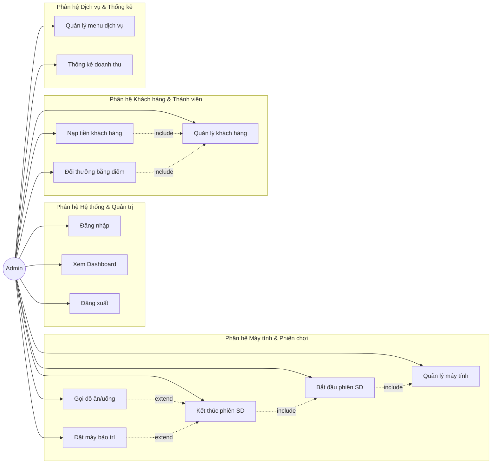

### 3.3.3. Biểu đồ Use Case chi tiết theo Phân hệ

#### Phân hệ Máy tính & Phiên sử dụng
Biểu đồ mô tả chi tiết các ca sử dụng liên quan đến quản lý trạng thái máy và vòng đời một phiên chơi của khách hàng tại phòng máy.

```mermaid
graph TB
    Admin((Admin))
    
    subgraph Phân hệ Máy tính & Phiên sử dụng
        UC03[UC03: Quản lý máy tính]
        UC04[UC04: Bắt đầu phiên sử dụng]
        UC05[UC05: Kết thúc phiên sử dụng]
        UC06[UC06: Gọi đồ ăn/uống]
        UC12[UC12: Đặt máy bảo trì]
    end
    
    Admin --> UC03
    Admin --> UC04
    Admin --> UC05
    Admin --> UC06
    Admin --> UC12
    
    UC04 -.->|include| UC03
    UC05 -.->|include| UC04
    UC06 -.->|extend| UC05
    UC12 -.->|extend| UC05
```

#### Phân hệ Khách hàng & Thành viên
Biểu đồ mô tả chi tiết các tương tác quản lý thông tin khách hàng, luồng tiền nạp và đổi điểm lấy dịch vụ miễn phí.

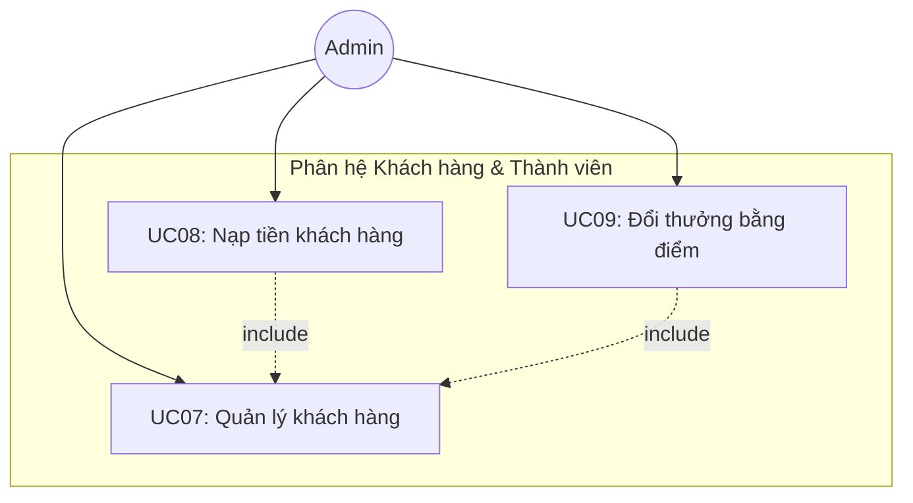

#### Phân hệ Quản trị & Hệ thống
Biểu đồ thể hiện các tác vụ của Admin liên quan tới bảo mật, cấu hình thực đơn dịch vụ và báo cáo tài chính của quán game.

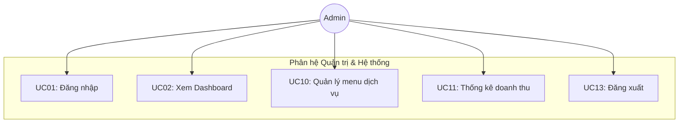

### 3.3.4. Đặc tả các Use Case chi tiết

#### UC01: Đăng nhập

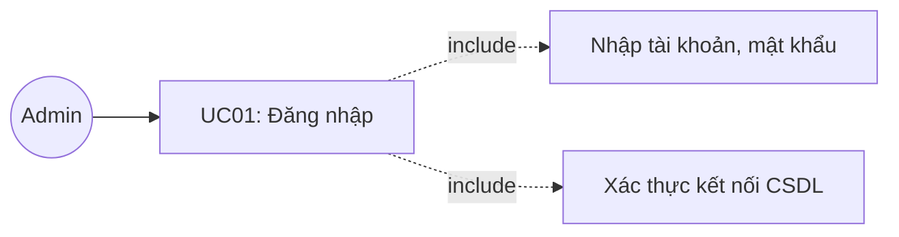

| Thuộc tính | Mô tả |
|-----------|-------|
| **Tên Use Case** | Đăng nhập |
| **Mô tả** | Quản trị viên đăng nhập vào hệ thống để bắt đầu phiên làm việc. |
| **Actor chính** | Admin |
| **Actor phụ** | Hệ thống CSDL H2 |
| **Tiền điều kiện** | Ứng dụng đã khởi động thành công và hiển thị giao diện đăng nhập. |
| **Hậu điều kiện** | Admin đăng nhập hệ thống thành công, hệ thống chuyển sang giao diện quản trị chính. |

**Luồng sự kiện chính:**

| Admin | Hệ thống |
|---|---|
| 1. Khởi động ứng dụng | |
| | 2. Hiển thị màn hình đăng nhập (GiaoDienDangNhap) |
| 3. Nhập tên đăng nhập và mật khẩu | |
| 4. Nhấn nút "ĐĂNG NHẬP" | |
| | 5. Kiểm tra thông tin tài khoản có khớp khớp với cấu hình hệ thống không |
| | 6. Gọi kết nối database để kiểm tra tính sẵn sàng của dữ liệu |
| | 7. Ẩn form đăng nhập và khởi chạy giao diện điều khiển chính (GiaoDienChinh) |

**Luồng sự kiện thay thế và ngoại lệ:**

| Admin | Hệ thống |
|---|---|
| | **Tại bước 5:** Nếu sai tài khoản hoặc mật khẩu → Hệ thống hiển thị hộp thoại cảnh báo: "Tên đăng nhập hoặc mật khẩu không chính xác!" |
| | **Tại bước 5.1:** Quay về bước 3 để nhập lại |
| | **Tại bước 6:** Nếu không kết nối được database nhúng H2 → Hệ thống hiển thị dialog thông báo lỗi kết nối CSDL và hướng dẫn khắc phục |

---

#### UC02: Xem Dashboard tổng quan

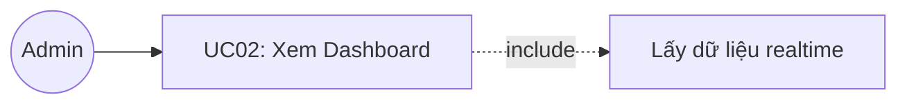

| Thuộc tính | Mô tả |
|-----------|-------|
| **Tên Use Case** | Xem Dashboard tổng quan |
| **Mô tả** | Admin theo dõi các chỉ số hoạt động thực tế theo thời gian thực (realtime) của quán. |
| **Actor chính** | Admin |
| **Actor phụ** | Không |
| **Tiền điều kiện** | Admin đăng nhập thành công vào hệ thống. |
| **Hậu điều kiện** | Hiển thị các số liệu thống kê doanh thu và máy tính chính xác tại thời điểm xem. |

**Luồng sự kiện chính:**

| Admin | Hệ thống |
|---|---|
| 1. Chọn menu "Dashboard" trên thanh sidebar điều hướng | |
| | 2. Thực hiện đếm số máy trống và số máy đang hoạt động từ bảng dữ liệu máy tính |
| | 3. Tính toán tổng doanh thu giờ chơi và doanh thu dịch vụ phát sinh trong ngày hôm nay |
| | 4. Lấy danh sách các phiên sử dụng máy tính đang chạy trong CSDL |
| | 5. Hiển thị 4 thẻ thông tin chỉ số: Máy Trống, Đang Sử Dụng, Doanh Thu Máy, Doanh Thu Dịch Vụ |
| | 6. Hiển thị bảng chi tiết các phiên đang chạy (Mã phiên, máy sử dụng, tên khách, thời gian bắt đầu, tiền tạm tính) |

---

#### UC03: Quản lý máy tính

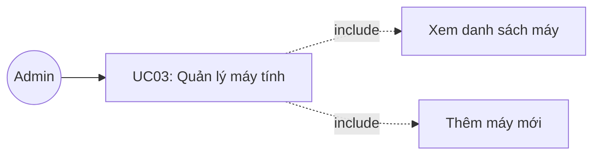

| Thuộc tính | Mô tả |
|-----------|-------|
| **Tên Use Case** | Quản lý máy tính |
| **Mô tả** | Xem danh sách máy tính dưới dạng sơ đồ lưới trực quan, lọc theo trạng thái và thêm máy tính mới. |
| **Actor chính** | Admin |
| **Actor phụ** | Không |
| **Tiền điều kiện** | Admin đăng nhập thành công và chọn phân hệ quản lý máy tính. |
| **Hậu điều kiện** | Dữ liệu máy tính được thêm hoặc lọc đúng theo yêu cầu. |

**Luồng sự kiện chính:**

| Admin | Hệ thống |
|---|---|
| 1. Chọn menu "Máy Tính" trên sidebar | |
| | 2. Lấy toàn bộ danh sách máy tính từ CSDL |
| | 3. Hiển thị lưới máy tính (card UI) với màu sắc hiển thị trạng thái (Xanh: Trống, Đỏ: Đang dùng, Vàng: Bảo trì) |
| 4. Nhấn nút "+ Thêm Máy" | |
| | 5. Hiển thị form thêm máy tính (Tên máy, Loại máy Thường/VIP, cấu hình) |
| 6. Nhập thông tin máy mới và nhấn "Lưu" | |
| | 7. Kiểm tra dữ liệu hợp lệ, thêm máy mới vào CSDL với trạng thái mặc định là "Trống" |
| | 8. Làm mới lưới hiển thị máy tính |

**Luồng sự kiện thay thế và ngoại lệ:**

| Admin | Hệ thống |
|---|---|
| **Tại bước 3a:** Chọn lọc trạng thái (Trống / Đang dùng / Bảo trì) | |
| | **Tại bước 3a.1:** Hệ thống truy vấn tương ứng và cập nhật lại lưới máy |
| | **Tại bước 7:** Nếu tên máy bị trùng hoặc để trống → Hệ thống cảnh báo: "Tên máy không được để trống hoặc trùng lặp!" và yêu cầu nhập lại |

---

#### UC04: Bắt đầu phiên sử dụng

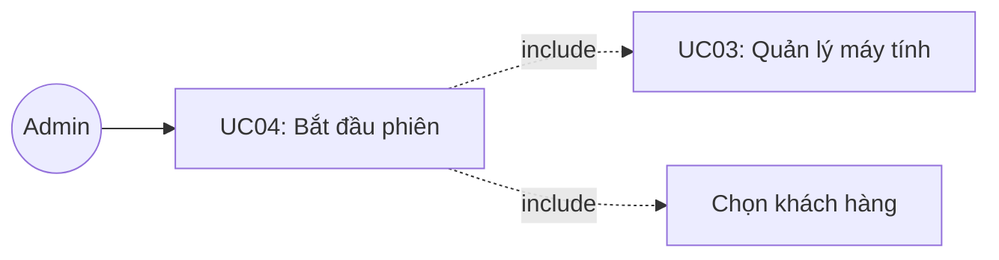

| Thuộc tính | Mô tả |
|-----------|-------|
| **Tên Use Case** | Bắt đầu phiên sử dụng |
| **Mô tả** | Kích hoạt phiên chơi máy tính cho một khách hàng (thành viên hoặc vãng lai). |
| **Actor chính** | Admin |
| **Actor phụ** | Không |
| **Tiền điều kiện** | Có máy tính ở trạng thái "Trống". |
| **Hậu điều kiện** | Phiên chơi được lưu vào CSDL, máy tính chuyển sang trạng thái "Đang dùng". |

**Luồng sự kiện chính:**

| Admin | Hệ thống |
|---|---|
| 1. Click vào một máy tính có trạng thái "Trống" trên lưới | |
| | 2. Hiển thị dialog "Bắt Đầu Phiên Sử Dụng" hiển thị tên máy, loại máy và đơn giá |
| 3. Chọn tài khoản Khách hàng thành viên từ dropdown | |
| 4. Nhấn nút "▶ Bắt Đầu" | |
| | 5. Khởi tạo một đối tượng phiên chơi mới (gioBatDau = thời gian hiện tại) |
| | 6. Thực hiện INSERT bản ghi phiên chơi vào bảng `phien_su_dung` trong CSDL |
| | 7. Cập nhật trạng thái máy tính trong bảng `may_tinh` sang "Đang dùng" |
| | 8. Đóng dialog, làm mới lưới máy tính và thông báo bắt đầu thành công |

**Luồng sự kiện thay thế và ngoại lệ:**

| Admin | Hệ thống |
|---|---|
| 3a. Không chọn khách hàng thành viên mà nhập tên Khách vãng lai | |
| | **Tại bước 3a.1:** Đặt tên khách vãng lai và không lưu liên kết mã khách hàng thành viên |

---

#### UC05: Kết thúc phiên sử dụng

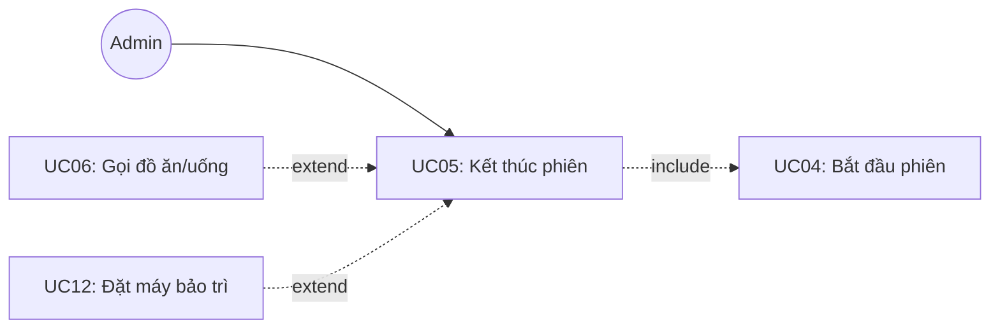

| Thuộc tính | Mô tả |
|-----------|-------|
| **Tên Use Case** | Kết thúc phiên sử dụng |
| **Mô tả** | Tính tiền giờ chơi, tiền dịch vụ, thanh toán hóa đơn và giải phóng máy về trạng thái trống hoặc bảo trì. |
| **Actor chính** | Admin |
| **Actor phụ** | Không |
| **Tiền điều kiện** | Máy tính được chọn đang ở trạng thái "Đang dùng" (có phiên chơi đang chạy). |
| **Hậu điều kiện** | Phiên chơi được cập nhật thời gian kết thúc và tổng tiền; số dư khách thành viên bị trừ; máy tính được giải phóng. |

**Luồng sự kiện chính:**

| Admin | Hệ thống |
|---|---|
| 1. Click vào máy tính đang ở trạng thái "Đang dùng" | |
| | 2. Truy vấn thông tin phiên chơi hiện tại của máy đó |
| | 3. Tính toán thời gian chơi thực tế (làm tròn đến 0.1 giờ) và tiền máy tương ứng |
| | 4. Tính toán tổng tiền các đơn đặt đồ ăn/nước uống đã gọi trong phiên |
| | 5. Hiển thị dialog thanh toán gồm: Tên khách, thời gian bắt đầu, tiền máy, tiền dịch vụ và tổng tiền thanh toán |
| 6. Nhấn nút "⏹ Kết Thúc" để hoàn tất | |
| | 7. Cập nhật thời gian kết thúc và tổng tiền vào bản ghi `phien_su_dung` |
| | 8. Nếu là Khách thành viên: Trừ tiền trực tiếp vào tài khoản, cộng tổng giờ chơi tích lũy và cộng điểm thưởng tương ứng (1 giờ chơi = 1 điểm) |
| | 9. Cập nhật trạng thái máy tính về "Trống" |
| | 10. Đóng dialog, làm mới lưới máy tính và hiển thị thông báo thanh toán thành công |

**Luồng sự kiện thay thế và ngoại lệ:**

| Admin | Hệ thống |
|---|---|
| 6a. Chọn nút "Bảo Trì" thay vì "Kết Thúc" | |
| | **Tại bước 6a.1:** Thực hiện thanh toán bình thường nhưng máy tính được đưa về trạng thái "Bảo trì" |
| | **Tại bước 8:** Nếu tài khoản Khách thành viên không đủ số dư để thanh toán → Hệ thống thông báo yêu cầu nạp thêm tiền hoặc chuyển sang thanh toán bằng tiền mặt trực tiếp |

---

#### UC06: Gọi đồ ăn/uống

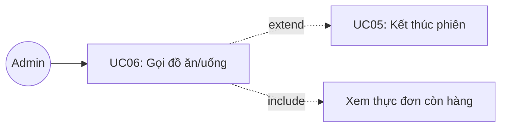

| Thuộc tính | Mô tả |
|-----------|-------|
| **Tên Use Case** | Gọi đồ ăn/uống |
| **Mô tả** | Đặt các món ăn hoặc thức uống cho máy tính đang hoạt động, hóa đơn dịch vụ được tính chung khi kết thúc phiên chơi. |
| **Actor chính** | Admin |
| **Actor phụ** | Không |
| **Tiền điều kiện** | Máy tính được gọi món phải đang ở trạng thái "Đang dùng". |
| **Hậu điều kiện** | Đơn hàng dịch vụ được tạo và liên kết trực tiếp với mã phiên đang chạy. |

**Luồng sự kiện chính:**

| Admin | Hệ thống |
|---|---|
| 1. Click vào máy tính "Đang dùng", trong dialog thông tin nhấn nút "🍔 Gọi Món" | |
| | 2. Lấy danh sách các món ăn, nước uống còn hàng trong thực đơn |
| | 3. Hiển thị bảng menu gọi món (cho phép nhập số lượng) |
| 4. Chọn các món ăn/thức uống và điều chỉnh số lượng tương ứng | |
| 5. Nhấn nút "✓ Xác Nhận Đơn" | |
| | 6. Khởi tạo đơn hàng `don_hang` và các bản ghi chi tiết đơn hàng `chi_tiet_don_hang` |
| | 7. Lưu đơn hàng vào CSDL và gán liên kết với mã phiên chơi hiện tại |
| | 8. Cập nhật lại tổng tiền dịch vụ tạm tính của phiên chơi |

**Luồng sự kiện thay thế và ngoại lệ:**

| Admin | Hệ thống |
|---|---|
| | **Tại bước 5:** Nếu Admin chưa chọn bất kỳ món nào hoặc nhập số lượng không hợp lệ (nhỏ hơn hoặc bằng 0) → Hệ thống hiển thị cảnh báo yêu cầu kiểm tra lại dữ liệu nhập |

---

#### UC07: Quản lý khách hàng

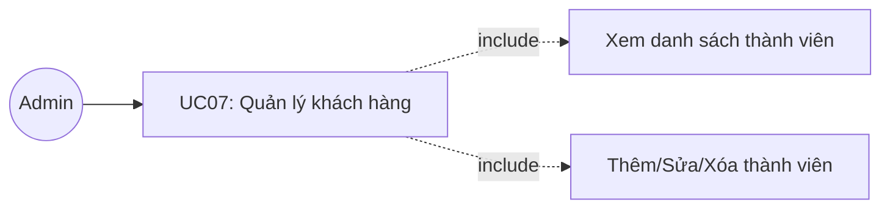

| Thuộc tính | Mô tả |
|-----------|-------|
| **Tên Use Case** | Quản lý khách hàng |
| **Mô tả** | Xem danh sách thành viên, thêm tài khoản mới, cập nhật thông tin hoặc xóa tài khoản khách hàng. |
| **Actor chính** | Admin |
| **Actor phụ** | Không |
| **Tiền điều kiện** | Admin đăng nhập thành công và chọn phân hệ Khách hàng. |
| **Hậu điều kiện** | Dữ liệu khách hàng trong database được cập nhật chính xác. |

**Luồng sự kiện chính:**

| Admin | Hệ thống |
|---|---|
| 1. Chọn menu "Khách Hàng" trên thanh điều hướng | |
| | 2. Lấy toàn bộ danh sách khách hàng từ CSDL và hiển thị lên bảng điều khiển |
| 3. Chọn thao tác thêm mới bằng cách nhấn "+ Thêm Khách" | |
| | 4. Hiển thị form nhập thông tin (Tên khách hàng, Số điện thoại, Số tiền nạp lần đầu) |
| 5. Nhập đầy đủ thông tin yêu cầu và nhấn "Tạo Khách Hàng" | |
| | 6. Kiểm tra tính hợp lệ của số điện thoại và số tiền nạp |
| | 7. Lưu thông tin thành viên mới vào bảng `khach_hang` |
| | 8. Cập nhật lại bảng hiển thị danh sách khách hàng |

**Luồng sự kiện thay thế và ngoại lệ:**

| Admin | Hệ thống |
|---|---|
| 3a. Chọn 1 khách hàng → Nhấn "Sửa" | |
| | **Tại bước 3a.1:** Hiển thị form chỉnh sửa Tên/SĐT và cập nhật database |
| 3b. Chọn 1 khách hàng → Nhấn "Xóa" | |
| | **Tại bước 3b.1:** Hiển thị xác nhận và xóa khách hàng khỏi database |
| 3c. Nhập từ khóa vào ô tìm kiếm → nhấn "Tìm" | |
| | **Tại bước 3c.1:** Lọc hiển thị kết quả tìm kiếm |
| | **Tại bước 6:** Nếu tên trống hoặc tiền nạp ≤ 0 → Thông báo lỗi và yêu cầu nhập lại |

---

#### UC08: Nạp tiền

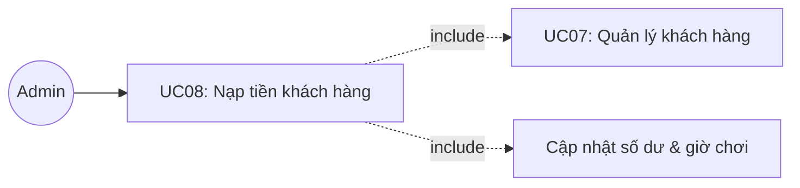

| Thuộc tính | Mô tả |
|-----------|-------|
| **Tên Use Case** | Nạp tiền khách hàng |
| **Mô tả** | Nạp thêm tiền vào tài khoản hội viên của khách hàng, hệ thống tự động quy đổi thành giờ chơi và điểm tích lũy. |
| **Actor chính** | Admin |
| **Actor phụ** | Không |
| **Tiền điều kiện** | Đã chọn một khách hàng thành viên trong danh sách. |
| **Hậu điều kiện** | Tài khoản khách hàng tăng số dư, tăng giờ chơi và điểm tích lũy trong database. |

**Luồng sự kiện chính:**

| Admin | Hệ thống |
|---|---|
| 1. Chọn khách hàng thành viên từ bảng và nhấn nút "💰 Nạp Tiền" | |
| | 2. Hiển thị dialog nạp tiền gồm thông tin khách hàng và ô nhập số tiền nạp |
| 3. Nhập số tiền cần nạp | |
| | 4. Quy đổi thời gian chơi tăng thêm (10.000đ = 1 giờ) và điểm thưởng tương ứng, hiển thị xem trước (preview) trên giao diện |
| 5. Nhấn nút xác nhận "Nạp Tiền" | |
| | 6. Cập nhật số dư tài khoản, tổng giờ chơi và điểm tích lũy của khách hàng trong database |
| | 7. Đóng dialog, làm mới danh sách khách hàng và hiển thị thông báo thành công |

**Luồng sự kiện thay thế và ngoại lệ:**

| Admin | Hệ thống |
|---|---|
| | **Tại bước 3:** Nếu nhập số tiền không phải là số hoặc số tiền nạp nhỏ hơn hoặc bằng 0 → Hệ thống thông báo lỗi: "Số tiền nạp không hợp lệ!" và không cho xác nhận |

---

#### UC09: Đổi thưởng

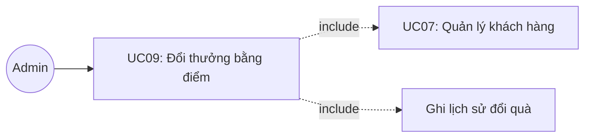

| Thuộc tính | Mô tả |
|-----------|-------|
| **Tên Use Case** | Đổi thưởng bằng điểm |
| **Mô tả** | Khách hàng thành viên sử dụng điểm tích lũy (⭐) để đổi lấy đồ ăn hoặc thức uống miễn phí trong thực đơn hỗ trợ đổi thưởng. |
| **Actor chính** | Admin |
| **Actor phụ** | Không |
| **Tiền điều kiện** | Khách hàng được chọn có điểm tích lũy lớn hơn 0 và đã chọn món quà đổi thưởng hợp lệ. |
| **Hậu điều kiện** | Điểm tích lũy của khách hàng bị trừ, hệ thống ghi nhận lịch sử đổi thưởng vào database. |

**Luồng sự kiện chính:**

| Admin | Hệ thống |
|---|---|
| 1. Chọn khách hàng thành viên và nhấn nút "🎁 Đổi Thưởng" | |
| | 2. Hiển thị dialog đổi thưởng có số điểm hiện tại của khách và danh sách thực đơn hỗ trợ đổi thưởng (các món có cấu hình điểm đổi > 0) |
| 3. Chọn các món ăn/nước uống muốn đổi và điều chỉnh số lượng | |
| | 4. Tự động tính tổng điểm cần dùng và hiển thị điểm còn lại sau khi đổi |
| 5. Nhấn nút "Đổi Thưởng" | |
| | 6. Kiểm tra xem điểm tích lũy hiện có của khách hàng có đủ để thực hiện giao dịch hay không |
| | 7. Lưu các bản ghi lịch sử đổi thưởng vào bảng `lich_su_doi_thuong` |
| | 8. Thực hiện trừ điểm tích lũy tương ứng trong bảng `khach_hang` |
| | 9. Làm mới thông tin giao diện khách hàng và thông báo đổi thưởng thành công |

**Luồng sự kiện thay thế và ngoại lệ:**

| Admin | Hệ thống |
|---|---|
| | **Tại bước 6:** Nếu tổng số điểm cần đổi lớn hơn số điểm tích lũy hiện có của khách hàng → Hệ thống hiển thị thông báo lỗi: "Không đủ điểm để thực hiện đổi thưởng!" và từ chối giao dịch |

---

#### UC10: Quản lý menu dịch vụ

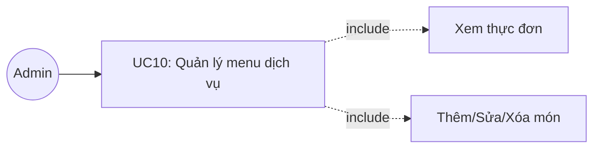

| Thuộc tính | Mô tả |
|-----------|-------|
| **Tên Use Case** | Quản lý menu dịch vụ |
| **Mô tả** | Admin quản lý danh sách các món ăn, nước uống phục vụ tại quán (CRUD thực đơn). |
| **Actor chính** | Admin |
| **Actor phụ** | Không |
| **Tiền điều kiện** | Admin đăng nhập thành công và lựa chọn phân hệ Dịch vụ. |
| **Hậu điều kiện** | Danh sách thực đơn trong database được cập nhật (thêm/sửa/xóa món ăn). |

**Luồng sự kiện chính:**

| Admin | Hệ thống |
|---|---|
| 1. Chọn menu "Dịch Vụ" trên sidebar điều hướng | |
| | 2. Truy vấn danh sách các dịch vụ ăn uống từ bảng `do_an_uong` |
| | 3. Hiển thị bảng menu (Tên món, Phân loại, Đơn giá, Điểm đổi thưởng, Tình trạng còn hàng) |
| 4. Thực hiện các thao tác Thêm món / Sửa món / Xóa món | |
| | 5. Hiển thị form nhập liệu tương ứng với thao tác được chọn |
| 6. Điền thông tin món ăn và nhấn "Lưu" | |
| | 7. Kiểm tra dữ liệu hợp lệ (tên không trống, giá bán > 0) và lưu vào database |
| | 8. Làm mới bảng hiển thị thực đơn dịch vụ |

---

#### UC11: Thống kê doanh thu

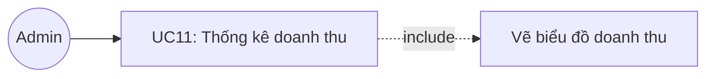

| Thuộc tính | Mô tả |
|-----------|-------|
| **Tên Use Case** | Thống kê doanh thu |
| **Mô tả** | Xem báo cáo tài chính tổng hợp về doanh thu giờ chơi và doanh thu dịch vụ theo khoảng thời gian tùy chọn dưới dạng biểu đồ và bảng số liệu. |
| **Actor chính** | Admin |
| **Actor phụ** | Không |
| **Tiền điều kiện** | Admin đăng nhập thành công và lựa chọn phân hệ Thống kê. |
| **Hậu điều kiện** | Hiển thị biểu đồ doanh thu và bảng tổng hợp số liệu chính xác theo khoảng ngày được chọn. |

**Luồng sự kiện chính:**

| Admin | Hệ thống |
|---|---|
| 1. Chọn menu "Thống Kê" trên thanh điều hướng | |
| | 2. Hiển thị giao diện bộ lọc thống kê (Từ ngày, Đến ngày) và các nút chọn nhanh (7 ngày qua, 30 ngày qua, Hôm nay) |
| 3. Chọn khoảng thời gian thống kê và nhấn nút "🔍 Xem thống kê" | |
| | 4. Thực hiện truy vấn tổng tiền máy và tiền dịch vụ từ các phiên chơi đã kết thúc trong khoảng thời gian đã chọn |
| | 5. Tổng hợp dữ liệu doanh thu theo từng ngày |
| | 6. Vẽ biểu đồ cột trực quan hiển thị doanh thu tăng trưởng theo thời gian sử dụng Graphics2D |
| | 7. Hiển thị bảng tổng hợp chi tiết (Ngày, tổng số phiên hoạt động, doanh thu) và các thẻ chỉ số (Tổng doanh thu, Tổng số phiên, Doanh thu trung bình/ngày) |

**Luồng sự kiện thay thế và ngoại lệ:**

| Admin | Hệ thống |
|---|---|
| | **Tại bước 3:** Nếu ngày bắt đầu được chọn lớn hơn ngày kết thúc → Hệ thống thông báo lỗi: "Khoảng ngày thống kê không hợp lệ!" và yêu cầu chọn lại |

---

#### UC12: Đặt máy bảo trì

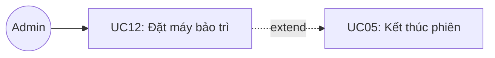

| Thuộc tính | Mô tả |
|-----------|-------|
| **Tên Use Case** | Đặt máy bảo trì |
| **Mô tả** | Đưa một máy tính vào trạng thái bảo trì hoặc khóa máy do sự cố phần cứng/phần mềm. |
| **Actor chính** | Admin |
| **Actor phụ** | Không |
| **Tiền điều kiện** | Máy tính được chọn đang ở trạng thái "Trống" hoặc đang thanh toán phiên chơi. |
| **Hậu điều kiện** | Trạng thái máy tính được cập nhật thành "Bảo trì" trong database, không cho phép mở phiên chơi mới trên máy này. |

**Luồng sự kiện chính:**

| Admin | Hệ thống |
|---|---|
| 1. Click vào máy tính đang hoạt động hoặc trống trên lưới | |
| | 2. Trong dialog thông tin máy, nhấn nút "Bảo Trì" |
| 3. Xác nhận chuyển trạng thái máy tính sang bảo trì | |
| | 4. Cập nhật trạng thái máy tính thành "Bảo trì" trong CSDL |
| | 5. Đóng dialog, làm mới lưới máy tính (card máy chuyển sang viền màu Vàng và có nhãn trạng thái "Bảo trì") |

---

#### UC13: Đăng xuất

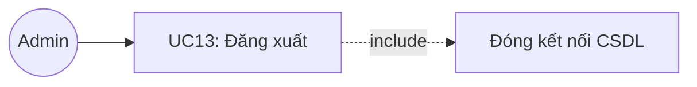

| Thuộc tính | Mô tả |
|-----------|-------|
| **Tên Use Case** | Đăng xuất |
| **Mô tả** | Thoát khỏi phiên làm việc hiện tại và đóng ứng dụng an toàn. |
| **Actor chính** | Admin |
| **Actor phụ** | Không |
| **Tiền điều kiện** | Ứng dụng đang hoạt động ở màn hình điều khiển chính. |
| **Hậu điều kiện** | Ứng dụng được giải phóng bộ nhớ và đóng hoàn toàn. |

**Luồng sự kiện chính:**

| Admin | Hệ thống |
|---|---|
| 1. Click vào nút "Đăng Xuất" ở góc cuối thanh sidebar | |
| | 2. Hiển thị hộp thoại hỏi xác nhận: "Bạn có chắc chắn muốn đăng xuất và đóng ứng dụng?" |
| 3. Chọn "Yes" | |
| | 4. Thực hiện đóng kết nối CSDL hiện tại để đảm bảo an toàn dữ liệu |
| | 5. Giải phóng tài nguyên giao diện (dispose) và thoát chương trình (System.exit) |

**Luồng sự kiện thay thế và ngoại lệ:**

| Admin | Hệ thống |
|---|---|
| | **Tại bước 3:** Nếu chọn "No" → Hệ thống đóng dialog xác nhận và giữ nguyên trạng thái giao diện chính để tiếp tục làm việc |

---

## 3.4. Phân tích hành vi và cấu trúc hệ thống

### 3.4.1. Biểu đồ hoạt động (Activity Diagram)

#### 1. Luồng Bắt đầu phiên chơi (UC04)

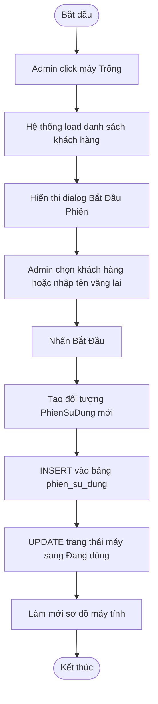

#### 2. Luồng Gọi đồ ăn/uống (UC06)

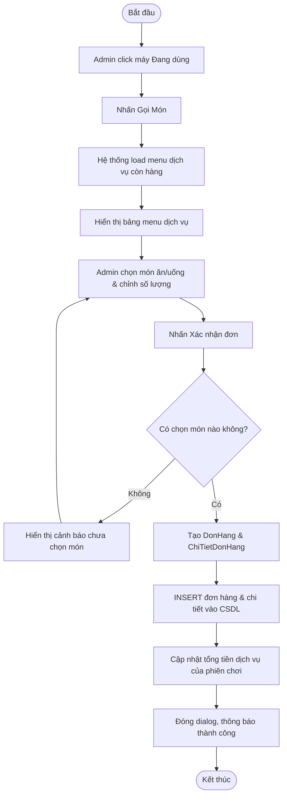

#### 3. Luồng Kết thúc phiên chơi & Thanh toán (UC05)

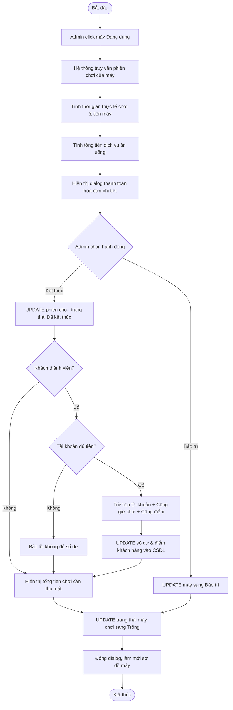

#### 4. Luồng Đổi thưởng bằng điểm (UC09)

```mermaid
flowchart TD
    Start([Bắt đầu]) --> SelectKH[Admin chọn khách hàng]
    SelectKH --> ClickReward[Nhấn Đổi Thưởng]
    ClickReward --> LoadRewards[Hệ thống tải danh sách món hỗ trợ đổi quà]
    LoadRewards --> ShowDlg[Hiển thị dialog đổi quà & điểm hiện có của khách]
    ShowDlg --> SelectGifts[Admin chọn quà & số lượng]
    SelectGifts --> CalcPoints[Tính tổng điểm cần dùng]
    CalcPoints --> ClickConfirm[Nhấn Đổi Thưởng]
    ClickConfirm --> CheckPoints{Điểm hiện có >= Điểm cần đổi?}
    CheckPoints -->|Không| AlertError[Hiển thị thông báo không đủ điểm]
    AlertError --> SelectGifts
    CheckPoints -->|Có| DbHistory[INSERT lịch sử đổi quà vào CSDL]
    DbHistory --> DbUpdateKH[UPDATE trừ điểm tích lũy của khách hàng]
    DbUpdateKH --> RefreshList[Làm mới danh sách khách hàng]
    RefreshList --> Stop([Kết thúc])
```

---

### 3.4.2. Biểu đồ tuần tự (Sequence Diagram)

#### 1. Đăng nhập (UC01)

```mermaid
sequenceDiagram
    actor Admin
    participant G as GiaoDienDangNhap
    participant C as DieuKhienDangNhap
    participant K as KetNoiCSDL
    participant H2 as H2 Database
    participant M as GiaoDienChinh

    Admin->>G: Nhập username, password
    Admin->>G: Nhấn nút "ĐĂNG NHẬP"
    G->>C: actionPerformed(ActionEvent)
    C->>C: Kiểm tra logic (username == "admin" && password == "admin")
    alt Sai thông tin đăng nhập
        C-->>G: hienThongBao("Sai tài khoản hoặc mật khẩu!")
        G-->>Admin: Hiển thị cảnh báo lỗi
    else Thông tin đăng nhập đúng
        C->>K: kiemTraKetNoi()
        K->>H2: Mở kết nối kiểm tra
        H2-->>K: Kết nối OK
        K-->>C: true
        C->>G: setVisible(false)
        C->>G: dispose()
        C->>M: new GiaoDienChinh()
        M->>H2: Lấy dữ liệu Dashboard
        H2-->>M: Trả về số liệu
        M-->>Admin: Hiển thị giao diện chính (Dashboard panel)
    end
```

#### 2. Bắt đầu phiên chơi (UC04)

```mermaid
sequenceDiagram
    actor Admin
    participant P as PanelMayTinh
    participant KH as KhachHangDAO
    participant PS as PhienSuDungDAO
    participant MT as MayTinhDAO
    participant H2 as H2 Database

    Admin->>P: Click vào card máy "Trống"
    P->>KH: layTatCa()
    KH->>H2: SELECT * FROM khach_hang
    H2-->>KH: ResultSet danh sách khách hàng
    KH-->>P: List<KhachHang>
    P-->>Admin: Hiển thị dialog "Bắt đầu phiên"
    Admin->>P: Chọn khách hàng (hoặc Khách vãng lai) & nhấn "Bắt Đầu"
    P->>PS: batDauPhien(PhienSuDung)
    PS->>H2: INSERT INTO phien_su_dung (ma_may, ten_khach, gio_bat_dau, ...)
    H2-->>PS: Thực thi thành công
    PS-->>P: true
    P->>MT: capNhatTrangThai(maMay, "Đang dùng")
    MT->>H2: UPDATE may_tinh SET trang_thai = 'Đang dùng' WHERE ma = maMay
    H2-->>MT: Thực thi thành công
    MT-->>P: true
    P->>P: lamMoiMayTinh() (Load lại lưới máy)
    P-->>Admin: Hiển thị máy chơi chuyển sang màu Đỏ
```

#### 3. Gọi đồ ăn/uống (UC06)

```mermaid
sequenceDiagram
    actor Admin
    participant D as DialogGiaoMon
    participant DA as DoAnUongDAO
    participant DH as DonHangDAO
    participant H2 as H2 Database

    Admin->>D: Click nút "Gọi Món" trên dialog phiên
    D->>DA: layConHang()
    DA->>H2: SELECT * FROM do_an_uong WHERE con_hang = true
    H2-->>DA: ResultSet thực đơn ăn uống
    DA-->>D: List<DoAnUong>
    D-->>Admin: Hiển thị bảng danh mục đồ ăn uống
    Admin->>D: Tick chọn các món, nhập số lượng & nhấn "Xác Nhận Đơn"
    D->>DH: taoDonHang(DonHang)
    DH->>H2: INSERT INTO don_hang (ma_phien, ma_may, tong_gia, ...)
    H2-->>DH: Lấy ma_don_hang tự sinh
    loop Với mỗi món được chọn
        DH->>H2: INSERT INTO chi_tiet_don_hang (ma_don_hang, ma_do_an, so_luong, ...)
    end
    H2-->>DH: Lưu thành công chi tiết
    DH-->>D: true
    D-->>Admin: Hiển thị thông báo "Gọi món thành công!"
```

#### 4. Kết thúc phiên & Thanh toán (UC05)

```mermaid
sequenceDiagram
    actor Admin
    participant D as DialogThanhToan
    participant PS as PhienSuDungDAO
    participant DH as DonHangDAO
    participant KH as KhachHangDAO
    participant MT as MayTinhDAO
    participant H2 as H2 Database

    Admin->>D: Click card máy "Đang dùng"
    D->>PS: layPhienDangChayTheoMay(maMay)
    PS->>H2: SELECT * FROM phien_su_dung WHERE ma_may = maMay AND trang_thai = 'Đang chạy'
    H2-->>PS: ResultSet phiên sử dụng
    PS-->>D: PhienSuDung
    D->>DH: layTongTienDonHang(maPhien)
    DH->>H2: SELECT SUM(tong_gia) FROM don_hang WHERE ma_phien = maPhien
    H2-->>DH: Tổng tiền dịch vụ (tienDV)
    DH-->>D: tienDV
    D->>D: Tính tiền máy = soGio * giaMoiGio. Tính tổng cộng = tienMay + tienDV
    D-->>Admin: Hiển thị chi tiết hóa đơn thanh toán
    Admin->>D: Nhấn nút "⏹ Kết Thúc"
    D->>PS: ketThucPhien(maPhien, tongTien)
    PS->>H2: UPDATE phien_su_dung SET gio_ket_thuc = now(), tong_tien = tongTien, trang_thai = 'Đã kết thúc'
    H2-->>PS: Thành công
    alt Khách hàng là thành viên
        D->>KH: truTienVaCongGioDiem(maKH, tongTien, soGio, diemDuocCong)
        KH->>H2: UPDATE khach_hang SET so_du = so_du - tongTien, tong_gio = tong_gio + soGio, diem = diem + diemDuocCong WHERE ma = maKH
        H2-->>KH: Thành công
    end
    D->>MT: capNhatTrangThai(maMay, "Trống")
    MT->>H2: UPDATE may_tinh SET trang_thai = 'Trống' WHERE ma = maMay
    H2-->>MT: Thành công
    D->>D: lamMoiSodoMay()
    D-->>Admin: Thông báo thanh toán thành công, máy chuyển sang màu Xanh
```

#### 5. Nạp tiền khách hàng (UC08)

```mermaid
sequenceDiagram
    actor Admin
    participant D as DialogNapTien
    participant KH as KhachHangDAO
    participant H2 as H2 Database

    Admin->>D: Chọn khách hàng & nhấn "Nạp Tiền"
    D-->>Admin: Hiển thị form nạp tiền
    Admin->>D: Nhập số tiền nạp & nhấn "Xác nhận nạp"
    D->>KH: napTienVaCongGioDiem(maKH, soTien)
    KH->>H2: UPDATE khach_hang SET so_du = so_du + soTien, tong_gio = tong_gio + (soTien/10000), diem = diem + (soTien/10000) WHERE ma = maKH
    H2-->>KH: Thành công
    KH-->>D: true
    D-->>Admin: Thông báo "Nạp tiền thành công! Cộng thêm X giờ chơi và X điểm!"
```

#### 6. Đổi thưởng bằng điểm (UC09)

```mermaid
sequenceDiagram
    actor Admin
    participant D as DialogDoiThuong
    participant KH as KhachHangDAO
    participant LS as LichSuDoiThuongDAO
    participant H2 as H2 Database

    Admin->>D: Chọn khách hàng & nhấn "Đổi Thưởng"
    D-->>Admin: Hiển thị dialog điểm hiện có & danh mục quà tặng
    Admin->>D: Chọn các phần quà và nhấn "Đổi Thưởng"
    D->>D: Kiểm tra điểm tích lũy của khách hàng
    alt Điểm tích lũy không đủ
        D-->>Admin: hienThongBao("Không đủ điểm tích lũy!")
    else Điểm tích lũy hợp lệ
        loop Với mỗi món quà được chọn
            D->>LS: ghiLichSu(maKH, maDoAn, soLuong, diemDoi)
            LS->>H2: INSERT INTO lich_su_doi_thuong (ma_khach_hang, ma_do_an, so_luong, diem_doi, ngay_doi)
            H2-->>LS: Thành công
        end
        D->>KH: truDiem(maKH, tongDiemDaDoi)
        KH->>H2: UPDATE khach_hang SET diem = diem - tongDiemDaDoi WHERE ma = maKH
        H2-->>KH: Thành công
        KH-->>D: true
        D-->>Admin: Thông báo "Đổi quà thành công! Đã trừ X điểm!"
    end
```

---

### 3.4.3. Biểu đồ lớp phân tích (Class Diagram)

```mermaid
classDiagram
    class NguoiDung {
        -int ma
        -String tenDangNhap
        -String matKhau
        -String vaiTro
        +getMa() int
        +getTenDangNhap() String
        +getMatKhau() String
        +getVaiTro() String
    }

    class MayTinh {
        -int ma
        -String ten
        -String loai
        -double giaMoiGio
        -String trangThai
        -String cauHinh
        +laTrong() boolean
        +dangDung() boolean
        +dangBaoTri() boolean
        +laVIP() boolean
    }

    class KhachHang {
        -int ma
        -String ten
        -String sdt
        -double soDu
        -double tongGio
        -int diem
        -Date ngayTao
    }

    class PhienSuDung {
        -int ma
        -int maMayTinh
        -Integer maKhachHang
        -String tenKhach
        -Date gioBatDau
        -Date gioKetThuc
        -double tongTien
        -String trangThai
        +dangChay() boolean
        +tinhSoGio() double
        +tinhTien(giaMoiGio) double
    }

    class DoAnUong {
        -int ma
        -String ten
        -double gia
        -String phanLoai
        -int diemDoi
        -boolean conHang
    }

    class DonHang {
        -int ma
        -Integer maPhien
        -int maMayTinh
        -double tongGia
        -Date thoiGianDat
        -List~ChiTietDonHang~ danhSachMon
        +themMon(ChiTietDonHang) void
        +tinhLaiTong() void
    }

    class ChiTietDonHang {
        -int ma
        -int maDonHang
        -int maDoAn
        -String tenDoAn
        -int soLuong
        -double gia
        +tinhThanhTien() double
    }

    class LichSuDoiThuong {
        -int ma
        -int maKhachHang
        -int maDoAn
        -String tenDoAn
        -int soLuong
        -int diemDoi
        -Date ngayDoi
    }

    MayTinh "1" --> "*" PhienSuDung : ghi nhận
    KhachHang "1" --> "*" PhienSuDung : sử dụng
    PhienSuDung "1" --> "*" DonHang : gọi món
    DonHang "1" --> "*" ChiTietDonHang : chi tiết
    DoAnUong "1" --> "*" ChiTietDonHang : thuộc về
    KhachHang "1" --> "*" LichSuDoiThuong : thực hiện
    DoAnUong "1" --> "*" LichSuDoiThuong : quy đổi
```

---

## 3.5. Kết luận chương
Chương 3 đã tiến hành khảo sát chi tiết hiện trạng quy trình nghiệp vụ thủ công của quán internet, phân tích và đưa ra giải pháp số hóa toàn diện thông qua hệ thống **CyberNet**. 
Thông qua mô hình ca sử dụng (Use Case Model), 13 chức năng và mối tương tác của Admin đã được phân rã rõ ràng qua các biểu đồ phân hệ và bảng đặc tả chi tiết.
Đồng thời, hành vi động của hệ thống được làm rõ qua các biểu đồ hoạt động (Activity Diagrams) và biểu đồ tuần tự (Sequence Diagrams) cho 6 nghiệp vụ cốt lõi, cùng biểu đồ cấu trúc tĩnh Class Diagram. Đây là cơ sở dữ liệu phân tích vững chắc phục vụ cho việc thiết kế kiến trúc phần mềm, cơ sở dữ liệu và xây dựng giao diện chi tiết ở Chương tiếp theo.


# CHƯƠNG 4. THIẾT KẾ HỆ THỐNG

> 📌 **Người thực hiện:**
> - **Thành viên 4:** Phần 4.1 – 4.3
> - **Thành viên 1:** Phần 4.4 – 4.6

## 4.1. Kiến trúc tổng thể

> 📌 **Người thực hiện: Thành viên 4**

### Mô hình kiến trúc MVC + DAO

Hệ thống CyberNet áp dụng kiến trúc **MVC kết hợp DAO Pattern**, tổ chức theo 4 package chính:

```
com.mycompany.quanlyquaninternet/
├── QuanLyQuanInternet.java          ← Main class (Entry Point)
├── entity/                          ← MODEL (7 entity class)
│   ├── NguoiDung.java
│   ├── MayTinh.java
│   ├── KhachHang.java
│   ├── PhienSuDung.java
│   ├── DoAnUong.java
│   ├── DonHang.java
│   └── ChiTietDonHang.java
├── dao/                             ← DATA ACCESS (7 DAO class)
│   ├── KetNoiCSDL.java              ← Singleton DB Connection
│   ├── MayTinhDAO.java
│   ├── KhachHangDAO.java
│   ├── PhienSuDungDAO.java
│   ├── DoAnUongDAO.java
│   ├── DonHangDAO.java
│   └── LichSuDoiThuongDAO.java
├── controller/                      ← CONTROLLER
│   └── DieuKhienDangNhap.java
└── view/                            ← VIEW (8 class giao diện)
    ├── GiaoDienDangNhap.java
    ├── GiaoDienChinh.java
    ├── PanelTongQuan.java
    ├── PanelMayTinh.java
    ├── PanelKhachHang.java
    ├── PanelPhienSuDung.java
    ├── PanelDoAnUong.java
    └── PanelThongKe.java
```

### Sơ đồ kiến trúc hệ thống

```mermaid
flowchart TB
    subgraph VIEW["VIEW Layer (Java Swing + FlatLaf Dark)"]
        GDN[GiaoDienDangNhap]
        GDC[GiaoDienChinh]
        PT[PanelTongQuan]
        PMT[PanelMayTinh]
        PKH[PanelKhachHang]
        PPS[PanelPhienSuDung]
        PDA[PanelDoAnUong]
        PTK[PanelThongKe]
    end

    subgraph CONTROLLER["CONTROLLER Layer"]
        DK[DieuKhienDangNhap]
    end

    subgraph DAO["DAO Layer (Data Access Object)"]
        KN[KetNoiCSDL - Singleton]
        MTDAO[MayTinhDAO]
        KHDAO[KhachHangDAO]
        PSDAO[PhienSuDungDAO]
        DADAO[DoAnUongDAO]
        DHDAO[DonHangDAO]
        LSDAO[LichSuDoiThuongDAO]
    end

    subgraph DB["DATABASE (H2 Embedded)"]
        H2[(H2 Database\nquanlyquaninternet.mv.db)]
    end

    GDN --> DK
    DK --> GDC
    GDC --> PT & PMT & PKH & PPS & PDA & PTK
    PMT --> MTDAO & PSDAO & KHDAO & DADAO & DHDAO
    PKH --> KHDAO & DADAO & LSDAO
    PT --> MTDAO & PSDAO & DHDAO
    PTK --> PSDAO
    MTDAO & KHDAO & PSDAO & DADAO & DHDAO & LSDAO --> KN
    KN --> H2
```

## 4.2. Thiết kế cơ sở dữ liệu

> 📌 **Người thực hiện: Thành viên 4**

### ERD (Entity Relationship Diagram)

```mermaid
erDiagram
    NGUOI_DUNG {
        int ma PK
        varchar ten_dang_nhap UK
        varchar mat_khau
        varchar vai_tro
    }

    KHACH_HANG {
        int ma PK
        varchar ten
        varchar sdt
        double so_du
        double tong_gio
        int diem
        datetime ngay_tao
    }

    MAY_TINH {
        int ma PK
        varchar ten
        varchar loai
        double gia_moi_gio
        varchar trang_thai
        varchar cau_hinh
    }

    PHIEN_SU_DUNG {
        int ma PK
        int ma_may_tinh FK
        int ma_khach_hang FK
        varchar ten_khach
        datetime gio_bat_dau
        datetime gio_ket_thuc
        double tong_tien
        varchar trang_thai
    }

    DO_AN_UONG {
        int ma PK
        varchar ten
        double gia
        varchar phan_loai
        int diem_doi
        boolean con_hang
    }

    DON_HANG {
        int ma PK
        int ma_phien FK
        int ma_may_tinh FK
        double tong_gia
        datetime thoi_gian_dat
    }

    CHI_TIET_DON_HANG {
        int ma PK
        int ma_don_hang FK
        int ma_do_an FK
        varchar ten_do_an
        int so_luong
        double gia
    }

    LICH_SU_DOI_THUONG {
        int ma PK
        int ma_khach_hang FK
        int ma_do_an FK
        varchar ten_do_an
        int diem_da_dung
        datetime ngay_doi
    }

    MAY_TINH ||--o{ PHIEN_SU_DUNG : "có nhiều phiên"
    KHACH_HANG ||--o{ PHIEN_SU_DUNG : "sử dụng"
    PHIEN_SU_DUNG ||--o{ DON_HANG : "có đơn hàng"
    MAY_TINH ||--o{ DON_HANG : "gọi món tại máy"
    DON_HANG ||--|{ CHI_TIET_DON_HANG : "chứa"
    DO_AN_UONG ||--o{ CHI_TIET_DON_HANG : "được gọi"
    KHACH_HANG ||--o{ LICH_SU_DOI_THUONG : "đổi thưởng"
    DO_AN_UONG ||--o{ LICH_SU_DOI_THUONG : "phần thưởng"
```

### Các bảng dữ liệu chính

#### Bảng: nguoi_dung (Tài khoản đăng nhập)

| STT | Tên cột | Kiểu dữ liệu | Ràng buộc | Mô tả |
|-----|---------|---------------|-----------|-------|
| 1 | ma | INT | PK, AUTO_INCREMENT | Mã người dùng |
| 2 | ten_dang_nhap | VARCHAR(50) | UNIQUE, NOT NULL | Tên đăng nhập |
| 3 | mat_khau | VARCHAR(100) | NOT NULL | Mật khẩu |
| 4 | vai_tro | VARCHAR(20) | DEFAULT 'staff' | Vai trò (admin/staff) |

#### Bảng: may_tinh (Máy tính)

| STT | Tên cột | Kiểu dữ liệu | Ràng buộc | Mô tả |
|-----|---------|---------------|-----------|-------|
| 1 | ma | INT | PK, AUTO_INCREMENT | Mã máy |
| 2 | ten | VARCHAR(50) | NOT NULL | Tên máy (Máy 01 – Máy 20) |
| 3 | loai | VARCHAR(20) | DEFAULT 'Thường' | Loại: Thường / VIP |
| 4 | gia_moi_gio | DOUBLE | DEFAULT 10000 | Giá thuê mỗi giờ (VNĐ) |
| 5 | trang_thai | VARCHAR(20) | DEFAULT 'Trống' | Trống / Đang dùng / Bảo trì |
| 6 | cau_hinh | VARCHAR(200) | - | Cấu hình phần cứng |

#### Bảng: khach_hang (Khách hàng)

| STT | Tên cột | Kiểu dữ liệu | Ràng buộc | Mô tả |
|-----|---------|---------------|-----------|-------|
| 1 | ma | INT | PK, AUTO_INCREMENT | Mã khách |
| 2 | ten | VARCHAR(100) | NOT NULL | Tên khách hàng |
| 3 | sdt | VARCHAR(20) | - | Số điện thoại |
| 4 | so_du | DOUBLE | DEFAULT 0 | Số dư tài khoản (VNĐ) |
| 5 | tong_gio | DOUBLE | DEFAULT 0 | Tổng giờ đã chơi |
| 6 | diem | INT | DEFAULT 0 | Điểm tích lũy |
| 7 | ngay_tao | DATETIME | DEFAULT NOW() | Ngày tạo tài khoản |

#### Bảng: phien_su_dung (Phiên sử dụng máy)

| STT | Tên cột | Kiểu dữ liệu | Ràng buộc | Mô tả |
|-----|---------|---------------|-----------|-------|
| 1 | ma | INT | PK, AUTO_INCREMENT | Mã phiên |
| 2 | ma_may_tinh | INT | FK → may_tinh(ma), NOT NULL | Máy tính sử dụng |
| 3 | ma_khach_hang | INT | FK → khach_hang(ma), NULL | Mã khách (null = vãng lai) |
| 4 | ten_khach | VARCHAR(100) | - | Tên khách hiển thị |
| 5 | gio_bat_dau | DATETIME | NOT NULL | Thời gian bắt đầu |
| 6 | gio_ket_thuc | DATETIME | NULL | Thời gian kết thúc |
| 7 | tong_tien | DOUBLE | DEFAULT 0 | Tổng tiền phiên |
| 8 | trang_thai | VARCHAR(20) | DEFAULT 'Đang chạy' | Đang chạy / Kết thúc |

#### Bảng: do_an_uong (Menu đồ ăn/uống)

| STT | Tên cột | Kiểu dữ liệu | Ràng buộc | Mô tả |
|-----|---------|---------------|-----------|-------|
| 1 | ma | INT | PK, AUTO_INCREMENT | Mã món |
| 2 | ten | VARCHAR(100) | NOT NULL | Tên món |
| 3 | gia | DOUBLE | NOT NULL | Giá bán (VNĐ) |
| 4 | phan_loai | VARCHAR(50) | DEFAULT 'Nước uống' | Đồ ăn / Nước uống |
| 5 | diem_doi | INT | DEFAULT 0 | Số điểm để đổi thưởng |
| 6 | con_hang | BOOLEAN | DEFAULT TRUE | Còn hàng hay hết |

#### Bảng: don_hang (Đơn gọi món)

| STT | Tên cột | Kiểu dữ liệu | Ràng buộc | Mô tả |
|-----|---------|---------------|-----------|-------|
| 1 | ma | INT | PK, AUTO_INCREMENT | Mã đơn |
| 2 | ma_phien | INT | FK → phien_su_dung(ma) | Phiên liên kết |
| 3 | ma_may_tinh | INT | FK → may_tinh(ma), NOT NULL | Máy đặt món |
| 4 | tong_gia | DOUBLE | DEFAULT 0 | Tổng giá đơn hàng |
| 5 | thoi_gian_dat | DATETIME | DEFAULT NOW() | Thời gian đặt |

#### Bảng: chi_tiet_don_hang (Chi tiết đơn hàng)

| STT | Tên cột | Kiểu dữ liệu | Ràng buộc | Mô tả |
|-----|---------|---------------|-----------|-------|
| 1 | ma | INT | PK, AUTO_INCREMENT | Mã chi tiết |
| 2 | ma_don_hang | INT | FK → don_hang(ma), ON DELETE CASCADE | Đơn hàng |
| 3 | ma_do_an | INT | FK → do_an_uong(ma) | Món ăn/uống |
| 4 | ten_do_an | VARCHAR(100) | - | Tên món (lưu thừa) |
| 5 | so_luong | INT | DEFAULT 1 | Số lượng |
| 6 | gia | DOUBLE | NOT NULL | Đơn giá tại thời điểm đặt |

## 4.3. Thiết kế cấu trúc phần mềm

> 📌 **Người thực hiện: Thành viên 4**

### Package Diagram

```mermaid
graph TB
    subgraph Main["QuanLyQuanInternet.java"]
        M[main - Entry Point]
    end

    subgraph Entity["Package: entity (7 classes)"]
        E1[NguoiDung]
        E2[MayTinh]
        E3[KhachHang]
        E4[PhienSuDung]
        E5[DoAnUong]
        E6[DonHang]
        E7[ChiTietDonHang]
    end

    subgraph DAO["Package: dao (7 classes)"]
        D0[KetNoiCSDL - Singleton]
        D1[MayTinhDAO]
        D2[KhachHangDAO]
        D3[PhienSuDungDAO]
        D4[DoAnUongDAO]
        D5[DonHangDAO]
        D6[LichSuDoiThuongDAO]
    end

    subgraph Controller["Package: controller (1 class)"]
        C1[DieuKhienDangNhap]
    end

    subgraph View["Package: view (8 classes)"]
        V1[GiaoDienDangNhap]
        V2[GiaoDienChinh]
        V3[PanelTongQuan]
        V4[PanelMayTinh]
        V5[PanelKhachHang]
        V6[PanelPhienSuDung]
        V7[PanelDoAnUong]
        V8[PanelThongKe]
    end

    M --> V1
    M --> C1
    C1 --> V1
    C1 --> V2
    V2 --> V3 & V4 & V5 & V6 & V7 & V8
    View --> DAO
    DAO --> Entity
    DAO --> D0
```

### Tổng quan class theo package

| Package | Số class | Vai trò |
|---------|---------|---------|
| `entity` | 7 | Lớp thực thể, ánh xạ bảng CSDL |
| `dao` | 7 | Truy xuất dữ liệu (CRUD + logic truy vấn) |
| `controller` | 1 | Xử lý logic đăng nhập |
| `view` | 8 | Giao diện người dùng (Swing) |
| **Tổng** | **24 class** | |

## 4.4. Thiết kế giao diện người dùng

> 📌 **Người thực hiện: Thành viên 1 (Nhóm trưởng)**

### Bảng màu giao diện (Dark Mode)

| Thành phần | Mã màu | Mô tả |
|-----------|--------|-------|
| Nền Sidebar | `rgb(17, 14, 45)` | Tím đậm rất tối |
| Nền nội dung | `rgb(24, 21, 55)` | Tím đậm tối |
| Thẻ (Card) | `rgb(30, 27, 65)` | Tím đậm nhẹ hơn |
| Màu nhấn (Accent) | `rgb(99, 102, 241)` | Indigo sáng |
| Chữ chính | `rgb(255, 255, 255)` | Trắng |
| Chữ phụ | `rgb(160, 160, 190)` | Xám tím nhạt |
| Xanh (Trống) | `rgb(16, 185, 129)` | Emerald |
| Đỏ (Đang dùng) | `rgb(239, 68, 68)` | Red |
| Vàng (VIP/Bảo trì) | `rgb(245, 158, 11)` | Amber |
| Tím (Nạp tiền) | `rgb(168, 85, 247)` | Purple |

### Màn hình 1: Đăng nhập (GiaoDienDangNhap)

**Kích thước:** 500×600px, không thay đổi kích thước.

**Bố cục:**
- Nền gradient từ `rgb(15,12,41)` → `rgb(48,43,99)` với hiệu ứng hình tròn mờ.
- Card trung tâm `380×450px` với bo góc 24px, viền indigo mờ.
- Icon game pad 🎮, tiêu đề "CYBER NET", phụ đề "Hệ thống quản lý quán internet".
- 2 trường nhập: Tên đăng nhập, Mật khẩu (bo góc, viền đổi màu khi focus).
- Nút ĐĂNG NHẬP gradient indigo → purple.
- Label thông báo lỗi (màu đỏ).

### Màn hình 2: Giao diện chính (GiaoDienChinh)

**Kích thước:** 1280×800px, tối thiểu 1100×700px.

**Bố cục:**
- **Sidebar trái (220px):** Logo 🎮 CYBER NET, 6 mục menu (Dashboard, Máy Tính, Khách Hàng, Phiên SD, Dịch Vụ, Thống Kê) với icon emoji, nút Đăng Xuất. Menu active có thanh indigo bên trái.
- **Header (55px):** Tên trang hiện tại, đồng hồ realtime HH:mm:ss, icon Admin.
- **Nội dung (CardLayout):** 6 panel chuyển đổi bằng click menu.

### Màn hình 3: Dashboard (PanelTongQuan)

**Bố cục:**
- **Hàng trên (4 card):** Máy Trống (xanh), Đang Dùng (đỏ), Doanh Thu Máy (xanh dương), Doanh Thu DV (tím) — mỗi card có icon, label và giá trị lớn với thanh màu bên trái.
- **Bảng phiên hoạt động:** Hiển thị realtime: mã, tên máy, khách hàng, giờ bắt đầu, thời gian đã dùng, chi phí hiện tại.

### Màn hình 4: Quản lý Máy Tính (PanelMayTinh)

**Bố cục:**
- **Thanh trên:** 4 nút lọc (Tất cả, Trống, Đang dùng, Bảo trì) + nút Làm mới + Thêm Máy.
- **Lưới máy (GridLayout 5 cột):** Mỗi máy là 1 card (180×140px) với viền màu theo trạng thái, icon 🖥️, tên máy, loại (VIP = vàng), trạng thái.
- **Click máy:** Trống → dialog bắt đầu phiên; Đang dùng → dialog thông tin phiên + gọi món; Bảo trì → đặt lại trống.

### Màn hình 5: Quản lý Khách Hàng (PanelKhachHang)

**Bố cục:**
- **Thanh trên:** Ô tìm kiếm + nút Tìm/Tất cả + nút Thêm Khách.
- **Bảng:** Mã, Tên, SĐT, Số dư, Tổng giờ, Điểm ⭐.
- **Thanh dưới:** 4 nút: 🎁 Đổi Thưởng (cam), 💰 Nạp Tiền (tím), ✏️ Sửa (indigo), 🗑 Xóa (đỏ).

### Màn hình 6: Thống Kê (PanelThongKe)

**Bố cục:**
- **Thanh trên:** 2 JDateChooser (Từ ngày, Đến ngày) + nút Xem + nút nhanh (7 ngày, 30 ngày, Hôm nay).
- **3 card tóm tắt:** Tổng Doanh Thu (xanh), Tổng Phiên (indigo), TB/Ngày (tím).
- **Biểu đồ cột:** Vẽ bằng Graphics2D với gradient indigo→purple, hiển thị giá trị trên mỗi cột, ngày dưới trục x.
- **Bảng dưới:** Ngày, Doanh thu, Số phiên.

## 4.5. Thiết kế hành vi hệ thống

> 📌 **Người thực hiện: Thành viên 1 (Nhóm trưởng)**

### Sequence Diagram — Kết thúc phiên & tính tiền

```mermaid
sequenceDiagram
    participant Admin
    participant PanelMayTinh
    participant PhienSuDungDAO
    participant DonHangDAO
    participant KhachHangDAO
    participant MayTinhDAO

    Admin->>PanelMayTinh: Click máy "Đang dùng"
    PanelMayTinh->>PhienSuDungDAO: layPhienDangChayTheoMay(maMay)
    PhienSuDungDAO-->>PanelMayTinh: PhienSuDung phien
    PanelMayTinh->>PanelMayTinh: tinhSoGio(), tinhTien()
    PanelMayTinh->>DonHangDAO: layTongTienDonHang(maPhien)
    DonHangDAO-->>PanelMayTinh: tienDV
    PanelMayTinh-->>Admin: Dialog: tiền máy + tiền DV = TỔNG
    Admin->>PanelMayTinh: Nhấn "⏹ Kết Thúc"
    PanelMayTinh->>PhienSuDungDAO: ketThucPhien(maPhien, tongTien)
    PanelMayTinh->>MayTinhDAO: capNhatTrangThai(maMay, "Trống")
    alt Khách thành viên
        PanelMayTinh->>KhachHangDAO: truTien(maKH, tongTien)
        PanelMayTinh->>KhachHangDAO: congGio(maKH, soGio)
        PanelMayTinh->>KhachHangDAO: congDiem(maKH, diem)
    end
    PanelMayTinh-->>Admin: Thông báo kết quả
```

### State Machine Diagram — Trạng thái máy tính

```mermaid
stateDiagram-v2
    [*] --> Trống: Khởi tạo
    Trống --> DangDung: Bắt đầu phiên
    DangDung --> Trống: Kết thúc phiên
    DangDung --> BaoTri: Chuyển bảo trì
    BaoTri --> Trống: Hoàn tất bảo trì

    state Trống {
        [*] --> SanSang
        SanSang: Máy sẵn sàng\nHiển thị viền xanh
    }
    state DangDung {
        [*] --> TinhGio
        TinhGio: Đang tính giờ\nHiển thị viền đỏ
    }
    state BaoTri {
        [*] --> DangSua
        DangSua: Đang sửa chữa\nHiển thị viền vàng
    }
```

## 4.6. Kết luận chương

Chương 4 đã thiết kế hoàn chỉnh hệ thống CyberNet:

- **Kiến trúc MVC + DAO** với 24 class tổ chức trong 4 package.
- **Cơ sở dữ liệu:** 7 bảng chính + 1 bảng lịch sử đổi thưởng với ERD đầy đủ.
- **Giao diện:** 6 panel chức năng chính với Dark Mode, bảng màu nhất quán.
- **Hành vi hệ thống:** Sequence Diagram chi tiết cho quy trình kết thúc phiên, State Machine cho trạng thái máy tính.

---

<div style="page-break-after: always;"></div>

# CHƯƠNG 5. CÀI ĐẶT VÀ THỬ NGHIỆM

> 📌 **Người thực hiện:**
> - **Thành viên 2:** Phần 5.1, 5.3, 5.4
> - **Thành viên 4:** Phần 5.2

## 5.1. Môi trường triển khai

> 📌 **Người thực hiện: Thành viên 2**

### Phần cứng yêu cầu tối thiểu

| Thành phần | Cấu hình tối thiểu | Cấu hình khuyến nghị |
|-----------|-------------------|---------------------|
| CPU | Intel Core i3 hoặc tương đương | Intel Core i5 trở lên |
| RAM | 4 GB | 8 GB |
| Ổ cứng | 500 MB trống | 1 GB trống (SSD) |
| Màn hình | 1280×800 pixel | 1920×1080 pixel |

### Phần mềm yêu cầu

| STT | Phần mềm | Phiên bản | Mục đích |
|-----|----------|-----------|----------|
| 1 | Java Runtime (JRE/JDK) | 17+ | Chạy ứng dụng Java |
| 2 | Hệ điều hành | Windows 10+ / macOS / Linux | Nền tảng chạy |
| 3 | Apache Maven (dev) | 3.x | Build dự án (chỉ khi phát triển) |
| 4 | Git (dev) | 2.x | Quản lý mã nguồn |

### Cách triển khai

```bash
# Build dự án thành Fat-JAR
mvn clean package

# Chạy ứng dụng
java -jar QuanLyQuanInternet.jar
```

> **Lưu ý:** CSDL H2 embedded tự động tạo file `data/quanlyquaninternet.mv.db` và khởi tạo schema + dữ liệu mẫu khi chạy lần đầu. Không cần cài đặt MySQL.

## 5.2. Cài đặt các chức năng chính

> 📌 **Người thực hiện: Thành viên 4**

### Chức năng 1: Đăng nhập

**Mô tả:** Giao diện đăng nhập với thiết kế glassmorphism, gradient nền tím, card đăng nhập bo góc với hiệu ứng viền. Hỗ trợ nhấn Enter để đăng nhập nhanh.

**Thông tin kỹ thuật:**
- Class: `GiaoDienDangNhap` (226 dòng code)
- Controller: `DieuKhienDangNhap` (62 dòng code)
- Tài khoản mặc định: admin/admin
- Kiểm tra kết nối CSDL trước khi cho phép đăng nhập

### Chức năng 2: Dashboard tổng quan

**Mô tả:** Hiển thị 4 thẻ thống kê realtime (Máy Trống, Đang Dùng, Doanh Thu Máy, Doanh Thu DV) và bảng phiên đang hoạt động với cập nhật thời gian thực.

**Thông tin kỹ thuật:**
- Class: `PanelTongQuan` (172 dòng code)
- Dữ liệu từ: `MayTinhDAO.demTheoTrangThai()`, `PhienSuDungDAO.layDoanhThuHomNay()`, `DonHangDAO.layDoanhThuDVHomNay()`
- Hiển thị thời gian phiên dạng: "Xh Xxp" (giờ/phút)

### Chức năng 3: Quản lý máy tính (Grid View)

**Mô tả:** Hiển thị 20 máy tính dạng lưới 5 cột, mỗi máy là một card với icon 🖥️, viền màu theo trạng thái (xanh=trống, đỏ=đang dùng, vàng=bảo trì). Click để tương tác.

**Thông tin kỹ thuật:**
- Class: `PanelMayTinh` (512 dòng code) — class lớn nhất
- Chức năng: Lọc trạng thái, Thêm máy, Bắt đầu/Kết thúc phiên, Gọi món, Bảo trì
- Popup dialog: 4 dialog (Bắt đầu phiên, Thông tin phiên, Gọi món, Thêm máy)

### Chức năng 4: Quản lý khách hàng

**Mô tả:** Bảng danh sách khách hàng với tìm kiếm, thêm/sửa/xóa, nạp tiền, đổi thưởng. Hiển thị xem trước giờ chơi và điểm khi nạp tiền.

**Thông tin kỹ thuật:**
- Class: `PanelKhachHang` (344 dòng code)
- Tính năng nổi bật: Live preview khi nạp tiền (nhập số tiền → hiển thị số giờ + điểm tương ứng)
- Đổi thưởng: Chọn nhiều phần thưởng cùng lúc, kiểm tra đủ điểm

### Chức năng 5: Gọi đồ ăn/uống

**Mô tả:** Bảng menu với checkbox chọn món, cột số lượng có thể chỉnh sửa. Đơn hàng tự động gắn với phiên sử dụng hiện tại.

**Thông tin kỹ thuật:**
- Tích hợp trong `PanelMayTinh.hienThiDialogGoiMon()`
- Tạo `DonHang` + `ChiTietDonHang` và lưu vào CSDL
- Tiền dịch vụ được cộng vào tổng khi kết thúc phiên

### Chức năng 6: Thống kê doanh thu

**Mô tả:** Chọn khoảng ngày (JDateChooser), xem thống kê doanh thu với biểu đồ cột gradient và bảng chi tiết. Có nút nhanh: 7 ngày, 30 ngày, Hôm nay.

**Thông tin kỹ thuật:**
- Class: `PanelThongKe` (137 dòng code)
- Biểu đồ vẽ bằng `Graphics2D` custom (không dùng thư viện bên ngoài)
- Tính toán: Tổng doanh thu, Tổng phiên, Trung bình/ngày

## 5.3. Kết quả thực nghiệm

> 📌 **Người thực hiện: Thành viên 2**

### Dữ liệu mẫu thử nghiệm

| Loại dữ liệu | Số lượng | Chi tiết |
|--------------|---------|---------|
| Tài khoản admin | 1 | admin/admin |
| Máy tính Thường | 10 | Máy 01–10, 10.000đ/giờ, Core i5 |
| Máy tính VIP | 10 | Máy 11–20, 15.000đ/giờ, Core i7/i9 |
| Khách hàng mẫu | 2 | Nguyễn Văn An, Trần Thị Bình |
| Menu đồ ăn/uống | 3 | Mì tôm (15K), Coca-Cola (12K), Cơm rang (30K) |

### Kết quả kiểm thử chức năng

| STT | Chức năng | Kết quả | Ghi chú |
|-----|-----------|---------|---------|
| 1 | Đăng nhập đúng tài khoản | ✅ Thành công | Chuyển sang Dashboard |
| 2 | Đăng nhập sai tài khoản | ✅ Thành công | Hiển thị thông báo lỗi |
| 3 | Xem Dashboard | ✅ Thành công | 4 thẻ cập nhật đúng |
| 4 | Bắt đầu phiên (khách thành viên) | ✅ Thành công | Máy chuyển đỏ, phiên được tạo |
| 5 | Bắt đầu phiên (khách vãng lai) | ✅ Thành công | Tên mặc định "Khách vãng lai" |
| 6 | Kết thúc phiên | ✅ Thành công | Tính tiền chính xác, trừ tiền, cộng điểm |
| 7 | Gọi món trong phiên | ✅ Thành công | Đơn hàng gắn đúng phiên |
| 8 | Thêm/sửa/xóa khách hàng | ✅ Thành công | CRUD hoạt động tốt |
| 9 | Nạp tiền + live preview | ✅ Thành công | Hiển thị đúng giờ + điểm |
| 10 | Đổi thưởng bằng điểm | ✅ Thành công | Trừ điểm, ghi lịch sử |
| 11 | Lọc máy theo trạng thái | ✅ Thành công | Lọc đúng các trạng thái |
| 12 | Thống kê doanh thu | ✅ Thành công | Biểu đồ + bảng hiển thị đúng |
| 13 | Đồng hồ realtime trên header | ✅ Thành công | Cập nhật mỗi giây |

### Đánh giá hiệu năng

| Tiêu chí | Kết quả |
|----------|---------|
| Thời gian khởi động ứng dụng | ~2 giây (bao gồm khởi tạo CSDL) |
| Thời gian đăng nhập | < 1 giây |
| Thời gian load danh sách 20 máy | < 0.5 giây |
| Dung lượng file JAR | ~5 MB (Fat-JAR bao gồm dependencies) |
| Dung lượng CSDL ban đầu | ~49 KB |
| RAM sử dụng | ~80–120 MB |

## 5.4. Đánh giá hệ thống

> 📌 **Người thực hiện: Thành viên 2 (phối hợp cả nhóm)**

### Ưu điểm

- **Giao diện đẹp, hiện đại:** Dark Mode chuyên nghiệp với FlatLaf, emoji icons, gradient, bo góc — tạo trải nghiệm tốt cho người dùng.
- **Triển khai đơn giản:** Đóng gói 1 file JAR duy nhất, CSDL embedded H2 tự tạo — không cần cài server.
- **Đầy đủ chức năng:** 6 module chính (Dashboard, Máy tính, Khách hàng, Phiên SD, Dịch vụ, Thống kê) phủ hết nghiệp vụ quản lý quán.
- **Tính tiền tự động:** Tính theo thời gian thực, phân biệt giá Thường/VIP.
- **Hệ thống tích điểm:** Tính năng nạp tiền + cộng giờ/điểm + đổi thưởng tạo giá trị cho khách hàng thân thiết.
- **Biểu đồ doanh thu:** Vẽ custom bằng Graphics2D, không phụ thuộc thư viện ngoài.
- **Mã nguồn Việt hóa hoàn toàn:** Tên biến, tên phương thức, comment đều bằng tiếng Việt — dễ đọc, dễ bảo trì.

### Hạn chế

- **Đăng nhập đơn giản:** Chỉ 1 tài khoản admin cứng (admin/admin), chưa hỗ trợ đăng ký, phân quyền staff, mã hóa mật khẩu.
- **Không hỗ trợ mạng:** Chạy standalone trên 1 máy duy nhất, chưa có kiến trúc client-server.
- **Chưa có báo cáo xuất file:** Chưa xuất được báo cáo doanh thu ra PDF/Excel.
- **Chưa có notification:** Không tự động cảnh báo khi phiên quá lâu hoặc hết tiền.
- **Chưa quản lý ca làm việc:** Chưa phân chia ca nhân viên.
- **CSDL embedded:** H2 Database phù hợp quy mô nhỏ, nếu mở rộng cần chuyển sang MySQL/PostgreSQL.

---

<div style="page-break-after: always;"></div>

# KẾT LUẬN VÀ HƯỚNG PHÁT TRIỂN

> 📌 **Người thực hiện: Thành viên 1 (Nhóm trưởng) — Tổng hợp từ cả nhóm**

## I. Kết quả đạt được

- ✅ Xây dựng thành công ứng dụng **"CyberNet — Hệ thống Quản Lý Quán Internet"** bằng Java Swing với giao diện Dark Mode hiện đại.
- ✅ Hoàn thiện **6 module chức năng chính:** Dashboard, Quản lý Máy tính (grid view), Quản lý Khách hàng, Quản lý Phiên sử dụng, Dịch vụ Đồ ăn/uống, Thống kê Doanh thu.
- ✅ Thiết kế **cơ sở dữ liệu 7 bảng** với H2 embedded, tự khởi tạo khi chạy.
- ✅ Áp dụng **kiến trúc MVC + DAO Pattern + Singleton Pattern** trong 24 class Java.
- ✅ Hệ thống **nạp tiền + tích điểm + đổi thưởng** hoàn chỉnh.
- ✅ **Biểu đồ doanh thu custom** bằng Graphics2D.
- ✅ Đóng gói thành **1 file Fat-JAR** duy nhất, dễ triển khai.
- ✅ Kiểm thử thành công **13/13 chức năng** trên dữ liệu mẫu.

## II. Hạn chế

- ⚠️ Chưa hỗ trợ phân quyền nhiều tài khoản (chỉ 1 admin cứng).
- ⚠️ Chưa có kiến trúc client-server, không hỗ trợ quản lý từ xa.
- ⚠️ Chưa xuất báo cáo PDF/Excel.
- ⚠️ Chưa có cảnh báo tự động (hết tiền, phiên quá giờ).

## III. Hướng phát triển tiếp theo

- 🔮 **Phân quyền tài khoản:** Thêm role staff, quản lý ca làm việc, mã hóa mật khẩu (BCrypt).
- 🔮 **Client-Server:** Chuyển sang kiến trúc client-server để quản lý từ nhiều máy tính.
- 🔮 **Xuất báo cáo:** Tích hợp Apache POI (Excel) hoặc iText (PDF) để xuất báo cáo doanh thu.
- 🔮 **Notification:** Thêm cảnh báo âm thanh/popup khi khách sắp hết tiền hoặc phiên quá 4 giờ.
- 🔮 **Chuyển CSDL:** Migrate từ H2 sang MySQL/PostgreSQL cho quy mô lớn hơn.
- 🔮 **Web dashboard:** Xây dựng web dashboard bằng Spring Boot để quản lý từ xa qua trình duyệt.
- 🔮 **Tích hợp thanh toán:** Hỗ trợ quét QR (VNPay/MoMo) để nạp tiền.

---

<div style="page-break-after: always;"></div>

# TÀI LIỆU THAM KHẢO

1. Phạm Hữu Khang, *Lập trình Java cơ bản*, NXB Lao động Xã hội, 2020.
2. Nguyễn Văn Vỵ, *Phân tích và Thiết kế Hệ thống Thông tin*, NXB Giáo dục, 2019.
3. Herbert Schildt, *Java: The Complete Reference*, McGraw Hill, 2021.
4. Oracle, "Java Swing Tutorial", https://docs.oracle.com/javase/tutorial/uiswing/, truy cập 10/2025.
5. FlatLaf Documentation, "FlatLaf - Flat Look and Feel", https://www.formdev.com/flatlaf/, truy cập 10/2025.
6. H2 Database Engine, "H2 Database Documentation", https://www.h2database.com/, truy cập 10/2025.
7. JCalendar, "JCalendar Documentation", https://toedter.com/jcalendar/, truy cập 10/2025.
8. Martin Fowler, *Patterns of Enterprise Application Architecture*, Addison-Wesley, 2002.
9. Apache Maven, "Maven Getting Started Guide", https://maven.apache.org/guides/, truy cập 10/2025.
