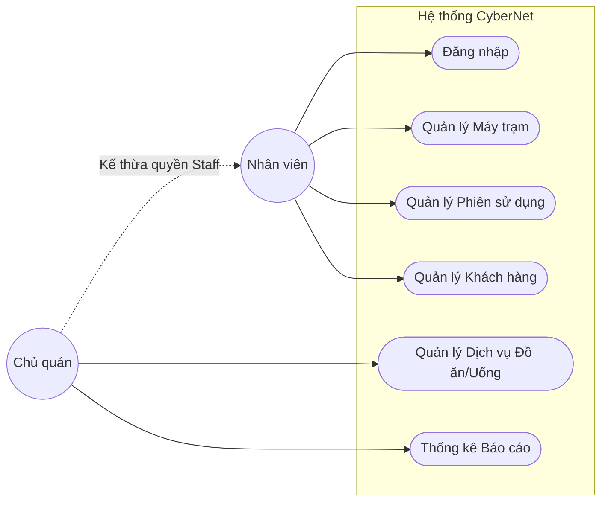
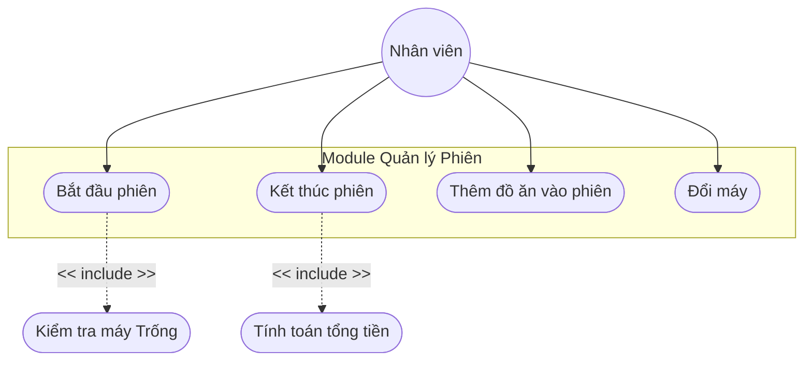
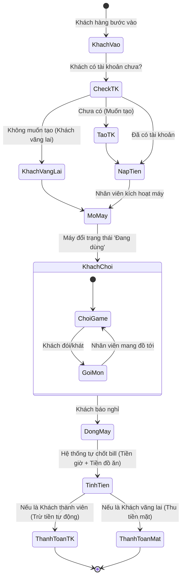

# CHƯƠNG 1: YÊU CẦU (REQUIREMENTS)

> **👤 PHÂN CÔNG THỰC HIỆN:**
> - **Thành viên 2 (UI/UX, Frontend):** Chịu trách nhiệm mục 1.1, 1.2, 1.3 và vẽ Mockup Giao diện (Giao diện wireframe sẽ được team tự chụp từ ứng dụng Java Swing đang chạy đính kèm vào word).
> - **Thành viên 3 (BA, Phân tích nghiệp vụ):** Chịu trách nhiệm thiết kế mục 1.4, 1.5, biểu đồ Use-case hệ thống và bảng đặc tả chi tiết 1.6.

---

## 1.1 Đặt vấn đề (Problem statement)

### 1.1.1 Bối cảnh hiện tại
Hiện nay, sự phát triển mạnh mẽ của thể thao điện tử (Esports) và nhu cầu giải trí số đã thúc đẩy sự ra đời của rất nhiều các chuỗi hệ thống phòng máy tính (Cyber Game, Quán Net). Tuy nhiên, tại các phòng máy quy mô vừa và nhỏ, chủ quán thường quản lý thời gian sử dụng, bán thức ăn đồ uống và thống kê doanh thu thông qua sổ sách thủ công hoặc các công cụ không chuyên biệt như Excel. Điều này dẫn đến nhiều hệ lụy tiêu cực:
1. Tính toán sai sót thời gian sử dụng của khách hàng.
2. Thất thoát doanh thu bán dịch vụ (đồ ăn, nước uống) do thu ngân không ghi chép đầy đủ.
3. Việc quản lý các máy tính hỏng hóc hoặc đang trong quá trình bảo trì gặp nhiều khó khăn.
4. Trải nghiệm của khách hàng không được tối ưu khi không có hệ thống tích lũy điểm thưởng kích cầu.

### 1.1.2 Mục tiêu của dự án
Dự án "Quản lý quán Internet CyberNet" được xây dựng nhằm mục đích cung cấp một giải pháp phần mềm toàn diện, cài đặt trực tiếp tại quầy thu ngân (Local) với các mục tiêu cốt lõi:
- **Tự động hóa hoàn toàn logic tính giờ:** Tự động quy đổi số tiền nạp sang số giờ chơi tương ứng dựa trên giá niêm yết của từng máy.
- **Tích hợp quản lý Dịch vụ:** Cung cấp tính năng gọi đồ ăn uống nhanh gọn, tự động cộng dồn vào hóa đơn thanh toán cuối phiên.
- **Xây dựng chương trình thành viên (Loyalty Program):** Tạo tài khoản cho khách quen, lưu trữ số dư ví ảo và tích lũy điểm thưởng qua mỗi lần nạp tiền. Khách có thể dùng điểm để đổi các dịch vụ miễn phí.
- **Trực quan hóa dữ liệu thống kê:** Thiết lập Dashboard tổng quan cho phép chủ quán dễ dàng theo dõi số lượng phiên sử dụng, hiệu suất phục vụ và tổng doanh thu.

### 1.1.3 Phân tích đối tượng người dùng
Hệ thống cung cấp trải nghiệm quản lý đóng kín dành cho phía doanh nghiệp vận hành.
- **Nhân viên thu ngân (Staff):** Người trực tiếp thao tác với phần mềm nhiều nhất (90% thời gian). Nhiệm vụ bao gồm mở máy cho khách, theo dõi phiên, thanh toán và xử lý đơn hàng gọi đồ. Yêu cầu giao diện phải nhanh, phím tắt linh hoạt, giảm thiểu số lần click chuột.
- **Người quản lý / Chủ quán (Admin):** Người nắm toàn quyền hệ thống. Được cấp quyền truy cập tính năng Thống kê, xuất biểu đồ doanh thu cuối ngày, và quản lý (thêm/sửa/xóa) danh mục dịch vụ cũng như thiết lập giá máy.

## 1.2 Thuật ngữ (Glossary)
- **CyberNet:** Tên chính thức của phần mềm hệ thống.
- **Máy trạm (Client / PC):** Đơn vị phần cứng được hệ thống quản lý. Có ba trạng thái chính: Trống (Free), Đang dùng (In-use), Bảo trì (Maintenance).
- **Phiên sử dụng (Session):** Khoảng thời gian khách hàng thực tế sử dụng dịch vụ trên máy trạm. Bắt đầu từ khi mở máy và kết thúc khi ấn tính tiền. Mọi hóa đơn phát sinh đều gắn chặt với Phiên này.

## 1.3 Thông số kỹ thuật bổ sung
- **Công nghệ lưu trữ:** H2 Database dạng file nhúng (Embedded). Đảm bảo tính linh hoạt "cài đặt là chạy", không yêu cầu setup server.
- **Bảo mật tối thiểu:** Không yêu cầu đăng ký phức tạp nhưng đòi hỏi thao tác qua lớp màn hình đăng nhập bảo vệ của nhân viên.
- **Giao diện người dùng:** Bắt buộc áp dụng Dark mode (màu nền tối) để không gây nhức mắt cho nhân viên làm ca đêm.

## 1.4 Biểu đồ Use-case Hệ Thống

### 1.4.1 Sơ đồ Use-case Tổng Quát
Hệ thống xoay quanh 2 tác nhân chính là Admin (Chủ quán) và Staff (Nhân viên thu ngân).

### 1.4.2 Sơ đồ Use-case Phân rã: Quản lý Phiên (Session Management)
Đi sâu vào chức năng mà nhân viên làm việc nhiều nhất: Quản lý phiên.

## 1.5 Sơ đồ Hoạt động (Activity Diagram)

Sơ đồ quy trình nghiệp vụ tổng quát khi một khách hàng bước vào quán chơi và thanh toán.

## 1.6 Đặc tả Use-case Chi tiết (Use-case Specifications)

### 1.6.1 Đặc tả UC-01: Bắt đầu Phiên sử dụng
| **Thuộc tính** | **Mô tả** |
|---|---|
| **Tên Use-case** | Bắt đầu Phiên sử dụng (Open Session) |
| **Tác nhân** | Nhân viên thu ngân |
| **Tiền điều kiện**| Nhân viên phải đăng nhập thành công. Máy trạm được chọn phải ở trạng thái "Trống" (Free). |
| **Luồng sự kiện chính**| 1. Nhân viên nhấn đúp vào biểu tượng của máy trạm đang Trống trên màn hình chính. 2. Hệ thống hiển thị hộp thoại pop-up "Mở máy". 3. Nhân viên chọn loại hình: "Khách vãng lai" hoặc tìm kiếm tên "Khách thành viên". 4. Nhân viên nhấn nút [Xác nhận Bắt đầu]. 5. Hệ thống ghi nhận thời gian `gioBatDau`, tạo record mới trong bảng `PHIEN_SU_DUNG`. 6. Hệ thống chuyển màu máy sang Đỏ (Đang dùng) và báo thành công. |
| **Luồng thay thế**| Nếu chọn Khách thành viên nhưng số dư ví của khách nhỏ hơn 0, hệ thống cảnh báo và yêu cầu nạp tiền trước khi mở máy. |

### 1.6.2 Đặc tả UC-02: Nạp tiền cho Khách hàng
| **Thuộc tính** | **Mô tả** |
|---|---|
| **Tên Use-case** | Nạp tiền vào tài khoản (Deposit Money) |
| **Tác nhân** | Nhân viên thu ngân |
| **Luồng sự kiện chính**| 1. Khách hàng cung cấp tên đăng nhập hoặc ID tại quầy và đưa tiền mặt. 2. Nhân viên vào tab "Khách hàng", chọn người dùng, nhấn [Nạp tiền]. 3. Hệ thống hiển thị form yêu cầu nhập mệnh giá VND. 4. Hệ thống tự động preview sẽ được cộng bao nhiêu Giờ và bao nhiêu Điểm thưởng. 5. Nhân viên ấn [Xác nhận]. Hệ thống lưu thông tin. |
