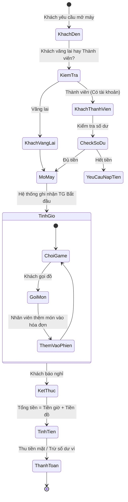
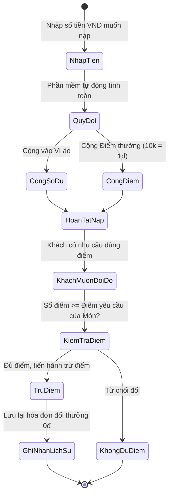

# CHƯƠNG 1: YÊU CẦU (REQUIREMENTS)

> **👤 PHÂN CÔNG THỰC HIỆN:**
> - **Thành viên 2 (UI/UX, Frontend):** Chịu trách nhiệm mục 1.1, 1.2, 1.3 và vẽ Mockup Giao diện (đính kèm vào báo cáo Word).
> - **Thành viên 3 (BA, Phân tích nghiệp vụ):** Chịu trách nhiệm thiết kế mục 1.4, 1.5, biểu đồ Use-case hệ thống và bảng đặc tả chi tiết 1.6.

---

## 1.1 Đặt vấn đề (Problem statement)

### 1.1.1 Bối cảnh
Hiện nay, sự phát triển mạnh mẽ của nhu cầu giải trí số đã thúc đẩy sự ra đời của các chuỗi phòng máy (Cyber Game). Tuy nhiên, tại các phòng máy quy mô nhỏ, chủ quán thường quản lý thời gian sử dụng, bán thức ăn đồ uống và thống kê doanh thu thông qua sổ sách thủ công. Điều này dẫn đến sự thiếu chính xác về tiền bạc, thất thoát dịch vụ do thu ngân quên ghi chép, và gây khó khăn cho việc tra cứu doanh thu cuối tháng.

### 1.1.2 Mục tiêu
Mục tiêu chiến lược của hệ thống "CyberNet" là tự động hóa hoàn toàn logic quản lý phòng máy:
1. Tự động quy đổi số tiền nạp sang thời gian chơi tương ứng.
2. Tích hợp thanh toán dịch vụ đồ ăn/nước uống nhanh gọn.
3. Kích cầu người dùng thông qua hệ thống tích điểm đổi quà.
4. Cung cấp báo cáo thống kê trực quan cho Chủ quán.

### 1.1.3 Người dùng mục tiêu
Hệ thống có hai đối tượng người dùng thao tác trực tiếp:
- **Nhân viên thu ngân (Staff):** Người trực tiếp giao tiếp với khách hàng, có quyền Mở/Đóng máy, Nạp tiền, và Đổi điểm thưởng.
- **Quản lý / Chủ quán (Admin):** Người nắm toàn quyền hệ thống, xem biểu đồ doanh thu và quản lý danh mục Đồ ăn/Uống.

### 1.1.4 Lợi ích khi sử dụng phần mềm
- Giảm thiểu sai sót tính toán tiền giờ (bằng 0%).
- Tốc độ phục vụ khách hàng tăng cao.
- Kiểm soát minh bạch dòng tiền, chống gian lận từ phía nhân viên.

### 1.1.5 Phạm vi của dự án
- **Trong phạm vi:** Quản lý cấu hình Máy trạm, Tài khoản khách hàng, Phiên sử dụng, Đơn hàng dịch vụ ăn uống, Thống kê doanh thu.
- **Ngoài phạm vi:** Hệ thống không điều khiển khóa/mở màn hình máy con thông qua mạng LAN, không tích hợp cổng thanh toán ngân hàng trực tuyến.

---

## 1.2 Thuật ngữ (Glossary)

1. **CyberNet:** Tên chính thức của phần mềm hệ thống quản lý.
2. **Máy trạm (Client/PC):** Thiết bị máy tính vật lý dành cho khách hàng thuê, được định giá theo giờ.
3. **Phiên sử dụng (Session):** Thời gian thực khách hàng dùng máy, tính từ lúc mở đến lúc đóng.
4. **Khách vãng lai (Guest):** Khách chơi trả tiền trực tiếp, không có tài khoản.
5. **Khách thành viên (Member):** Khách có tài khoản, được nạp tiền vào ví điện tử cục bộ.
6. **Ví ảo (Số dư):** Tiền mà Khách thành viên nạp vào và được hệ thống lưu trữ để trừ dần.
7. **Điểm thưởng (Point):** Điểm tích lũy khi nạp tiền, dùng để quy đổi ra dịch vụ ăn uống miễn phí.
8. **H2 Database:** Hệ quản trị CSDL nhúng siêu nhẹ, lưu trữ toàn bộ dữ liệu offline.
9. **DAO (Data Access Object):** Lớp trung gian thực hiện các câu lệnh SQL giao tiếp với Database.
10. **MVC (Model-View-Controller):** Mô hình kiến trúc phần mềm được sử dụng trong dự án này.

---

## 1.3 Thông số kỹ thuật bổ sung

Các yêu cầu phi chức năng mà hệ thống CyberNet cần đảm bảo:
- **Tốc độ phản hồi:** Mở giao diện không quá 3 giây.
- **Độ tin cậy:** Không xảy ra lỗi Crash, chống xung đột phiên làm việc.
- **Tính di động (Portability):** Ứng dụng phải được đóng gói gọn trong 1 file `.jar` và 1 file `.db`, chạy được trên mọi máy có cài sẵn Java mà không cần kết nối mạng Internet.
- **Yêu cầu thiết kế GUI:** Giao diện bắt buộc áp dụng Dark mode bằng thư viện FlatLaf để bảo vệ mắt cho nhân viên trực ca đêm.

---

## 1.4 Mô hình hóa quy trình nghiệp vụ

### 1.4.1 Quy trình Mở máy và Sử dụng Dịch vụ

Quy trình mô tả luồng khách hàng vào quán, thuê máy tính và sử dụng các dịch vụ ăn uống phát sinh trong phiên chơi.

### 1.4.2 Quy trình Nạp tiền và Đổi thưởng

Quy trình mô tả cách hệ thống tự động quy đổi dòng tiền nạp của khách hàng thành Điểm thưởng, sau đó khách sử dụng điểm đó.

---

## 1.5 Mô hình hóa chức năng

### 1.5.1 Các yêu cầu chức năng
1. **Quản lý Đăng nhập:** Hệ thống xác thực quyền Admin/Staff.
2. **Quản lý Máy trạm:** Xem sơ đồ máy, Bật máy, Tắt máy.
3. **Quản lý Khách hàng:** Đăng ký mới, Sửa thông tin, Nạp tiền, Đổi điểm.
4. **Quản lý Dịch vụ:** CRUD danh sách món ăn/nước uống.
5. **Thống kê Báo cáo:** Hiển thị doanh thu, tổng số phiên theo ngày.

### 1.5.2 Sơ đồ Use-case Tổng Quát
Sơ đồ mô tả các chức năng tổng thể của phần mềm CyberNet theo góc nhìn của 2 Tác nhân.

---

## 1.6 Đặc tả các Use-case

### 1.6.1 UC-01. Bắt đầu Phiên sử dụng (Mở máy)
| **Thuộc tính** | **Mô tả** |
|---|---|
| **Tên Use-case** | Bắt đầu Phiên sử dụng (Open Session) |
| **Mã UC** | UC-01 |
| **Tác nhân** | Nhân viên thu ngân |
| **Mục đích** | Kích hoạt máy trạm cho khách hàng sử dụng và bắt đầu tính tiền giờ. |
| **Tiền điều kiện**| Nhân viên phải đăng nhập thành công. Máy trạm được chọn phải ở trạng thái "Trống". |
| **Luồng chính**| 1. Nhân viên nhấn đúp vào biểu tượng của máy trạm đang Trống. 2. Hệ thống hiển thị hộp thoại "Mở máy". 3. Nhân viên chọn: Khách vãng lai / Khách thành viên. 4. Nhân viên nhấn nút [Xác nhận]. 5. Hệ thống ghi nhận thời gian `gioBatDau`, tạo record mới trong bảng `PHIEN_SU_DUNG`. 6. Hệ thống chuyển màu máy sang Đỏ (Đang dùng). |
| **Luồng thay thế**| Nếu chọn Khách thành viên nhưng số dư ví nhỏ hơn 0, hệ thống từ chối mở máy. |

### 1.6.2 UC-02. Nạp tiền vào tài khoản
| **Thuộc tính** | **Mô tả** |
|---|---|
| **Tên Use-case** | Nạp tiền vào tài khoản (Deposit Money) |
| **Mã UC** | UC-02 |
| **Tác nhân** | Nhân viên thu ngân |
| **Luồng chính**| 1. Vào tab "Khách hàng", chọn người dùng, nhấn [Nạp tiền]. 2. Hệ thống hiển thị form nhập mệnh giá VND. 3. Nhập số tiền, hệ thống tự động tính sẽ cộng bao nhiêu Giờ và bao nhiêu Điểm thưởng. 4. Ấn [Xác nhận], hệ thống cập nhật Database và tải lại bảng. |
| **Luồng thay thế**| Nhập số tiền < 0 hoặc chứa ký tự đặc biệt, phần mềm hiển thị lỗi chặn lại. |
