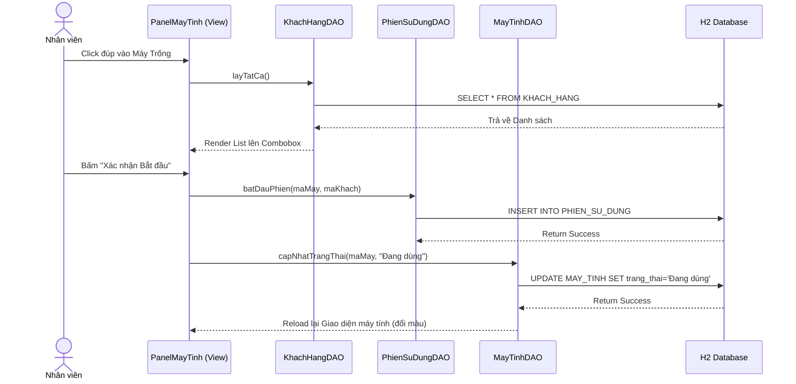
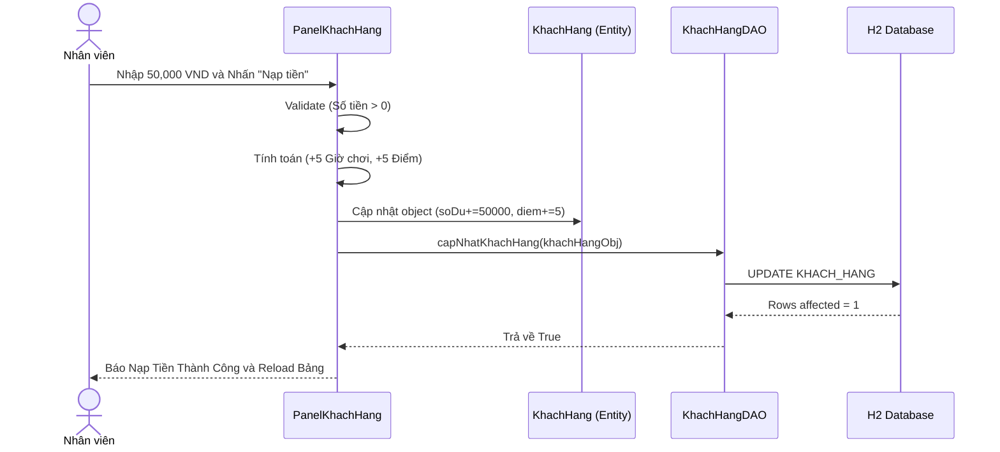

# CHƯƠNG 2: PHÂN TÍCH TRƯỜNG HỢP SỬ DỤNG (USE-CASE ANALYSIS)

> **👤 PHÂN CÔNG THỰC HIỆN:**
> - **Thành viên 3 (BA, Phân tích nghiệp vụ):** Chịu trách nhiệm thiết kế, lập luận kiến trúc và vẽ các Biểu đồ Tuần tự (Sequence Diagram), Sơ đồ Hoạt động luồng dữ liệu.
> - **Thành viên 4 (Backend Developer):** Hỗ trợ lập tài liệu mô tả tương tác giữa các Lớp (Views of participating classes) dựa vào source code.

---

## 2.1 Phân tích kiến trúc hệ thống

### 2.1.1 Kiến trúc mức cao của hệ thống (High-level Architecture)
Hệ thống quản lý quán Internet CyberNet được thiết kế mạnh mẽ dựa trên sự kết hợp giữa **mô hình MVC (Model-View-Controller)** và thiết kế **DAO (Data Access Object) Pattern**. 

1. **Lớp View (Giao diện):** Xây dựng bằng Java Swing kết hợp FlatLaf. Đảm nhận việc vẽ các màn hình (Panel) và lắng nghe tương tác người dùng.
2. **Lớp Controller (Điều khiển):** Bắt sự kiện từ lớp View. Thực hiện Data Validation và chuyển giao nhiệm vụ cho lớp truy cập dữ liệu.
3. **Lớp DAO (Data Access):** Tương tác trực tiếp với cơ sở dữ liệu H2 bằng các câu lệnh SQL CRUD. Áp dụng Mẫu Singleton (`KetNoiCSDL`) để duy trì duy nhất một ống dẫn dữ liệu xuyên suốt vòng đời ứng dụng.

### 2.1.2 Các đối tượng trừu tượng hóa chính của hệ thống (Key abstractions)
Dựa trên miền nghiệp vụ (Business Domain), 4 đối tượng trừu tượng cốt lõi được định nghĩa:
- **NguoiDung (Admin/Staff):** Đại diện cho người vận hành phần mềm. 
- **MayTinh (Máy Trạm):** Tài sản cố định của quán, có thuộc tính Đơn giá và Trạng thái.
- **KhachHang (Tài khoản):** Thực thể di động nắm giữ Số dư ví ảo và Điểm thưởng.
- **PhienSuDung (Session):** Thực thể trung tâm liên kết Máy tính và Khách hàng. Mỗi khi Máy được bật, một Phiên được tạo ra để đo đạc thời gian và hứng hóa đơn Dịch vụ.

---

## 2.2 Thực thi trường hợp sử dụng (Use-case realizations)

### 2.2.1 Các biểu đồ tuần tự (Sequence diagrams)

Các biểu đồ tuần tự thể hiện rõ nét sự trao đổi thông điệp (Message Passing) giữa Actor và các tầng MVC theo thời gian.

**1. Biểu đồ Tuần tự: Quy trình Bắt đầu Phiên (Mở máy)**

**2. Biểu đồ Tuần tự: Quy trình Nạp Tiền & Tự động Cộng Điểm**

### 2.2.2 Góc nhìn của các lớp trong hệ thống (Views of participating classes)
Sự kết nối giữa các Lớp (Views of participating classes) được kiểm soát chặt chẽ thông qua Controller. Ví dụ trong quy trình **Kết thúc Phiên thanh toán**:
1. Lớp giao diện `PanelMayTinh` gửi thông điệp yêu cầu tính tiền.
2. `PhienSuDungDAO` truy xuất thời gian `gioBatDau`, tính toán sự chênh lệch giờ hệ thống để quy ra Số Giờ Chơi thực tế.
3. `DonHangDAO` (nếu có) đóng góp tổng số tiền Dịch vụ (Đồ ăn/uống) được gắn với `maPhien`.
4. Logic Controller tính `Tổng Tiền` và gọi `KhachHangDAO.truTien()`.
5. Cuối cùng, `MayTinhDAO` phục hồi trạng thái máy về Trống. Đảm bảo toàn vẹn giao dịch (Transaction Integrity).
