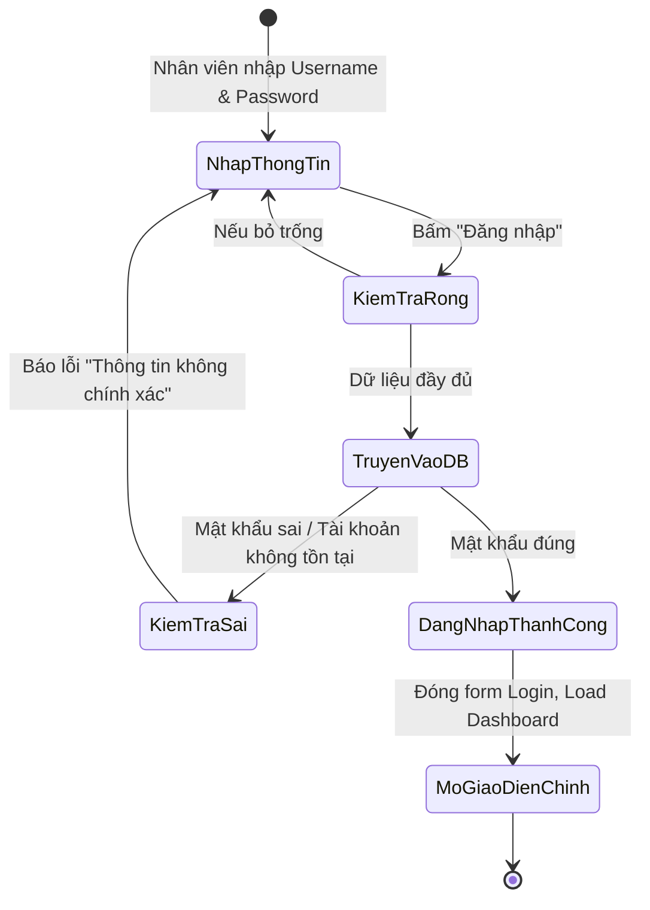
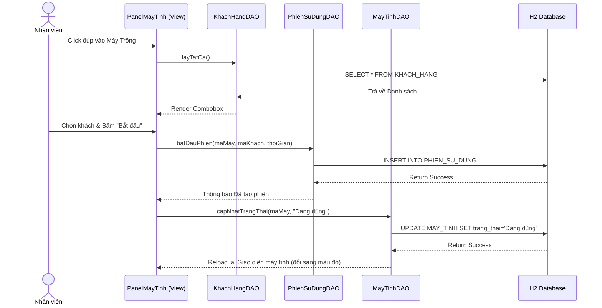
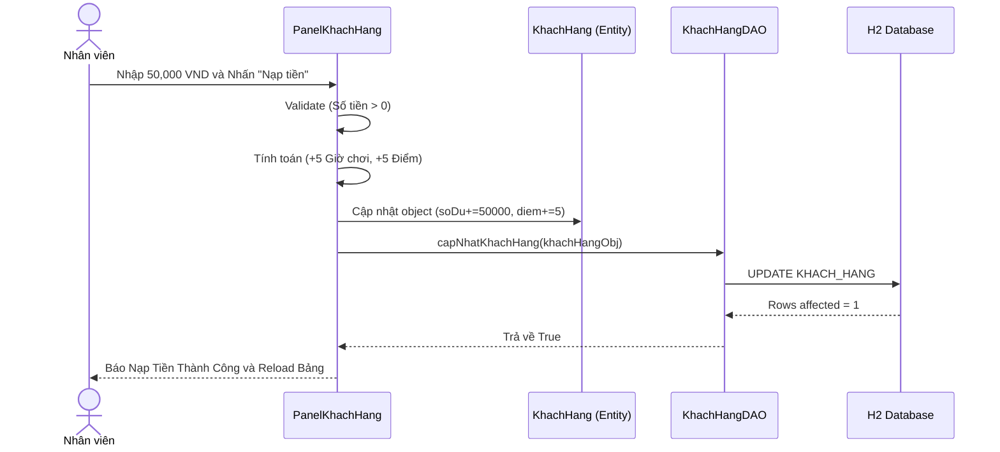
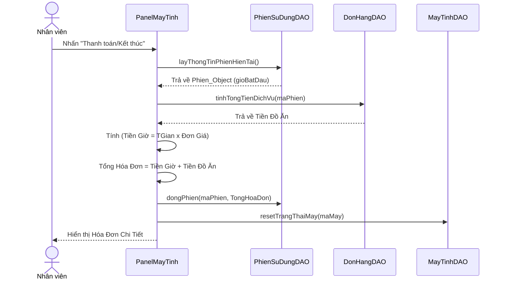

# CHƯƠNG 2: PHÂN TÍCH TRƯỜNG HỢP SỬ DỤNG (USE-CASE ANALYSIS)

> **👤 PHÂN CÔNG THỰC HIỆN:**
> - **Thành viên 3 (BA, Phân tích nghiệp vụ):** Chịu trách nhiệm thiết kế, lập luận kiến trúc và vẽ các Biểu đồ Tuần tự (Sequence Diagram), Sơ đồ Hoạt động luồng dữ liệu.
> - **Thành viên 4 (Backend Developer):** Hỗ trợ lập tài liệu mô tả tương tác giữa các Lớp (Views of participating classes) dựa vào source code Controller/DAO.

---

## 2.1 Phân tích kiến trúc hệ thống

### 2.1.1 Kiến trúc mức cao (High-level Architecture)
Hệ thống quản lý quán Internet CyberNet được thiết kế mạnh mẽ dựa trên sự kết hợp giữa **mô hình MVC (Model-View-Controller)** và thiết kế **DAO (Data Access Object) Pattern**. Lựa chọn này giúp hệ thống tách biệt rành mạch giữa dữ liệu thô, logic xử lý nghiệp vụ và thành phần giao diện, từ đó tạo tiền đề bảo trì dễ dàng sau này.

1. **Lớp View (Giao diện):** Xây dựng bằng Java Swing kết hợp FlatLaf. Đảm nhận việc vẽ các màn hình, lắng nghe thao tác click chuột.
2. **Lớp Controller (Điều khiển):** Bắt sự kiện (Event Listener) từ lớp View. Thực hiện Data Validation. Điều phối luồng xử lý bằng cách gọi các dịch vụ từ lớp DAO.
3. **Lớp DAO (Data Access):** Tương tác trực tiếp với file database nhúng H2.
4. **Lớp Entity (Thực thể):** Ánh xạ cấu trúc bảng trong DB thành đối tượng Java (POJO).

---

## 2.2 Sơ đồ Hoạt động Hệ thống (System Activity Diagrams)
Sơ đồ hoạt động đi sâu vào việc giải quyết tuần tự các điều kiện logic của hệ thống.

### 2.2.1 Sơ đồ Hoạt động: Đăng nhập Hệ thống
Mô tả quy trình kiểm tra bảo mật trước khi truy cập phần mềm.

---

## 2.3 Thực thi trường hợp sử dụng (Use-case realizations - Sequence Diagrams)

Các biểu đồ tuần tự (Sequence Diagram) thể hiện sự giao tiếp thông điệp (Message Passing) giữa các thành phần MVC.

### 2.3.1 Biểu đồ Tuần tự: Quy trình Bắt đầu Phiên (Mở máy)

### 2.3.2 Biểu đồ Tuần tự: Nạp Tiền & Tự động Cộng Điểm

### 2.3.3 Biểu đồ Tuần tự: Kết thúc Phiên & Thanh toán

