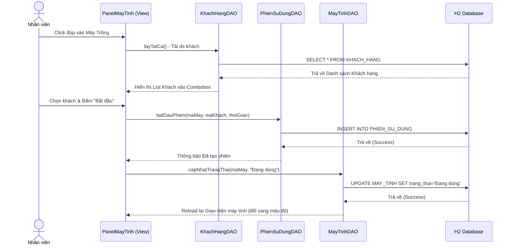
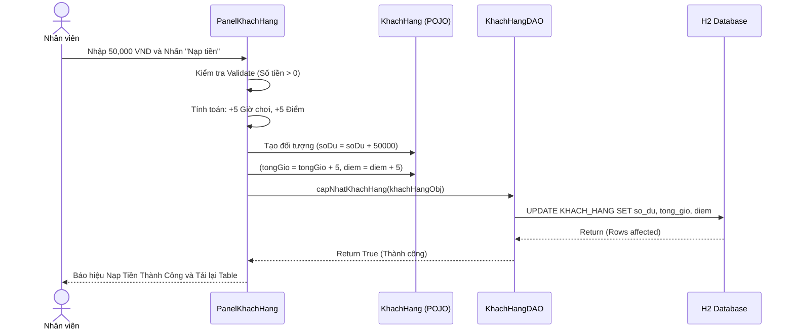

# CHƯƠNG 2: PHÂN TÍCH TRƯỜNG HỢP SỬ DỤNG (USE-CASE ANALYSIS)

> **👤 PHÂN CÔNG THỰC HIỆN:**
> - **Thành viên 3 (BA, Phân tích nghiệp vụ):** Chịu trách nhiệm thiết kế, lập luận kiến trúc và vẽ các Biểu đồ Tuần tự (Sequence Diagram).
> - **Thành viên 4 (Backend Developer):** Hỗ trợ lập tài liệu mô tả tương tác giữa các Lớp (Views of participating classes) dựa vào source code Controller/DAO.

---

## 2.1 Phân tích kiến trúc hệ thống

### 2.1.1 Kiến trúc mức cao (High-level Architecture)
Hệ thống quản lý quán Internet CyberNet được thiết kế mạnh mẽ dựa trên sự kết hợp giữa **mô hình MVC (Model-View-Controller)** và thiết kế **DAO (Data Access Object) Pattern**. Lựa chọn này giúp hệ thống tách biệt rành mạch giữa dữ liệu thô, logic xử lý nghiệp vụ và thành phần giao diện, từ đó tạo tiền đề bảo trì dễ dàng sau này.

1. **Lớp View (Giao diện):** 
   - Nhiệm vụ: Xây dựng bằng Java Swing kết hợp FlatLaf. Đảm nhận việc vẽ các màn hình, lắng nghe thao tác click chuột của thu ngân, hiển thị thông báo lỗi.
   - Các thành phần chính: `GiaoDienDangNhap`, `GiaoDienChinh`, các module Panel như `PanelMayTinh`, `PanelDoAnUong`.

2. **Lớp Controller (Điều khiển):** 
   - Nhiệm vụ: Bắt sự kiện (Event Listener) từ lớp View. Thực hiện Data Validation (Ví dụ: kiểm tra số tiền nạp phải lớn hơn 0). Điều phối luồng xử lý bằng cách gọi các dịch vụ từ lớp DAO.
   - Việc tách logic ra khỏi View giúp các form UI luôn nhẹ và có phản hồi mượt mà.

3. **Lớp DAO (Data Access) & Singleton Database:** 
   - Nhiệm vụ: Tương tác trực tiếp với file database nhúng H2 (`quanlyquaninternet.mv.db`).
   - Mẫu thiết kế Singleton được áp dụng nghiêm ngặt cho class `KetNoiCSDL`. Toàn bộ quá trình chạy ứng dụng chỉ tạo ra **duy nhất một connection** (một ống nước duy nhất) tới database. Các DAO như `KhachHangDAO`, `MayTinhDAO` đều mượn chung kết nối này, giúp tối ưu hóa bộ nhớ và không gặp lỗi "database locked".

4. **Lớp Entity (Thực thể):**
   - Nhiệm vụ: Ánh xạ cấu trúc bảng trong DB thành đối tượng Java (POJO). Bao gồm các fields, Getter, Setter và Constructor tương ứng.

### 2.1.2 Các đối tượng trừu tượng hóa cốt lõi (Key Abstractions)
Trong quá trình phân tích bài toán quán Internet, nhóm đã khoanh vùng được 4 thực thể trừu tượng lớn nhất:
- **Tài khoản (Account/NguoiDung):** Thực thể đại diện cho người vận hành phần mềm. 
- **Máy Trạm (PC Station/MayTinh):** Là tài sản cố định của quán, nơi diễn ra hành vi sử dụng. Mỗi máy được định tuyến giá cả khác nhau (Máy VIP đắt hơn Máy Thường).
- **Khách Hàng (Customer):** Thực thể di động, nắm giữ tài sản tiền tệ và điểm thưởng để trao đổi.
- **Phiên (Session/PhienSuDung):** **Đây là thực thể quan trọng nhất.** Đóng vai trò cầu nối N-N giữa Máy Trạm và Khách Hàng. Bất cứ khi nào Khách hàng ngồi vào Máy Trạm, một Phiên mới được khai sinh.

---

## 2.2 Thực thi trường hợp sử dụng (Use-case realizations)

Để minh họa luồng đi của dữ liệu từ khi Nhân viên click chuột trên View cho đến khi dữ liệu nằm sâu trong Database, nhóm sử dụng các Biểu đồ Tuần tự (Sequence Diagram).

### 2.2.1 Biểu đồ Tuần tự: Quy trình Bắt đầu Phiên (Mở máy)

**Mô tả luồng tương tác:**
- Khi giao diện `PanelMayTinh` nhận tín hiệu mở máy, nó sẽ chủ động kéo danh sách khách hàng từ `KhachHangDAO` lên bộ nhớ để nhân viên lựa chọn.
- Ngay khi có lệnh xác nhận, hai truy vấn CSDL liên tục được thực thi: Một truy vấn INSERT để sinh ra Phiên, và một truy vấn UPDATE để khóa cứng máy tính thành trạng thái 'Đang dùng'.
- Tính nguyên vẹn dữ liệu được bảo vệ. Nếu ghi Phiên thất bại, máy tính sẽ không bị đổi trạng thái sai lầm.

### 2.2.2 Biểu đồ Tuần tự: Nạp Tiền & Tự động Cộng Điểm

**Mô tả luồng tương tác:**
- Điểm khác biệt trong logic này là **sự tính toán được thực hiện tại View/Controller** trước khi đóng gói đẩy xuống DAO.
- Thao tác nạp tiền không chỉ cập nhật ví ảo `so_du`, mà phần mềm được cài đặt thuật toán tự quy đổi: `Số Giờ = Tiền Nạp / Giá Trị Trung Bình`.
- Class `KhachHangDAO` chỉ thực hiện duy nhất 1 câu SQL UPDATE thay vì phải chạy 3 câu SQL rời rạc cho tiền, giờ, và điểm. Điều này tăng cường hiệu suất tối đa.
