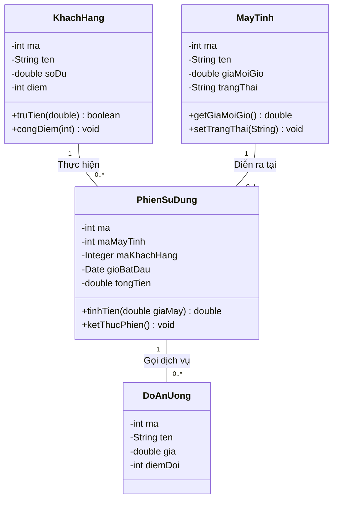

# CHƯƠNG 3: THIẾT KẾ (USE-CASE DESIGN)

> **👤 PHÂN CÔNG THỰC HIỆN:**
> - **Thành viên 1 (Trưởng nhóm, Database/Backend):** Chịu trách nhiệm toàn bộ nội dung chương này.

---

## 3.1 Xác định các thành phần thiết kế (Identify design elements)

### 3.1.1 Xác định các lớp (Identify classes)
Quá trình ánh xạ từ yêu cầu người dùng sang code Java được hiện thực hóa qua các thành phần thực thể cốt lõi: `MayTinh`, `KhachHang`, `PhienSuDung`, `DoAnUong`. Chúng mang tính chất đóng gói dữ liệu (Encapsulation) thông qua các field `private` và phương thức `Getter/Setter`.

### 3.1.2 Xác định các hệ thống con và giao diện (Identify subsystems and interfaces)
Dự án bao gồm 3 hệ thống con chính (Subsystems):
- **Core Session Subsystem:** Quản lý vòng đời hoạt động của Phiên và Máy tính.
- **Accounting Subsystem:** Hệ thống kế toán ẩn xử lý tính giờ, tính điểm thưởng và nạp tiền.
- **Service Subsystem:** Hệ thống phụ chịu trách nhiệm về menu đồ ăn thức uống.

### 3.1.3 Xác định các gói (Identify packages)
Hệ thống tuân thủ thiết kế phân tầng tiêu chuẩn trong Java bằng 4 package:
- `entity`: Chứa POJO.
- `dao`: Chứa các bộ truy cập DB.
- `controller`: Chứa logic điều hướng.
- `view`: Chứa màn hình.

---

## 3.2 Thiết kế trường hợp sử dụng (Use-case design)

### 3.2.1 Thiết kế các biểu đồ tuần tự (Design sequence diagrams)
(Các biểu đồ tuần tự chi tiết về sự luân chuyển dữ liệu ở cấp độ Class và Database đã được phân tích và vẽ đầy đủ ở **Mục 2.2.1** - Biểu đồ Bắt đầu Phiên và Nạp tiền).

### 3.2.2 Thiết kế biểu đồ lớp (Class diagrams)
Sơ đồ mô tả cấu trúc của các lớp thực thể trọng yếu nhất cấu thành nên phần mềm quản lý, cũng như mối quan hệ nhân quả giữa chúng.

---

## 3.3 Thiết kế cơ sở dữ liệu (Database design)

### 3.3.1 Lược đồ cơ sở dữ liệu
Sơ đồ ERD (Entity-Relationship Diagram) của hệ thống Database H2. Mối quan hệ giữa bảng gốc và bảng phát sinh.

### 3.3.2 Chi tiết các bảng
**Ràng buộc toàn vẹn Dữ liệu được thiết kế cứng trong Database:**
- Bảng **KHACH_HANG**: Cột `sdt` (Số điện thoại) được gán là `UNIQUE` nhằm chống tạo tài khoản ảo lấy điểm thưởng.
- Bảng **MAY_TINH**: Cột `gia_moi_gio` cài đặt `NOT NULL`.
- Bảng **LICH_SU_DOI_THUONG**: Áp dụng Khóa ngoại kép tới `KhachHang` và `DoAnUong`, tạo ra 1 dòng ghi chú tài chính mỗi khi khách đổi điểm để quản lý dễ bề đối soát.
