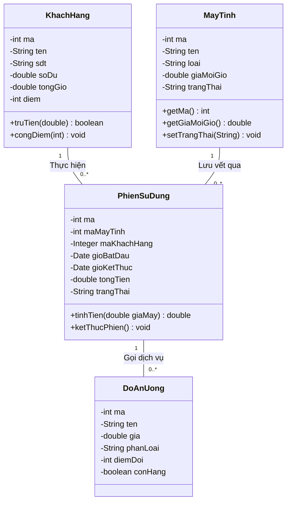
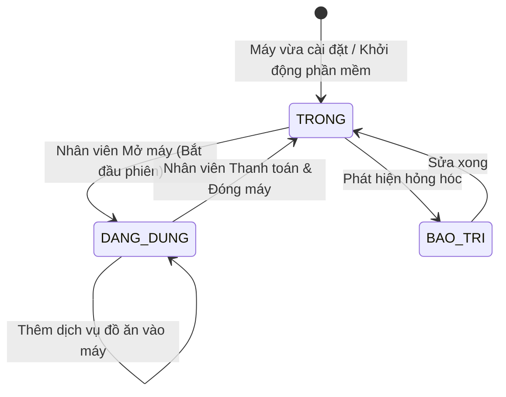
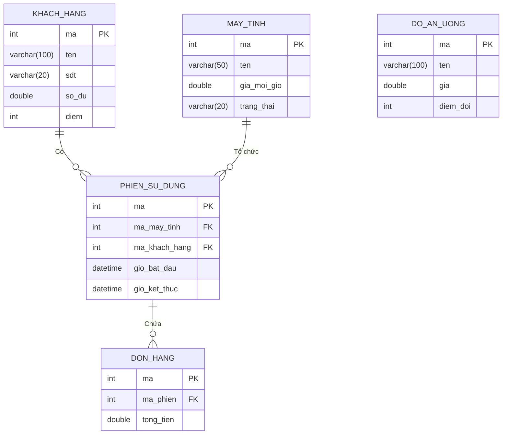

# CHƯƠNG 3: THIẾT KẾ (USE-CASE DESIGN)

> **👤 PHÂN CÔNG THỰC HIỆN:**
> - **Thành viên 1 (Trưởng nhóm, Database/Backend):** Chịu trách nhiệm toàn bộ nội dung chương này. Triển khai các Biểu đồ Lớp (Class Diagram), ERD CSDL, Sơ đồ Trạng thái (State Diagram) và Sơ đồ Thành phần (Component Diagram).

---

## 3.1 Thiết kế Sơ đồ Lớp (Class Diagram)

Sơ đồ mô tả cấu trúc của các lớp thực thể trọng yếu nhất cấu thành nên phần mềm quản lý, cũng như mối quan hệ nhân quả giữa chúng.



---

## 3.2 Sơ đồ Trạng thái (State Machine Diagram)

Trong phần mềm quản lý phòng máy, thực thể `Máy Tính` sở hữu chu trình sống (lifecycle) trạng thái cực kỳ nghiêm ngặt nhằm tránh việc trùng lặp phiên (hai người ngồi một máy).



---

## 3.3 Thiết kế Cơ sở dữ liệu (Database Design)

### 3.3.1 Sơ đồ Thực thể - Mối quan hệ (Entity-Relationship Diagram)

Sơ đồ ERD của toàn bộ hệ thống Database H2. Mối quan hệ giữa bảng gốc (KHACH_HANG, MAY_TINH, DO_AN_UONG) và bảng phát sinh (PHIEN_SU_DUNG, DON_HANG, LICH_SU_DOI_THUONG).



---

## 3.4 Sơ đồ Thành phần (Component Diagram)

Kiến trúc gói mã nguồn và sự giao tiếp giữa các thành phần nội bộ trong ứng dụng Java.

```mermaid
flowchart TD
    subgraph UI_Layer [Tầng Giao Diện - View Component]
        UI_Login[GiaoDienDangNhap]
        UI_Main[GiaoDienChinh]
        UI_Modules[Các Panel Chức Năng]
    end

    subgraph Controller_Layer [Tầng Xử Lý - Controller Component]
        Ctrl_Auth[Auth Controller]
        Ctrl_Logic[Logic Controller]
    end

    subgraph Data_Layer [Tầng Truy cập dữ liệu - DAO Component]
        DAO_Connection[KetNoiCSDL (Singleton)]
        DAO_Classes[KhachHangDAO, MayTinhDAO...]
    end

    DB[(H2 Embedded Database)]

    UI_Login --> Ctrl_Auth
    UI_Main --> UI_Modules
    UI_Modules --> Ctrl_Logic
    
    Ctrl_Auth --> DAO_Classes
    Ctrl_Logic --> DAO_Classes
    
    DAO_Classes --> DAO_Connection
    DAO_Connection --> DB
```
