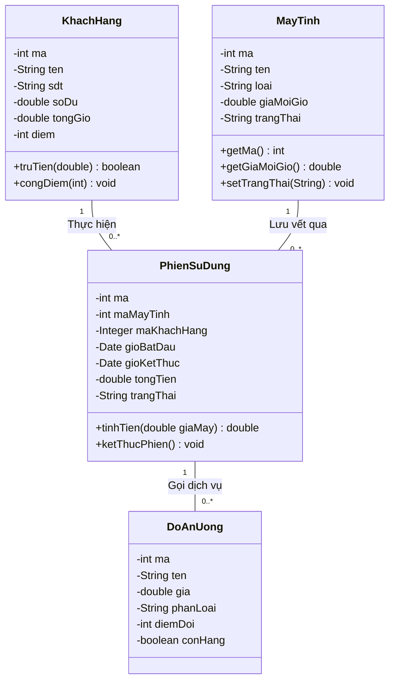
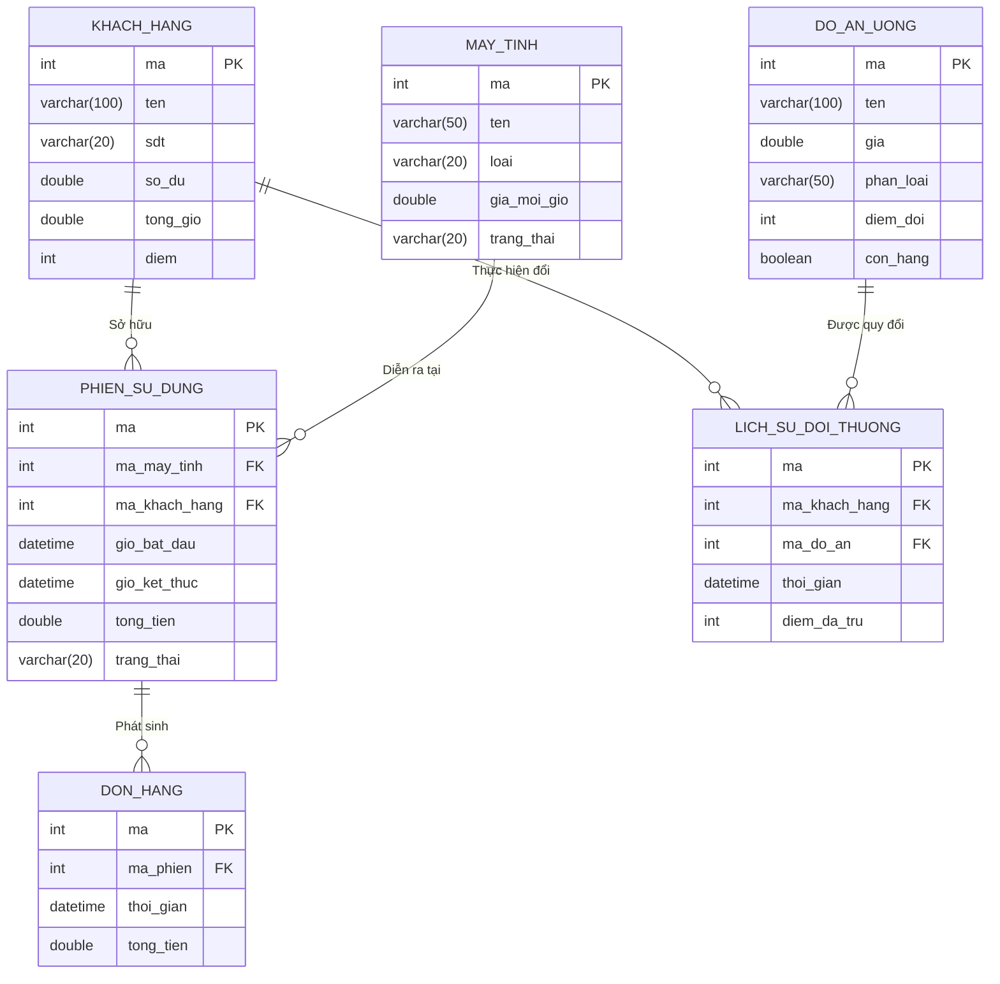

# CHƯƠNG 3: THIẾT KẾ (USE-CASE DESIGN)

> **👤 PHÂN CÔNG THỰC HIỆN:**
> - **Thành viên 1 (Trưởng nhóm, Database/Backend):** Chịu trách nhiệm toàn bộ nội dung chương này. Triển khai các Biểu đồ Lớp (Class Diagram), ERD CSDL và mô tả các ràng buộc dữ liệu.

---

## 3.1 Xác định các thành phần thiết kế và Class Diagram

Quá trình ánh xạ từ yêu cầu người dùng sang code Java được hiện thực hóa qua các thành phần thực thể. Chúng mang tính chất đóng gói dữ liệu (Encapsulation) thông qua các field `private` và phương thức `Getter/Setter`.

### 3.1.1 Biểu đồ Lớp Đặc Tả (Class Diagram)

Dưới đây là sơ đồ mô tả cấu trúc của 4 lớp thực thể trọng yếu nhất cấu thành nên phần mềm quản lý, cũng như mối quan hệ nhân quả giữa chúng.

**Mô tả:**
- Lớp `PhienSuDung` (Session) chứa thuộc tính `maKhachHang` kiểu tham chiếu tự do, nghĩa là Phiên có thể có mã khách hàng (Nếu khách có tài khoản), hoặc null (Nếu là khách vãng lai).
- Hàm `truTien()` của `KhachHang` có khả năng trả về boolean để tự động chặn các giao dịch nếu khách không còn đủ tiền.

---

## 3.2 Thiết kế Cơ sở dữ liệu (Database Design)

Để đảm bảo hệ thống phần mềm có thể tự động chạy mà không cần setup phức tạp, nhóm đã lựa chọn kiến trúc cơ sở dữ liệu **Relational Database** tích hợp trực tiếp (H2 Engine).

### 3.2.1 Sơ đồ Thực thể - Mối quan hệ (Entity-Relationship Diagram)

Dưới đây là sơ đồ ERD của toàn bộ hệ thống Database do Thành viên 1 thiết kế. 

### 3.2.2 Ràng buộc toàn vẹn Dữ liệu

Nhằm chống lại các lỗi người dùng và sự thiếu chính xác trong quá trình tính tiền, nhóm đã cài đặt sẵn các ràng buộc (Constraints) trực tiếp vào mức thiết kế của các bảng SQL (`schema.sql`).

**1. Bảng Khách Hàng (KHACH_HANG):**
- Cột `sdt` (Số điện thoại) được gán là `UNIQUE`. Mỗi khách hàng chỉ được phép đăng ký duy nhất 1 tài khoản thông qua SĐT để ngăn chặn tài khoản rác spam lấy điểm thưởng ban đầu.
- Cột `so_du` và `diem` mặc định (DEFAULT) luôn bắt đầu từ 0.

**2. Bảng Máy Tính (MAY_TINH):**
- Cột `gia_moi_gio` (Giá tiền/giờ) cài đặt `NOT NULL`.
- Cột `trang_thai` được định sẵn các giá trị chuỗi cố định ('Trống', 'Đang dùng', 'Bảo trì'). Ở cấp độ database, điều này bảo vệ tính toàn vẹn trạng thái.

**3. Bảng Lịch sử đổi thưởng (LICH_SU_DOI_THUONG):**
- Bảng này đóng vai trò là "Kế toán chéo" (Audit Log). Mọi hành động làm suy giảm điểm của khách hàng (`diem_da_tru`) bắt buộc phải tạo ra 1 record liên kết với ID của món ăn (`ma_do_an`) để quản lý có thể đối soát (cross-check) vào cuối tháng xem nhân viên có gian lận điểm không.
