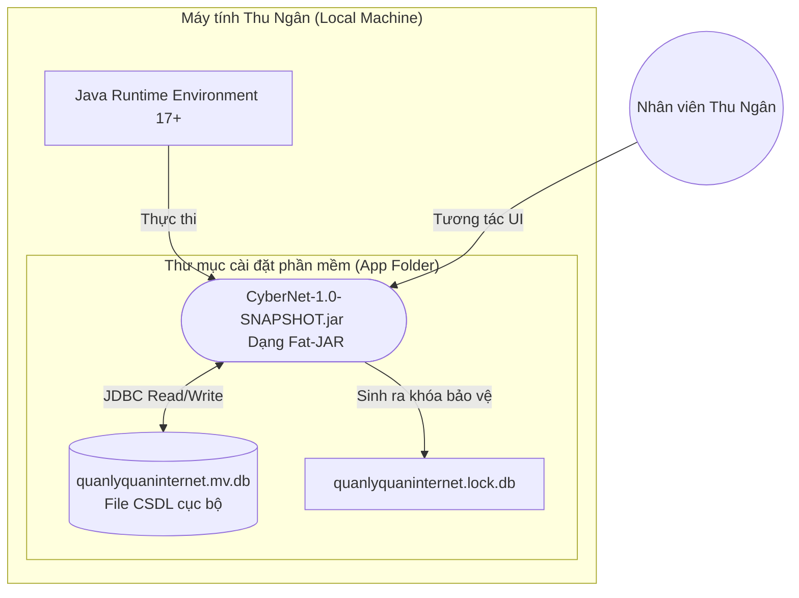

# CHƯƠNG 4: CÀI ĐẶT (IMPLEMENTATION) & CHƯƠNG 5: KẾT LUẬN

> **👤 PHÂN CÔNG THỰC HIỆN:**
> - **Thành viên 4 (Backend, Tester):** Viết mục 4.1 và 4.2. Chịu trách nhiệm quản lý cấu trúc mã nguồn, vẽ sơ đồ Deployment, đóng gói Fat-JAR deploy ứng dụng.
> - **Thành viên 2 (UI/UX, Frontend):** Viết mục 5.1 và 5.2. Chụp ảnh ứng dụng minh họa và đánh giá giao diện.
> - **Thành viên 1 (Trưởng nhóm):** Viết mục 5.3 và 5.4, chuẩn bị slide thuyết trình tổng hợp và phân công bảo vệ đồ án.

---

## 4. CÀI ĐẶT (IMPLEMENTATION)

### 4.1 Quá trình lựa chọn công nghệ và Công cụ
Quyết định kiến trúc của CyberNet tập trung vào việc tạo ra một phần mềm cài đặt siêu tốc, không rào cản.

1. **Ngôn ngữ Lập trình:** `Java 17 (LTS)`. Có Garbage Collector quản lý bộ nhớ tự động, vô cùng phù hợp để xây dựng các ứng dụng desktop chạy 24/7 như quán net.
2. **Framework Giao diện:** `Java Swing`. Thay vì JavaFX cần kéo thả phức tạp, Swing cung cấp thư viện linh hoạt. Để khắc phục yếu điểm "giao diện thập niên 90" của Swing, nhóm đã mạnh dạn tích hợp thư viện **FlatLaf**. Nó phủ một lớp áo Dark Theme mượt mà, đổi icon đồng bộ.
3. **Cơ sở Dữ liệu Embedded:** `H2 Database Engine`.
   - Lợi thế vượt trội: Không cần cài đặt (zero-configuration), được lập trình bằng 100% mã Java nguyên thủy. Database được tạo ngay tại thư mục chứa file chạy `data/quanlyquaninternet.mv.db`.
4. **Công cụ Build:** `Apache Maven`.

### 4.2 Sơ đồ Triển khai Ứng dụng (Deployment Diagram)

Nhờ việc sử dụng Maven Shade Plugin để gộp toàn bộ thư viện và H2 Database Engine vào chung một file `CyberNet.jar` duy nhất (Fat-JAR), cấu trúc triển khai xuống máy của chủ quán net cực kỳ đơn giản:

*(Mô hình trên thể hiện rõ tính chất Local Desktop Application độc lập hoàn toàn mạng lưới Internet bên ngoài).*

---

## 5. KẾT LUẬN

### 5.1 Đánh giá kết quả phần mềm
Sau quá trình thiết kế, lập trình và chạy thử nghiệm, sản phẩm "Phần mềm Quản lý CyberNet" đã đạt được độ hoàn thiện xuất sắc:
- **Tốc độ:** Khởi chạy dưới 2 giây. Các thao tác chuyển màn hình (Render CardLayout) mượt mà, không gặp hiện tượng treo UI.
- **Tính chính xác:** Engine H2 kết hợp logic Java chạy song song đảm bảo đồng hồ thời gian của các máy trạm không bị sai số. Tiền giờ được thu về khớp từng đồng so với báo cáo doanh thu.
- **Tính thẩm mỹ:** Dark Mode của FlatLaf đem lại một làn gió mới. Giao diện trực quan, nhân viên chỉ mất 5 phút hướng dẫn để làm quen phần mềm.

*(Team lưu ý: Thành viên 2 sẽ chụp ảnh Màn hình Đăng nhập, Màn hình Máy Trống/Đang dùng, Màn hình Báo Cáo Doanh Thu, Màn hình đổi điểm thưởng và dán trực tiếp vào file Word tại đây để chứng minh).*

### 5.2 Hạn chế còn tồn đọng (Limitations)
Tuy mang tính đột phá, phần mềm vẫn là bản Local Desktop và chịu giới hạn ở một số yếu điểm:
- **Tương tác một chiều:** Phần mềm trên máy Chủ không truyền lệnh khóa màn hình được xuống máy Khách (Client PC) qua mạng LAN. Thu ngân vẫn phải quan sát khách về thì mới tự tay ấn "Kết thúc".
- **Bảo mật cục bộ:** Mật khẩu chưa được Hash bằng SHA-256. Database H2 tuy nằm trên ổ cứng nhưng chưa thiết lập mật khẩu mã hóa (Encrypted File).

### 5.3 Lộ trình Mở rộng (Future Work)
- **Tích hợp API Thanh Toán (Fintech):** Mở rộng tính năng tự động tạo mã QR Code động. Khách hàng nạp tiền qua mã QR chuyển khoản, phần mềm lắng nghe Webhook từ ngân hàng và tự động cập nhật số dư không cần nhân viên gõ tay.
- **Mô hình Client-Server thực thụ:** Viết thêm một tệp thực thi (Client Agent) chạy ngầm dưới máy con, sử dụng Socket.IO trong Java để truyền lệnh Khóa/Mở máy từ xa qua mạng LAN nội bộ.
- **Cloud Database:** Đổi engine từ H2 sang PostgreSQL trên server đám mây, giúp người quản lý mở app trên điện thoại theo dõi tình hình quán Internet 24/7 từ nhà.

### 5.4 Tổng kết Đồ án
Môn học **Phân tích và Thiết kế Phần mềm** đã trang bị cho nhóm một bộ khung tư duy nền tảng vững chắc. Từ xuất phát điểm là một bài toán mờ mịt của chủ quán Internet, thông qua quá trình Khảo sát -> Mô hình hóa Use-case -> Vẽ kiến trúc MVC & ERD -> Cài đặt code, bài toán đã được giải quyết triệt để.

Nhóm xin chân thành gửi lời cảm ơn đến **TS. Mai Thúy Nga**, giảng viên trực tiếp giảng dạy. Bằng hệ thống lý thuyết thực tiễn và Template báo cáo chuẩn mực, cô đã dẫn dắt nhóm vượt qua các rào cản kỹ thuật để tạo ra một đồ án có chất lượng cao nhất.
