# CHƯƠNG 3. PHÂN TÍCH HỆ THỐNG

---

## 3.1. Khảo sát hiện trạng

### 3.1.1. Quy trình nghiệp vụ hiện tại
Tại các quán internet có quy mô nhỏ và vừa chưa áp dụng các phần mềm quản lý chuyên nghiệp, quy trình vận hành thủ công diễn ra như sau:
1. **Khách đến chơi:** Khách hàng đến quầy gặp nhân viên quản lý. Nhân viên ghi chép tên khách, số máy được phân phối và giờ bắt đầu vào sổ theo dõi. Nhân viên đi đến máy tính của khách và bật công tắc mở máy thủ công (hoặc mở máy thông qua một phần mềm điều khiển đơn giản không liên kết với hệ thống tài chính).
2. **Gọi dịch vụ (Đồ ăn, thức uống):** Trong quá trình sử dụng máy, khách hàng đi tới quầy hoặc gọi nhân viên để đặt đồ ăn/nước uống. Nhân viên ghi chép đơn hàng ra giấy, chuẩn bị đồ ăn và mang đến máy cho khách. Đơn hàng được giữ lại quầy để cộng tiền khi khách thanh toán.
3. **Thanh toán & Kết thúc:** Khách hàng ra quầy báo máy nghỉ. Nhân viên đối chiếu giờ bắt đầu và giờ kết thúc chơi để tính tiền máy (sử dụng máy tính cầm tay để tính số giờ nhân với đơn giá). Sau đó cộng thêm tiền các phiếu gọi dịch vụ ăn uống tương ứng để ra tổng hóa đơn thanh toán. Khách hàng trả tiền mặt, nhân viên gạch tên khách trong sổ theo dõi và tắt máy thủ công.
4. **Báo cáo doanh thu:** Cuối ngày làm việc, chủ quán hoặc nhân viên thực hiện cộng dồn toàn bộ số tiền máy và tiền dịch vụ đã ghi nhận trong sổ để tính tổng doanh thu trong ngày, ghi chép vào sổ quỹ để theo dõi.

### 3.1.2. Các vấn đề, hạn chế
Từ quy trình khảo sát thực tế trên, hệ thống thủ công bộc lộ nhiều hạn chế nghiêm trọng:
- **Sai sót trong tính tiền:** Việc tính toán tiền giờ thủ công bằng máy tính cầm tay dễ xảy ra sai sót, đặc biệt khi lượng khách ra vào đông hoặc thời gian chơi lẻ (ví dụ: 1 giờ 37 phút).
- **Khó quản lý trạng thái máy:** Nhân viên khó theo dõi trực quan máy nào đang trống, máy nào đang hoạt động hoặc máy nào bị lỗi (bảo trì) khi quy mô phòng máy tăng từ 20 máy trở lên.
- **Thất thoát doanh thu dịch vụ:** Các đơn gọi đồ ăn/thức uống ghi chép bằng giấy dễ bị thất lạc, ghi thiếu hoặc nhân viên quên cộng vào hóa đơn thanh toán khi khách ra về.
- **Thiếu tính gắn kết khách hàng:** Không quản lý được thông tin khách hàng thân thiết, không có cơ chế nạp tiền trước, tích điểm thành viên hay chính sách ưu đãi đổi thưởng để giữ chân khách hàng.
- **Báo cáo thống kê chậm trễ và thiếu chính xác:** Việc tổng hợp doanh thu cuối ngày bằng sổ sách mất thời gian, dễ nhầm lẫn và không thể cung cấp biểu đồ so sánh xu hướng doanh thu theo tuần, tháng để chủ quán đưa ra quyết định kinh doanh.

---

## 3.2. Phân tích yêu cầu

### 3.2.1. Yêu cầu nghiệp vụ
Hệ thống quản lý quán internet CyberNet cần đáp ứng các yêu cầu nghiệp vụ thực tế sau:
- **Phân loại máy và đơn giá:** Quản lý tối thiểu 20 máy tính được phân thành 2 loại: máy Thường (giá mặc định 10.000đ/giờ) và máy VIP (giá mặc định 15.000đ/giờ) để tối ưu hóa nguồn thu.
- **Quản lý khách hàng linh hoạt:** Hỗ trợ cả Khách vãng lai (không cần tài khoản, thanh toán sau) và Khách thành viên (nạp tiền trước vào tài khoản để trừ dần, hỗ trợ tích lũy điểm thưởng).
- **Tự động hóa tính tiền:** Hệ thống tự động tính chi phí chơi dựa trên thời gian thực sử dụng (làm tròn đến 0.1 giờ), tự động cộng tiền dịch vụ để xuất hóa đơn tổng hợp.
- **Cơ chế tích điểm và đổi thưởng:** Khách thành viên khi chơi sẽ được tích lũy điểm thưởng (1 giờ chơi = 1 điểm). Điểm này dùng để đổi lấy các dịch vụ ăn uống miễn phí có cấu hình điểm đổi trong menu.
- **Liên thông dữ liệu:** Khi kết thúc phiên chơi, doanh thu phải tự động cập nhật lên hệ thống báo cáo và bảng điều khiển tổng quan (Dashboard) thời gian thực.

### 3.2.2. Yêu cầu chức năng

| STT | Yêu cầu chức năng | Mô tả chi tiết | Độ ưu tiên |
|-----|-------------------|----------------|-------------|
| YC01 | Đăng nhập hệ thống | Nhân viên quản lý đăng nhập bằng tài khoản admin để bảo mật dữ liệu. | Cao |
| YC02 | Xem Dashboard tổng quan | Theo dõi trực quan số máy trống, đang sử dụng, doanh thu trong ngày và danh sách phiên đang chạy. | Cao |
| YC03 | Quản lý máy tính | Xem danh sách máy dưới dạng lưới, thêm máy mới, sửa cấu hình. | Cao |
| YC04 | Bắt đầu phiên chơi | Click chọn máy trống → chọn khách hàng → kích hoạt tính giờ. | Cao |
| YC05 | Kết thúc phiên chơi | Tính tiền tự động, trừ tiền tài khoản thành viên, cộng điểm, giải phóng máy. | Cao |
| YC06 | Gọi đồ ăn / nước uống | Chọn món từ thực đơn, nhập số lượng và gán đơn hàng vào phiên chơi đang chạy của máy. | Cao |
| YC07 | Quản lý khách hàng | Quản lý danh sách thành viên (CRUD), tìm kiếm theo tên hoặc số điện thoại. | Cao |
| YC08 | Nạp tiền tài khoản | Nạp tiền vào tài khoản hội viên, tự động quy đổi thành giờ chơi và điểm thưởng. | Cao |
| YC09 | Đổi thưởng bằng điểm | Dùng điểm tích lũy của thành viên đổi lấy đồ ăn uống miễn phí. | Trung bình |
| YC10 | Quản lý menu dịch vụ | Quản lý danh mục đồ ăn, nước uống, đơn giá, điểm đổi thưởng và tình trạng còn hàng. | Trung bình |
| YC11 | Thống kê doanh thu | Thống kê doanh thu theo khoảng ngày, vẽ biểu đồ cột trực quan, liệt kê chi tiết giao dịch. | Trung bình |
| YC12 | Đặt máy bảo trì | Chuyển trạng thái máy tính sang bảo trì khi có sự cố kỹ thuật. | Thấp |
| YC13 | Đăng xuất | Thoát khỏi phiên làm việc an toàn, đóng kết nối cơ sở dữ liệu. | Cao |

### 3.2.3. Yêu cầu phi chức năng
- **Bảo mật:** Giao diện quản lý chỉ có admin truy cập được. Cơ sở dữ liệu H2 lưu trữ an toàn dưới dạng file cục bộ có mật khẩu bảo vệ kết nối.
- **Hiệu năng:** Khởi động ứng dụng trong vòng < 2 giây. Tải danh sách máy và thực hiện các thao tác chuyển đổi panel giao diện mượt mà (dưới 300ms) nhờ cơ chế CardLayout.
- **Độ tin cậy:** Áp dụng Singleton Pattern cho kết nối CSDL giúp ngăn ngừa xung đột dữ liệu. Sử dụng Database Transactions để đảm bảo tính toàn vẹn khi lưu trữ thông tin phiên chơi và thanh toán trừ tiền khách hàng.
- **Khả năng mở rộng:** Kiến trúc chia rõ ràng MVC (Model - View - Controller) kết hợp DAO Pattern giúp dễ dàng thay thế CSDL H2 bằng MySQL khi phát triển thành chuỗi phòng máy lớn.
- **Tính khả dụng:** Giao diện thiết kế Dark Mode sang trọng, giảm mỏi mắt cho nhân viên trực máy. Các trạng thái máy có màu sắc viền phân biệt rõ ràng, hỗ trợ emoji dễ nhận diện.

---

## 3.3. Mô hình ca sử dụng (Use Case Model)

### 3.3.1. Danh sách Use Case
Hệ thống CyberNet bao gồm 13 ca sử dụng (Use Case) chính dành cho tác nhân Quản lý (Admin):

| STT | Mã Use Case | Tên Use Case | Tác nhân chính | Tác nhân phụ | Mô tả |
|-----|-------------|--------------|----------------|--------------|-------|
| 1 | UC01 | Đăng nhập | Admin | CSDL H2 | Xác thực tài khoản Admin để truy cập hệ thống. |
| 2 | UC02 | Xem Dashboard | Admin | Không | Giám sát các chỉ số vận hành và doanh thu realtime. |
| 3 | UC03 | Quản lý máy tính | Admin | Không | Xem danh sách máy dạng lưới, thêm máy mới vào hệ thống. |
| 4 | UC04 | Bắt đầu phiên | Admin | Không | Kích hoạt phiên chơi mới tại máy trống cho khách hàng. |
| 5 | UC05 | Kết thúc phiên | Admin | Không | Tính hóa đơn, trừ tiền tài khoản thành viên, giải phóng máy. |
| 6 | UC06 | Gọi đồ ăn/uống | Admin | Không | Gọi thêm món ăn, đồ uống gắn liền với phiên chơi. |
| 7 | UC07 | Quản lý khách hàng | Admin | Không | Quản lý thông tin tài khoản thành viên (CRUD). |
| 8 | UC08 | Nạp tiền | Admin | Không | Nạp tiền vào tài khoản hội viên và cộng điểm, giờ chơi. |
| 9 | UC09 | Đổi thưởng | Admin | Không | Khách dùng điểm tích lũy đổi đồ ăn/nước uống miễn phí. |
| 10 | UC10 | Quản lý menu dịch vụ| Admin | Không | CRUD thực đơn dịch vụ ăn uống của quán. |
| 11 | UC11 | Thống kê doanh thu | Admin | Không | Xem báo cáo tài chính và biểu đồ doanh thu theo ngày. |
| 12 | UC12 | Đặt máy bảo trì | Admin | Không | Chuyển máy sang trạng thái bảo trì khi hỏng hóc. |
| 13 | UC13 | Đăng xuất | Admin | Không | Thoát khỏi hệ thống và đóng kết nối CSDL an toàn. |

### 3.3.2. Biểu đồ Use Case tổng quát

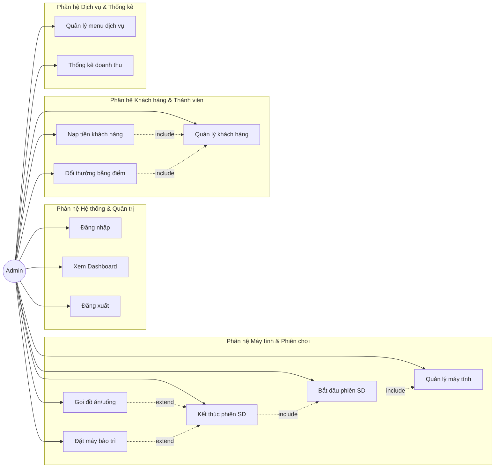

### 3.3.3. Biểu đồ Use Case chi tiết

#### Phân hệ Máy tính & Phiên sử dụng
Biểu đồ mô tả chi tiết các ca sử dụng liên quan đến quản lý trạng thái máy và vòng đời một phiên chơi của khách hàng tại phòng máy.

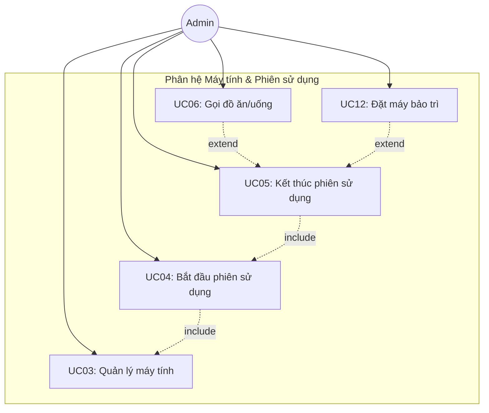

#### Phân hệ Khách hàng & Thành viên
Biểu đồ mô tả chi tiết các tương tác quản lý thông tin khách hàng, luồng tiền nạp và đổi điểm lấy dịch vụ miễn phí.

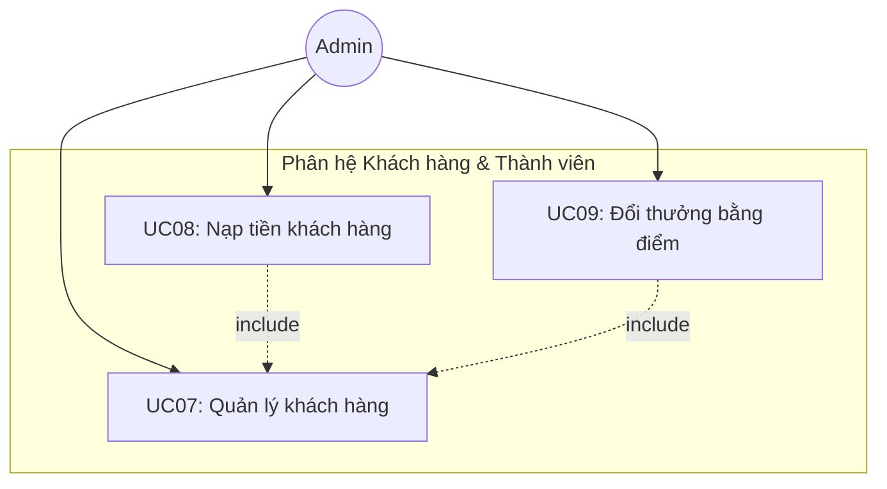

#### Phân hệ Quản trị & Hệ thống
Biểu đồ thể hiện các tác vụ của Admin liên quan tới bảo mật, cấu hình thực đơn dịch vụ và báo cáo tài chính của quán game.

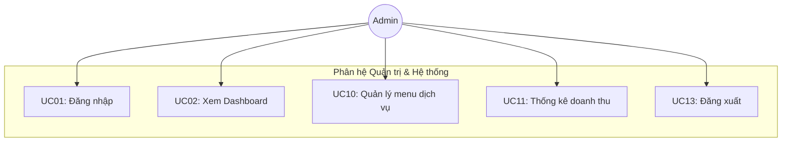

### 3.3.4. Đặc tả các Use Case chi tiết

#### UC01: Đăng nhập

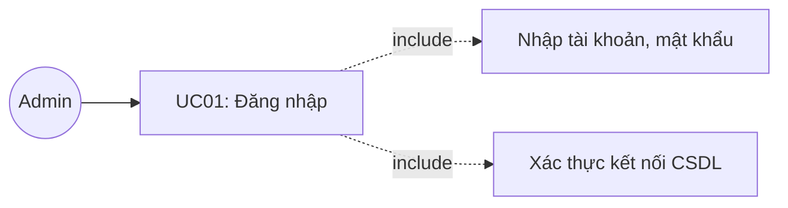

| Thuộc tính | Mô tả |
|-----------|-------|
| **Tên Use Case** | Đăng nhập |
| **Mô tả** | Quản trị viên đăng nhập vào hệ thống để bắt đầu phiên làm việc. |
| **Actor chính** | Admin |
| **Actor phụ** | Hệ thống CSDL H2 |
| **Tiền điều kiện** | Ứng dụng đã khởi động thành công và hiển thị giao diện đăng nhập. |
| **Hậu điều kiện** | Admin đăng nhập hệ thống thành công, hệ thống chuyển sang giao diện quản trị chính. |

**Luồng sự kiện chính:**

| Admin | Hệ thống |
|---|---|
| 1. Khởi động ứng dụng | |
| | 2. Hiển thị màn hình đăng nhập (GiaoDienDangNhap) |
| 3. Nhập tên đăng nhập và mật khẩu | |
| 4. Nhấn nút "ĐĂNG NHẬP" | |
| | 5. Kiểm tra thông tin tài khoản có khớp khớp với cấu hình hệ thống không |
| | 6. Gọi kết nối database để kiểm tra tính sẵn sàng của dữ liệu |
| | 7. Ẩn form đăng nhập và khởi chạy giao diện điều khiển chính (GiaoDienChinh) |

**Luồng sự kiện thay thế và ngoại lệ:**

| Admin | Hệ thống |
|---|---|
| | **Tại bước 5:** Nếu sai tài khoản hoặc mật khẩu → Hệ thống hiển thị hộp thoại cảnh báo: "Tên đăng nhập hoặc mật khẩu không chính xác!" |
| | **Tại bước 5.1:** Quay về bước 3 để nhập lại |
| | **Tại bước 6:** Nếu không kết nối được database nhúng H2 → Hệ thống hiển thị dialog thông báo lỗi kết nối CSDL và hướng dẫn khắc phục |

**Biểu đồ hoạt động phân làn (Activity Diagram Swimlane):**

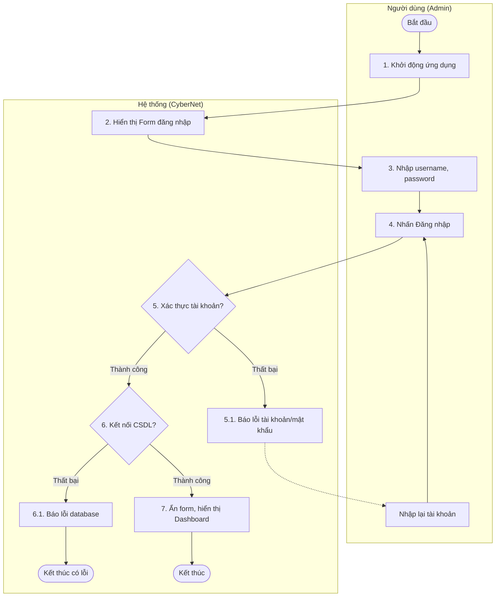

---

#### UC02: Xem Dashboard tổng quan

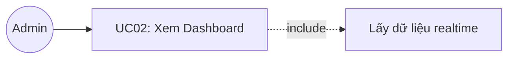

| Thuộc tính | Mô tả |
|-----------|-------|
| **Tên Use Case** | Xem Dashboard tổng quan |
| **Mô tả** | Admin theo dõi các chỉ số hoạt động thực tế theo thời gian thực (realtime) của quán. |
| **Actor chính** | Admin |
| **Actor phụ** | Không |
| **Tiền điều kiện** | Admin đăng nhập thành công vào hệ thống. |
| **Hậu điều kiện** | Hiển thị các số liệu thống kê doanh thu và máy tính chính xác tại thời điểm xem. |

**Luồng sự kiện chính:**

| Admin | Hệ thống |
|---|---|
| 1. Chọn menu "Dashboard" trên thanh sidebar điều hướng | |
| | 2. Thực hiện đếm số máy trống và số máy đang hoạt động từ bảng dữ liệu máy tính |
| | 3. Tính toán tổng doanh thu giờ chơi và doanh thu dịch vụ phát sinh trong ngày hôm nay |
| | 4. Lấy danh sách các phiên sử dụng máy tính đang chạy trong CSDL |
| | 5. Hiển thị 4 thẻ thông tin chỉ số: Máy Trống, Đang Sử Dụng, Doanh Thu Máy, Doanh Thu Dịch Vụ |
| | 6. Hiển thị bảng chi tiết các phiên đang chạy (Mã phiên, máy sử dụng, tên khách, thời gian bắt đầu, tiền tạm tính) |

**Biểu đồ hoạt động phân làn (Activity Diagram Swimlane):**

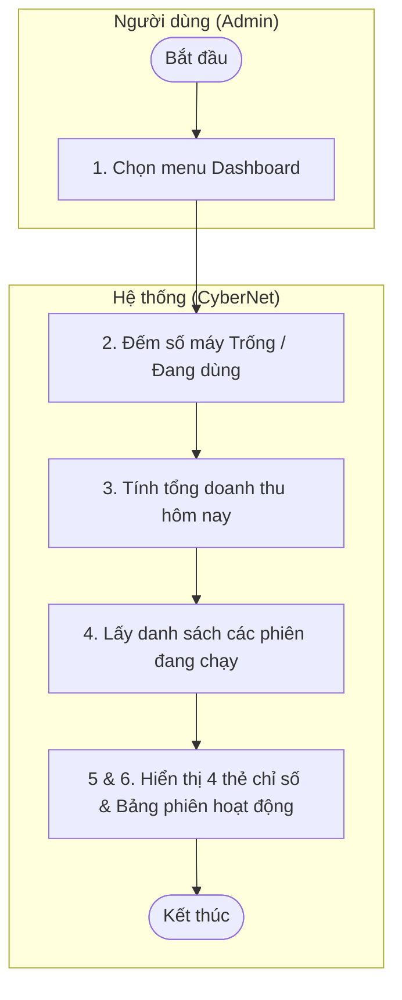

---

#### UC03: Quản lý máy tính

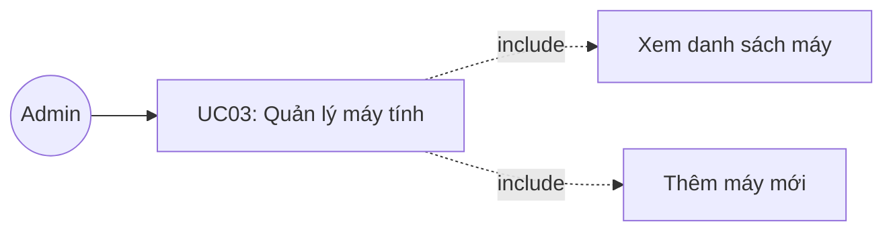

| Thuộc tính | Mô tả |
|-----------|-------|
| **Tên Use Case** | Quản lý máy tính |
| **Mô tả** | Xem danh sách máy tính dưới dạng sơ đồ lưới trực quan, lọc theo trạng thái và thêm máy tính mới. |
| **Actor chính** | Admin |
| **Actor phụ** | Không |
| **Tiền điều kiện** | Admin đăng nhập thành công và chọn phân hệ quản lý máy tính. |
| **Hậu điều kiện** | Dữ liệu máy tính được thêm hoặc lọc đúng theo yêu cầu. |

**Luồng sự kiện chính:**

| Admin | Hệ thống |
|---|---|
| 1. Chọn menu "Máy Tính" trên sidebar | |
| | 2. Lấy toàn bộ danh sách máy tính từ CSDL |
| | 3. Hiển thị lưới máy tính (card UI) với màu sắc hiển thị trạng thái (Xanh: Trống, Đỏ: Đang dùng, Vàng: Bảo trì) |
| 4. Nhấn nút "+ Thêm Máy" | |
| | 5. Hiển thị form thêm máy tính (Tên máy, Loại máy Thường/VIP, cấu hình) |
| 6. Nhập thông tin máy mới và nhấn "Lưu" | |
| | 7. Kiểm tra dữ liệu hợp lệ, thêm máy mới vào CSDL với trạng thái mặc định là "Trống" |
| | 8. Làm mới lưới hiển thị máy tính |

**Luồng sự kiện thay thế và ngoại lệ:**

| Admin | Hệ thống |
|---|---|
| **Tại bước 3a:** Chọn lọc trạng thái (Trống / Đang dùng / Bảo trì) | |
| | **Tại bước 3a.1:** Hệ thống truy vấn tương ứng và cập nhật lại lưới máy |
| | **Tại bước 7:** Nếu tên máy bị trùng hoặc để trống → Hệ thống cảnh báo: "Tên máy không được để trống hoặc trùng lặp!" và yêu cầu nhập lại |

**Biểu đồ hoạt động phân làn (Activity Diagram Swimlane):**

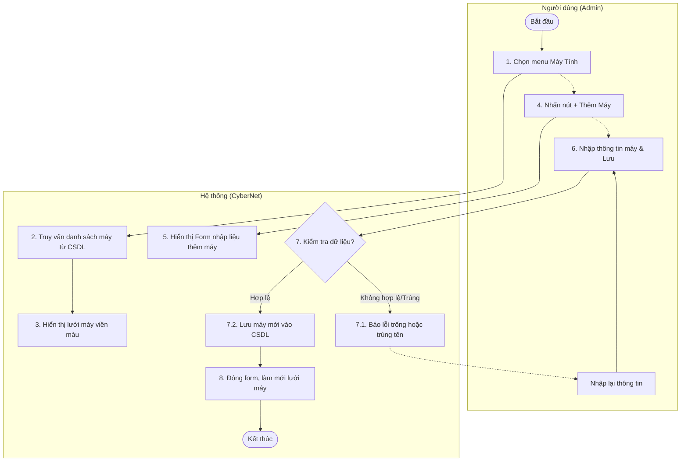

---

#### UC04: Bắt đầu phiên sử dụng

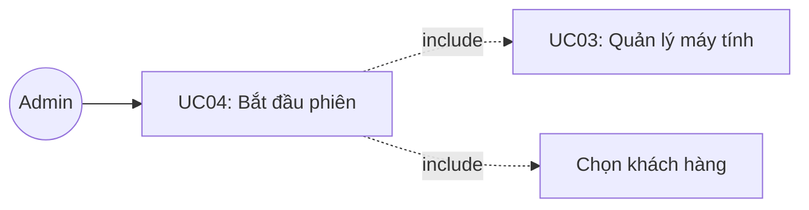

| Thuộc tính | Mô tả |
|-----------|-------|
| **Tên Use Case** | Bắt đầu phiên sử dụng |
| **Mô tả** | Kích hoạt phiên chơi máy tính cho một khách hàng (thành viên hoặc vãng lai). |
| **Actor chính** | Admin |
| **Actor phụ** | Không |
| **Tiền điều kiện** | Có máy tính ở trạng thái "Trống". |
| **Hậu điều kiện** | Phiên chơi được lưu vào CSDL, máy tính chuyển sang trạng thái "Đang dùng". |

**Luồng sự kiện chính:**

| Admin | Hệ thống |
|---|---|
| 1. Click vào một máy tính có trạng thái "Trống" trên lưới | |
| | 2. Hiển thị dialog "Bắt Đầu Phiên Sử Dụng" hiển thị tên máy, loại máy và đơn giá |
| 3. Chọn tài khoản Khách hàng thành viên từ dropdown | |
| 4. Nhấn nút "▶ Bắt Đầu" | |
| | 5. Khởi tạo một đối tượng phiên chơi mới (gioBatDau = thời gian hiện tại) |
| | 6. Thực hiện INSERT bản ghi phiên chơi vào bảng `phien_su_dung` trong CSDL |
| | 7. Cập nhật trạng thái máy tính trong bảng `may_tinh` sang "Đang dùng" |
| | 8. Đóng dialog, làm mới lưới máy tính và thông báo bắt đầu thành công |

**Luồng sự kiện thay thế và ngoại lệ:**

| Admin | Hệ thống |
|---|---|
| 3a. Không chọn khách hàng thành viên mà nhập tên Khách vãng lai | |
| | **Tại bước 3a.1:** Đặt tên khách vãng lai và không lưu liên kết mã khách hàng thành viên |

**Biểu đồ hoạt động phân làn (Activity Diagram Swimlane):**

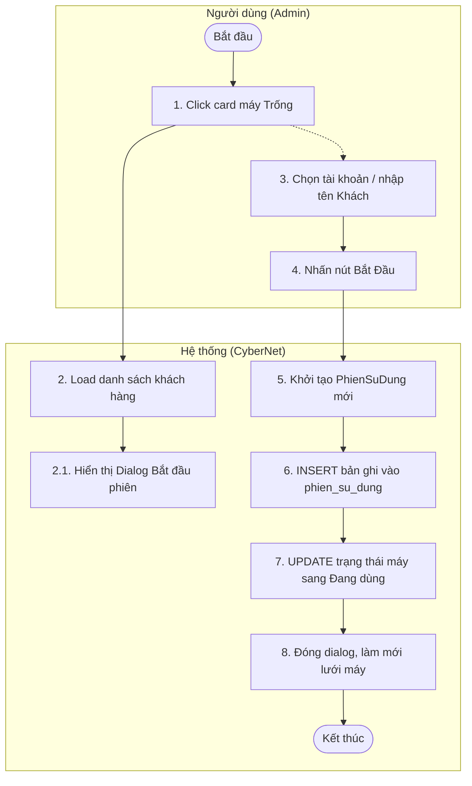

---

#### UC05: Kết thúc phiên sử dụng

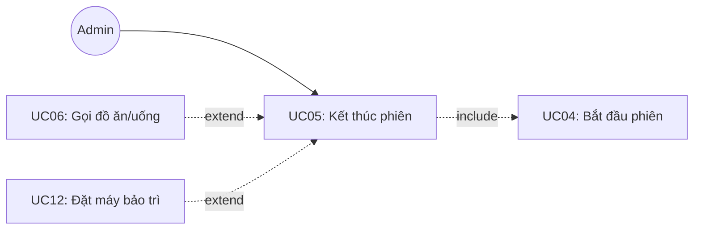

| Thuộc tính | Mô tả |
|-----------|-------|
| **Tên Use Case** | Kết thúc phiên sử dụng |
| **Mô tả** | Tính tiền giờ chơi, tiền dịch vụ, thanh toán hóa đơn và giải phóng máy về trạng thái trống hoặc bảo trì. |
| **Actor chính** | Admin |
| **Actor phụ** | Không |
| **Tiền điều kiện** | Máy tính được chọn đang ở trạng thái "Đang dùng" (có phiên chơi đang chạy). |
| **Hậu điều kiện** | Phiên chơi được cập nhật thời gian kết thúc và tổng tiền; số dư khách thành viên bị trừ; máy tính được giải phóng. |

**Luồng sự kiện chính:**

| Admin | Hệ thống |
|---|---|
| 1. Click vào máy tính đang ở trạng thái "Đang dùng" | |
| | 2. Truy vấn thông tin phiên chơi hiện tại của máy đó |
| | 3. Tính toán thời gian chơi thực tế (làm tròn đến 0.1 giờ) và tiền máy tương ứng |
| | 4. Tính toán tổng tiền các đơn đặt đồ ăn/nước uống đã gọi trong phiên |
| | 5. Hiển thị dialog thanh toán gồm: Tên khách, thời gian bắt đầu, tiền máy, tiền dịch vụ và tổng tiền thanh toán |
| 6. Nhấn nút "⏹ Kết Thúc" để hoàn tất | |
| | 7. Cập nhật thời gian kết thúc và tổng tiền vào bản ghi `phien_su_dung` |
| | 8. Nếu là Khách thành viên: Trừ tiền trực tiếp vào tài khoản, cộng tổng giờ chơi tích lũy và cộng điểm thưởng tương ứng (1 giờ chơi = 1 điểm) |
| | 9. Cập nhật trạng thái máy tính về "Trống" |
| | 10. Đóng dialog, làm mới lưới máy tính và hiển thị thông báo thanh toán thành công |

**Luồng sự kiện thay thế và ngoại lệ:**

| Admin | Hệ thống |
|---|---|
| 6a. Chọn nút "Bảo Trì" thay vì "Kết Thúc" | |
| | **Tại bước 6a.1:** Thực hiện thanh toán bình thường nhưng máy tính được đưa về trạng thái "Bảo trì" |
| | **Tại bước 8:** Nếu tài khoản Khách thành viên không đủ số dư để thanh toán → Hệ thống thông báo yêu cầu nạp thêm tiền hoặc chuyển sang thanh toán bằng tiền mặt trực tiếp |

**Biểu đồ hoạt động phân làn (Activity Diagram Swimlane):**

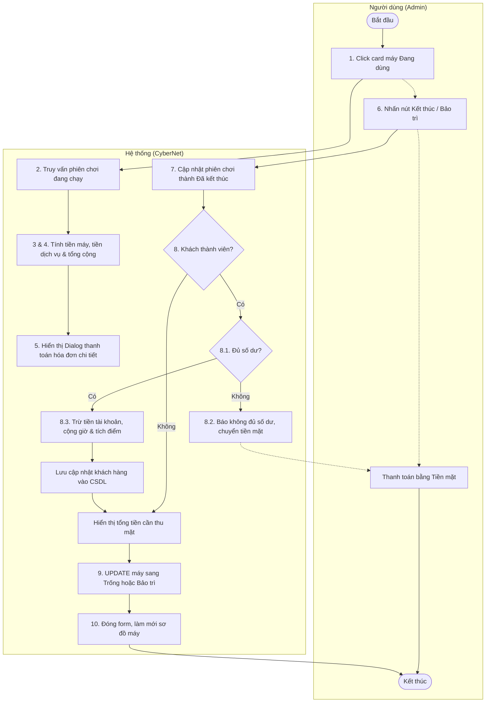

---

#### UC06: Gọi đồ ăn/uống

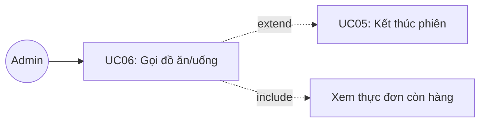

| Thuộc tính | Mô tả |
|-----------|-------|
| **Tên Use Case** | Gọi đồ ăn/uống |
| **Mô tả** | Đặt các món ăn hoặc thức uống cho máy tính đang hoạt động, hóa đơn dịch vụ được tính chung khi kết thúc phiên chơi. |
| **Actor chính** | Admin |
| **Actor phụ** | Không |
| **Tiền điều kiện** | Máy tính được gọi món phải đang ở trạng thái "Đang dùng". |
| **Hậu điều kiện** | Đơn hàng dịch vụ được tạo và liên kết trực tiếp với mã phiên đang chạy. |

**Luồng sự kiện chính:**

| Admin | Hệ thống |
|---|---|
| 1. Click vào máy tính "Đang dùng", trong dialog thông tin nhấn nút "🍔 Gọi Món" | |
| | 2. Lấy danh sách các món ăn, nước uống còn hàng trong thực đơn |
| | 3. Hiển thị bảng menu gọi món (cho phép nhập số lượng) |
| 4. Chọn các món ăn/thức uống và điều chỉnh số lượng tương ứng | |
| 5. Nhấn nút "✓ Xác Nhận Đơn" | |
| | 6. Khởi tạo đơn hàng `don_hang` và các bản ghi chi tiết đơn hàng `chi_tiet_don_hang` |
| | 7. Lưu đơn hàng vào CSDL và gán liên kết với mã phiên chơi hiện tại |
| | 8. Cập nhật lại tổng tiền dịch vụ tạm tính của phiên chơi |

**Luồng sự kiện thay thế và ngoại lệ:**

| Admin | Hệ thống |
|---|---|
| | **Tại bước 5:** Nếu Admin chưa chọn bất kỳ món nào hoặc nhập số lượng không hợp lệ (nhỏ hơn hoặc bằng 0) → Hệ thống hiển thị cảnh báo yêu cầu kiểm tra lại dữ liệu nhập |

**Biểu đồ hoạt động phân làn (Activity Diagram Swimlane):**

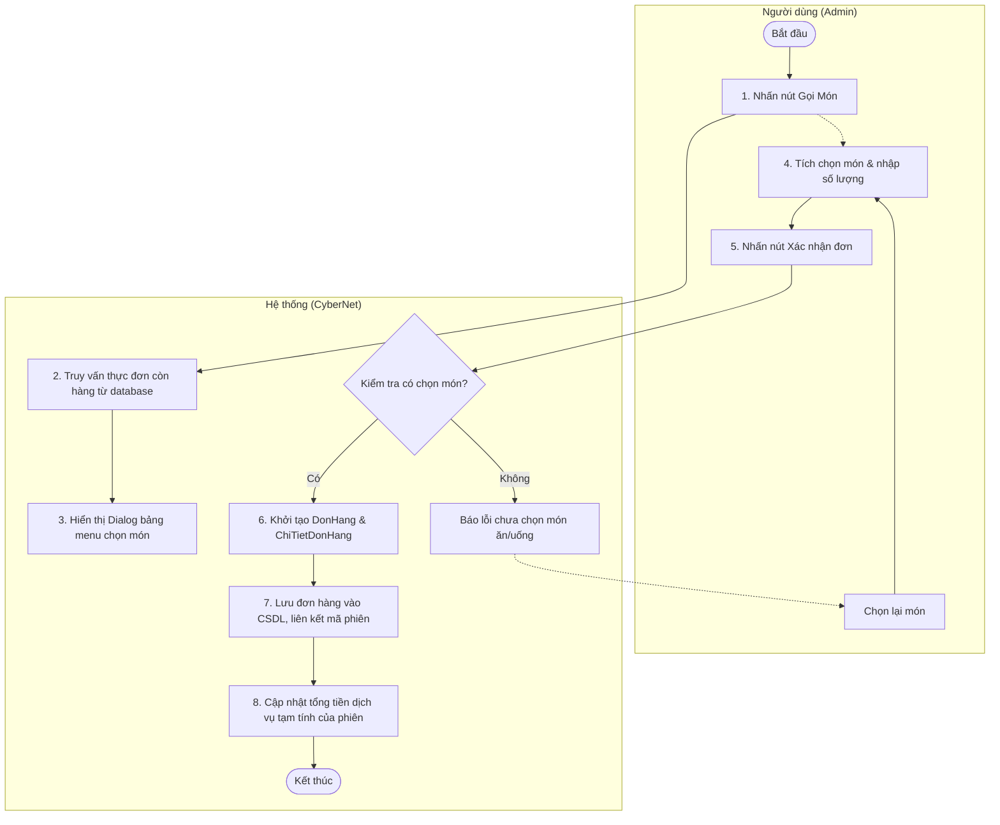

---

#### UC07: Quản lý khách hàng

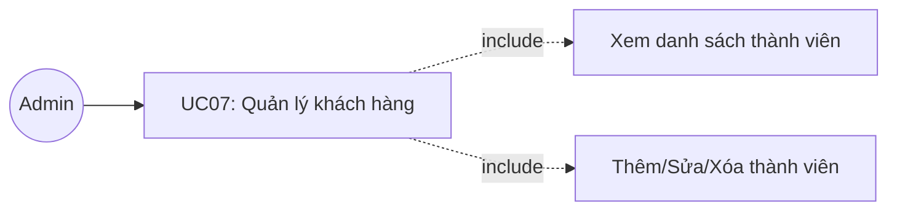

| Thuộc tính | Mô tả |
|-----------|-------|
| **Tên Use Case** | Quản lý khách hàng |
| **Mô tả** | Xem danh sách thành viên, thêm tài khoản mới, cập nhật thông tin hoặc xóa tài khoản khách hàng. |
| **Actor chính** | Admin |
| **Actor phụ** | Không |
| **Tiền điều kiện** | Admin đăng nhập thành công và chọn phân hệ Khách hàng. |
| **Hậu điều kiện** | Dữ liệu khách hàng trong database được cập nhật chính xác. |

**Luồng sự kiện chính:**

| Admin | Hệ thống |
|---|---|
| 1. Chọn menu "Khách Hàng" trên thanh điều hướng | |
| | 2. Lấy toàn bộ danh sách khách hàng từ CSDL và hiển thị lên bảng điều khiển |
| 3. Chọn thao tác thêm mới bằng cách nhấn "+ Thêm Khách" | |
| | 4. Hiển thị form nhập thông tin (Tên khách hàng, Số điện thoại, Số tiền nạp lần đầu) |
| 5. Nhập đầy đủ thông tin yêu cầu và nhấn "Tạo Khách Hàng" | |
| | 6. Kiểm tra tính hợp lệ của số điện thoại và số tiền nạp |
| | 7. Lưu thông tin thành viên mới vào bảng `khach_hang` |
| | 8. Cập nhật lại bảng hiển thị danh sách khách hàng |

**Luồng sự kiện thay thế và ngoại lệ:**

| Admin | Hệ thống |
|---|---|
| 3a. Chọn 1 khách hàng → Nhấn "Sửa" | |
| | **Tại bước 3a.1:** Hiển thị form chỉnh sửa Tên/SĐT và cập nhật database |
| 3b. Chọn 1 khách hàng → Nhấn "Xóa" | |
| | **Tại bước 3b.1:** Hiển thị xác nhận và xóa khách hàng khỏi database |
| 3c. Nhập từ khóa vào ô tìm kiếm → nhấn "Tìm" | |
| | **Tại bước 3c.1:** Lọc hiển thị kết quả tìm kiếm |
| | **Tại bước 6:** Nếu tên trống hoặc tiền nạp ≤ 0 → Thông báo lỗi và yêu cầu nhập lại |

**Biểu đồ hoạt động phân làn (Activity Diagram Swimlane):**

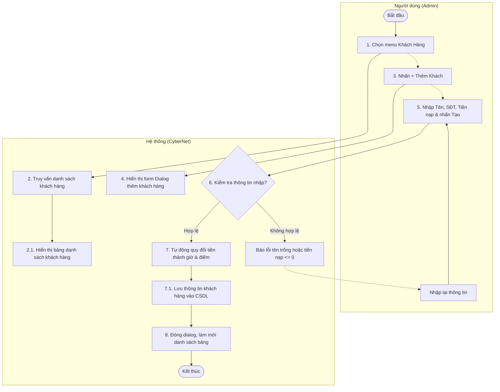

---

#### UC08: Nạp tiền

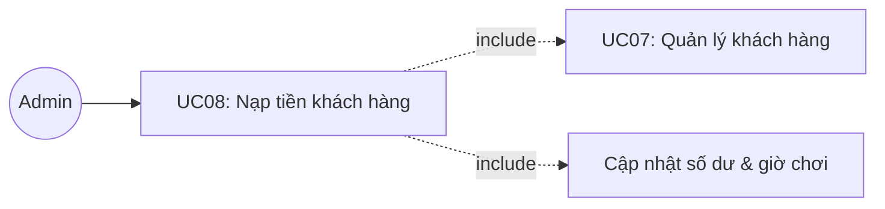

| Thuộc tính | Mô tả |
|-----------|-------|
| **Tên Use Case** | Nạp tiền khách hàng |
| **Mô tả** | Nạp thêm tiền vào tài khoản hội viên của khách hàng, hệ thống tự động quy đổi thành giờ chơi và điểm tích lũy. |
| **Actor chính** | Admin |
| **Actor phụ** | Không |
| **Tiền điều kiện** | Đã chọn một khách hàng thành viên trong danh sách. |
| **Hậu điều kiện** | Tài khoản khách hàng tăng số dư, tăng giờ chơi và điểm tích lũy trong database. |

**Luồng sự kiện chính:**

| Admin | Hệ thống |
|---|---|
| 1. Chọn khách hàng thành viên từ bảng và nhấn nút "💰 Nạp Tiền" | |
| | 2. Hiển thị dialog nạp tiền gồm thông tin khách hàng và ô nhập số tiền nạp |
| 3. Nhập số tiền cần nạp | |
| | 4. Quy đổi thời gian chơi tăng thêm (10.000đ = 1 giờ) và điểm thưởng tương ứng, hiển thị xem trước (preview) trên giao diện |
| 5. Nhấn nút xác nhận "Nạp Tiền" | |
| | 6. Cập nhật số dư tài khoản, tổng giờ chơi và điểm tích lũy của khách hàng trong database |
| | 7. Đóng dialog, làm mới danh sách khách hàng và hiển thị thông báo thành công |

**Luồng sự kiện thay thế và ngoại lệ:**

| Admin | Hệ thống |
|---|---|
| | **Tại bước 3:** Nếu nhập số tiền không phải là số hoặc số tiền nạp nhỏ hơn hoặc bằng 0 → Hệ thống thông báo lỗi: "Số tiền nạp không hợp lệ!" và không cho xác nhận |

**Biểu đồ hoạt động phân làn (Activity Diagram Swimlane):**

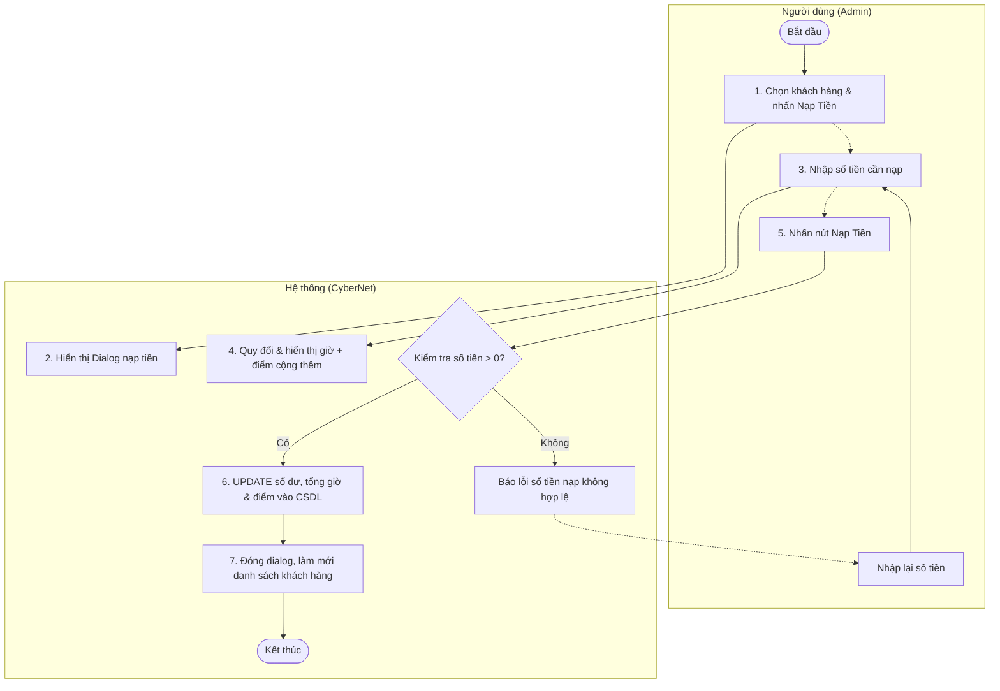

---

#### UC09: Đổi thưởng

```mermaid
graph LR
    Admin((Admin))
    UC09[UC09: Đổi thưởng bằng điểm]
    UC07[UC07: Quản lý khách hàng]
    UC09_Inc1[Ghi lịch sử đổi quà]
    Admin --> UC09
    UC09 -.->|include| UC07
    UC09 -.->|include| UC09_Inc1
```

| Thuộc tính | Mô tả |
|-----------|-------|
| **Tên Use Case** | Đổi thưởng bằng điểm |
| **Mô tả** | Khách hàng thành viên sử dụng điểm tích lũy (⭐) để đổi lấy đồ ăn hoặc thức uống miễn phí trong thực đơn hỗ trợ đổi thưởng. |
| **Actor chính** | Admin |
| **Actor phụ** | Không |
| **Tiền điều kiện** | Khách hàng được chọn có điểm tích lũy lớn hơn 0 và đã chọn món quà đổi thưởng hợp lệ. |
| **Hậu điều kiện** | Điểm tích lũy của khách hàng bị trừ, hệ thống ghi nhận lịch sử đổi thưởng vào database. |

**Luồng sự kiện chính:**

| Admin | Hệ thống |
|---|---|
| 1. Chọn khách hàng thành viên và nhấn nút "🎁 Đổi Thưởng" | |
| | 2. Hiển thị dialog đổi thưởng có số điểm hiện tại của khách và danh sách thực đơn hỗ trợ đổi thưởng (các món có cấu hình điểm đổi > 0) |
| 3. Chọn các món ăn/nước uống muốn đổi và điều chỉnh số lượng | |
| | 4. Tự động tính tổng điểm cần dùng và hiển thị điểm còn lại sau khi đổi |
| 5. Nhấn nút "Đổi Thưởng" | |
| | 6. Kiểm tra xem điểm tích lũy hiện có của khách hàng có đủ để thực hiện giao dịch hay không |
| | 7. Lưu các bản ghi lịch sử đổi thưởng vào bảng `lich_su_doi_thuong` |
| | 8. Thực hiện trừ điểm tích lũy tương ứng trong bảng `khach_hang` |
| | 9. Làm mới thông tin giao diện khách hàng và thông báo đổi thưởng thành công |

**Luồng sự kiện thay thế và ngoại lệ:**

| Admin | Hệ thống |
|---|---|
| | **Tại bước 6:** Nếu tổng số điểm cần đổi lớn hơn số điểm tích lũy hiện có của khách hàng → Hệ thống hiển thị thông báo lỗi: "Không đủ điểm để thực hiện đổi thưởng!" và từ chối giao dịch |

**Biểu đồ hoạt động phân làn (Activity Diagram Swimlane):**

```mermaid
flowchart TD
    subgraph Admin_Lanes["Người dùng (Admin)"]
        Start([Bắt đầu]) --> SelectKH[1. Chọn khách hàng & nhấn Đổi Thưởng]
        SelectKH -.-> SelectGifts[3. Tích chọn các phần quà muốn đổi]
        SelectGifts --> ClickConfirm[5. Nhấn nút Đổi Thưởng]
        SelectAgain[Chọn lại phần quà] --> SelectGifts
    end
    subgraph System_Lanes["Hệ thống (CyberNet)"]
        SelectKH --> ShowDlg[2. Hiển thị Dialog đổi quà & số điểm tích lũy]
        SelectGifts --> CalcPoints[4. Tính tổng điểm cần & điểm còn lại]
        ClickConfirm --> CheckPoints{6. Điểm khách >= Điểm cần?}
        CheckPoints -->|Không| AlertError[Báo lỗi không đủ điểm đổi thưởng]
        AlertError -.-> SelectAgain
        CheckPoints -->|Có| WriteHistory[7. INSERT ghi nhận vào bảng lịch sử đổi thưởng]
        WriteHistory --> DeductPoints[8. UPDATE trừ điểm khách hàng trong CSDL]
        DeductPoints --> RefreshTable[9. Đóng dialog, cập nhật lại bảng khách hàng]
        RefreshTable --> End([Kết thúc])
    end
```

---

#### UC10: Quản lý menu dịch vụ

```mermaid
graph LR
    Admin((Admin))
    UC10[UC10: Quản lý menu dịch vụ]
    UC10_Inc1[Xem thực đơn]
    UC10_Inc2[Thêm/Sửa/Xóa món]
    Admin --> UC10
    UC10 -.->|include| UC10_Inc1
    UC10 -.->|include| UC10_Inc2
```

| Thuộc tính | Mô tả |
|-----------|-------|
| **Tên Use Case** | Quản lý menu dịch vụ |
| **Mô tả** | Admin quản lý danh sách các món ăn, nước uống phục vụ tại quán (CRUD thực đơn). |
| **Actor chính** | Admin |
| **Actor phụ** | Không |
| **Tiền điều kiện** | Admin đăng nhập thành công và lựa chọn phân hệ Dịch vụ. |
| **Hậu điều kiện** | Danh sách thực đơn trong database được cập nhật (thêm/sửa/xóa món ăn). |

**Luồng sự kiện chính:**

| Admin | Hệ thống |
|---|---|
| 1. Chọn menu "Dịch Vụ" trên sidebar điều hướng | |
| | 2. Truy vấn danh sách các dịch vụ ăn uống từ bảng `do_an_uong` |
| | 3. Hiển thị bảng menu (Tên món, Phân loại, Đơn giá, Điểm đổi thưởng, Tình trạng còn hàng) |
| 4. Thực hiện các thao tác Thêm món / Sửa món / Xóa món | |
| | 5. Hiển thị form nhập liệu tương ứng với thao tác được chọn |
| 6. Điền thông tin món ăn và nhấn "Lưu" | |
| | 7. Kiểm tra dữ liệu hợp lệ (tên không trống, giá bán > 0) và lưu vào database |
| | 8. Làm mới bảng hiển thị thực đơn dịch vụ |

**Biểu đồ hoạt động phân làn (Activity Diagram Swimlane):**

```mermaid
flowchart TD
    subgraph Admin_Lanes["Người dùng (Admin)"]
        Start([Bắt đầu]) --> SelectTab[1. Chọn menu Dịch Vụ]
        SelectTab -.-> ChooseCRUD[4. Chọn Thêm/Sửa/Xóa món]
        ChooseCRUD -.-> InputInfo[6. Điền thông tin & nhấn Lưu]
        InputAgain[Nhập lại dữ liệu] --> InputInfo
    end
    subgraph System_Lanes["Hệ thống (CyberNet)"]
        SelectTab --> FetchMenu[2. Truy vấn CSDL danh sách menu đồ ăn uống]
        FetchMenu --> ShowTable[3. Hiển thị bảng danh mục dịch vụ]
        ChooseCRUD --> ShowDlg[5. Hiển thị Dialog form nhập thông tin món]
        InputInfo --> Validate[7. Kiểm tra dữ liệu hợp lệ?]
        Validate -->|Không hợp lệ| AlertError[Báo lỗi dữ liệu không hợp lệ]
        AlertError -.-> InputAgain
        Validate -->|Hợp lệ| UpdateDB[7.1. Lưu thông tin món vào CSDL]
        UpdateDB --> RefreshTable[8. Đóng form, làm mới bảng thực đơn]
        RefreshTable --> End([Kết thúc])
    end
```

---

#### UC11: Thống kê doanh thu

```mermaid
graph LR
    Admin((Admin))
    UC11[UC11: Thống kê doanh thu]
    UC11_Inc1[Vẽ biểu đồ doanh thu]
    Admin --> UC11
    UC11 -.->|include| UC11_Inc1
```

| Thuộc tính | Mô tả |
|-----------|-------|
| **Tên Use Case** | Thống kê doanh thu |
| **Mô tả** | Xem báo cáo tài chính tổng hợp về doanh thu giờ chơi và doanh thu dịch vụ theo khoảng thời gian tùy chọn dưới dạng biểu đồ và bảng số liệu. |
| **Actor chính** | Admin |
| **Actor phụ** | Không |
| **Tiền điều kiện** | Admin đăng nhập thành công và lựa chọn phân hệ Thống kê. |
| **Hậu điều kiện** | Hiển thị biểu đồ doanh thu và bảng tổng hợp số liệu chính xác theo khoảng ngày được chọn. |

**Luồng sự kiện chính:**

| Admin | Hệ thống |
|---|---|
| 1. Chọn menu "Thống Kê" trên thanh điều hướng | |
| | 2. Hiển thị giao diện bộ lọc thống kê (Từ ngày, Đến ngày) và các nút chọn nhanh (7 ngày qua, 30 ngày qua, Hôm nay) |
| 3. Chọn khoảng thời gian thống kê và nhấn nút "🔍 Xem thống kê" | |
| | 4. Thực hiện truy vấn tổng tiền máy và tiền dịch vụ từ các phiên chơi đã kết thúc trong khoảng thời gian đã chọn |
| | 5. Tổng hợp dữ liệu doanh thu theo từng ngày |
| | 6. Vẽ biểu đồ cột trực quan hiển thị doanh thu tăng trưởng theo thời gian sử dụng Graphics2D |
| | 7. Hiển thị bảng tổng hợp chi tiết (Ngày, tổng số phiên hoạt động, doanh thu) và các thẻ chỉ số (Tổng doanh thu, Tổng số phiên, Doanh thu trung bình/ngày) |

**Luồng sự kiện thay thế và ngoại lệ:**

| Admin | Hệ thống |
|---|---|
| | **Tại bước 3:** Nếu ngày bắt đầu được chọn lớn hơn ngày kết thúc → Hệ thống thông báo lỗi: "Khoảng ngày thống kê không hợp lệ!" và yêu cầu chọn lại |

**Biểu đồ hoạt động phân làn (Activity Diagram Swimlane):**

```mermaid
flowchart TD
    subgraph Admin_Lanes["Người dùng (Admin)"]
        Start([Bắt đầu]) --> SelectTab[1. Chọn menu Thống Kê]
        SelectTab -.-> ChooseDate[3. Chọn khoảng ngày & bấm Xem Thống Kê]
        SelectAgain[Chọn lại ngày] --> ChooseDate
    end
    subgraph System_Lanes["Hệ thống (CyberNet)"]
        SelectTab --> ShowUI[2. Hiển thị bộ lọc JDateChooser & các nút chọn nhanh]
        ChooseDate --> ValidateDate{Kiểm tra Ngày bắt đầu <= Ngày kết thúc?}
        ValidateDate -->|Không| AlertError[Báo lỗi khoảng ngày không hợp lệ]
        AlertError -.-> SelectAgain
        ValidateDate -->|Có| FetchData[4 & 5. Truy vấn CSDL, tổng hợp doanh thu theo ngày]
        FetchData --> DrawChart[6. Vẽ biểu đồ cột Graphics2D]
        DrawChart --> ShowResult[7. Hiển thị biểu đồ, 3 thẻ chỉ số & bảng doanh thu]
        ShowResult --> End([Kết thúc])
    end
```

---

#### UC12: Đặt máy bảo trì

```mermaid
graph LR
    Admin((Admin))
    UC12[UC12: Đặt máy bảo trì]
    UC05[UC05: Kết thúc phiên]
    Admin --> UC12
    UC12 -.->|extend| UC05
```

| Thuộc tính | Mô tả |
|-----------|-------|
| **Tên Use Case** | Đặt máy bảo trì |
| **Mô tả** | Đưa một máy tính vào trạng thái bảo trì hoặc khóa máy do sự cố phần cứng/phần mềm. |
| **Actor chính** | Admin |
| **Actor phụ** | Không |
| **Tiền điều kiện** | Máy tính được chọn đang ở trạng thái "Trống" hoặc đang thanh toán phiên chơi. |
| **Hậu điều kiện** | Trạng thái máy tính được cập nhật thành "Bảo trì" trong database, không cho phép mở phiên chơi mới trên máy này. |

**Luồng sự kiện chính:**

| Admin | Hệ thống |
|---|---|
| 1. Click vào máy tính đang hoạt động hoặc trống trên lưới | |
| | 2. Trong dialog thông tin máy, nhấn nút "Bảo Trì" |
| 3. Xác nhận chuyển trạng thái máy tính sang bảo trì | |
| | 4. Cập nhật trạng thái máy tính thành "Bảo trì" trong CSDL |
| | 5. Đóng dialog, làm mới lưới máy tính (card máy chuyển sang viền màu Vàng và có nhãn trạng thái "Bảo trì") |

**Biểu đồ hoạt động phân làn (Activity Diagram Swimlane):**

```mermaid
flowchart TD
    subgraph Admin_Lanes["Người dùng (Admin)"]
        Start([Bắt đầu]) --> SelectComp[1. Click vào máy tính trên lưới]
        SelectComp -.-> ClickConfirm[3. Xác nhận đặt Bảo trì]
    end
    subgraph System_Lanes["Hệ thống (CyberNet)"]
        SelectComp --> ShowDlg[2. Hiển thị Dialog thông tin máy và nút Bảo Trì]
        ClickConfirm --> UpdateDB[4. UPDATE trạng thái máy sang Bảo trì trong CSDL]
        UpdateDB --> RefreshGrid[5. Đóng dialog, cập nhật card máy sang viền màu Vàng]
        RefreshGrid --> End([Kết thúc])
    end
```

---

#### UC13: Đăng xuất

```mermaid
graph LR
    Admin((Admin))
    UC13[UC13: Đăng xuất]
    UC13_Inc1[Đóng kết nối CSDL]
    Admin --> UC13
    UC13 -.->|include| UC13_Inc1
```

| Thuộc tính | Mô tả |
|-----------|-------|
| **Tên Use Case** | Đăng xuất |
| **Mô tả** | Thoát khỏi phiên làm việc hiện tại và đóng ứng dụng an toàn. |
| **Actor chính** | Admin |
| **Actor phụ** | Không |
| **Tiền điều kiện** | Ứng dụng đang hoạt động ở màn hình điều khiển chính. |
| **Hậu điều kiện** | Ứng dụng được giải phóng bộ nhớ và đóng hoàn toàn. |

**Luồng sự kiện chính:**

| Admin | Hệ thống |
|---|---|
| 1. Click vào nút "Đăng Xuất" ở góc cuối thanh sidebar | |
| | 2. Hiển thị hộp thoại hỏi xác nhận: "Bạn có chắc chắn muốn đăng xuất và đóng ứng dụng?" |
| 3. Chọn "Yes" | |
| | 4. Thực hiện đóng kết nối CSDL hiện tại để đảm bảo an toàn dữ liệu |
| | 5. Giải phóng tài nguyên giao diện (dispose) và thoát chương trình (System.exit) |

**Luồng sự kiện thay thế và ngoại lệ:**

| Admin | Hệ thống |
|---|---|
| | **Tại bước 3:** Nếu chọn "No" → Hệ thống đóng dialog xác nhận và giữ nguyên trạng thái giao diện chính để tiếp tục làm việc |

**Biểu đồ hoạt động phân làn (Activity Diagram Swimlane):**

```mermaid
flowchart TD
    subgraph Admin_Lanes["Người dùng (Admin)"]
        Start([Bắt đầu]) --> ClickLogout[1. Nhấn Đăng Xuất trên sidebar]
        ClickLogout -.-> ConfirmLogout[3. Xác nhận chọn Yes / No]
        ConfirmLogout -->|Yes| EndApp
        ConfirmLogout -->|No| Cancel
    end
    subgraph System_Lanes["Hệ thống (CyberNet)"]
        ClickLogout --> ShowConfirm[2. Hiển thị hộp thoại hỏi xác nhận]
        EndApp[Xác nhận Yes] --> CloseDB[4. Đóng kết nối CSDL H2 an toàn]
        CloseDB --> DisposeGUI[5. Giải phóng giao diện & Thoát ứng dụng]
        DisposeGUI --> End([Kết thúc chương trình])
        Cancel[Xác nhận No] --> ResumeGUI[Đóng dialog, tiếp tục sử dụng]
        ResumeGUI --> EndSession([Tiếp tục phiên làm việc])
    end
```

---

## 3.4. Phân tích hành vi và cấu trúc hệ thống

### 3.4.1. Biểu đồ hoạt động (Activity Diagram)

#### 1. Luồng Bắt đầu phiên chơi (UC04)

```mermaid
flowchart TD
    Start([Bắt đầu]) --> ClickEmpty[Admin click máy Trống]
    ClickEmpty --> LoadKH[Hệ thống load danh sách khách hàng]
    LoadKH --> ShowDlg[Hiển thị dialog Bắt Đầu Phiên]
    ShowDlg --> SelectKH[Admin chọn khách hàng hoặc nhập tên vãng lai]
    SelectKH --> ClickStart[Nhấn Bắt Đầu]
    ClickStart --> CreateSession[Tạo đối tượng PhienSuDung mới]
    CreateSession --> DbInsert[INSERT vào bảng phien_su_dung]
    DbInsert --> DbUpdate[UPDATE trạng thái máy sang Đang dùng]
    DbUpdate --> RefreshGrid[Làm mới sơ đồ máy tính]
    RefreshGrid --> Stop([Kết thúc])
```

#### 2. Luồng Gọi đồ ăn/uống (UC06)

```mermaid
flowchart TD
    Start([Bắt đầu]) --> ClickActive[Admin click máy Đang dùng]
    ClickActive --> ClickOrder[Nhấn Gọi Món]
    ClickOrder --> LoadMenu[Hệ thống load menu dịch vụ còn hàng]
    LoadMenu --> ShowMenu[Hiển thị bảng menu dịch vụ]
    ShowMenu --> SelectItems[Admin chọn món ăn/uống & chỉnh số lượng]
    SelectItems --> ClickConfirm[Nhấn Xác nhận đơn]
    CheckSelected{Có chọn món nào không?}
    ClickConfirm --> CheckSelected
    CheckSelected -->|Không| ErrorMsg[Hiển thị cảnh báo chưa chọn món]
    ErrorMsg --> SelectItems
    CheckSelected -->|Có| CreateOrder[Tạo DonHang & ChiTietDonHang]
    CreateOrder --> DbInsert[INSERT đơn hàng & chi tiết vào CSDL]
    DbInsert --> UpdateSession[Cập nhật tổng tiền dịch vụ của phiên chơi]
    UpdateSession --> RefreshUI[Đóng dialog, thông báo thành công]
    RefreshUI --> Stop([Kết thúc])
```

#### 3. Luồng Kết thúc phiên chơi & Thanh toán (UC05)

```mermaid
flowchart TD
    Start([Bắt đầu]) --> ClickActive[Admin click máy Đang dùng]
    ClickActive --> LoadSession[Hệ thống truy vấn phiên chơi của máy]
    LoadSession --> CalcTime[Tính thời gian thực tế chơi & tiền máy]
    CalcTime --> CalcService[Tính tổng tiền dịch vụ ăn uống]
    CalcService --> ShowBill[Hiển thị dialog thanh toán hóa đơn chi tiết]
    ShowBill --> SelectAction{Admin chọn hành động}
    SelectAction -->|Bảo trì| UpdateBaoTri[UPDATE máy sang Bảo trì]
    SelectAction -->|Kết thúc| DbUpdateSession[UPDATE phiên chơi: trạng thái Đã kết thúc]
    
    DbUpdateSession --> CheckKH{Khách thành viên?}
    CheckKH -->|Không| ShowFinal[Hiển thị tổng tiền chơi cần thu mặt]
    CheckKH -->|Có| CheckBalance{Tài khoản đủ tiền?}
    
    CheckBalance -->|Không| AlertBalance[Báo lỗi không đủ số dư]
    AlertBalance --> ShowFinal
    
    CheckBalance -->|Có| DeductBalance[Trừ tiền tài khoản + Cộng giờ chơi + Cộng điểm]
    DeductBalance --> DbUpdateKH[UPDATE số dư & điểm khách hàng vào CSDL]
    DbUpdateKH --> ShowFinal
    
    ShowFinal --> DbUpdatePC[UPDATE trạng thái máy chơi sang Trống]
    UpdateBaoTri --> DbUpdatePC
    DbUpdatePC --> RefreshUI[Đóng dialog, làm mới sơ đồ máy]
    RefreshUI --> Stop([Kết thúc])
```

#### 4. Luồng Đổi thưởng bằng điểm (UC09)

```mermaid
flowchart TD
    Start([Bắt đầu]) --> SelectKH[Admin chọn khách hàng]
    SelectKH --> ClickReward[Nhấn Đổi Thưởng]
    ClickReward --> LoadRewards[Hệ thống tải danh sách món hỗ trợ đổi quà]
    LoadRewards --> ShowDlg[Hiển thị dialog đổi quà & điểm hiện có của khách]
    ShowDlg --> SelectGifts[Admin chọn quà & số lượng]
    SelectGifts --> CalcPoints[Tính tổng điểm cần dùng]
    CalcPoints --> ClickConfirm[Nhấn Đổi Thưởng]
    ClickConfirm --> CheckPoints{Điểm hiện có >= Điểm cần đổi?}
    CheckPoints -->|Không| AlertError[Hiển thị thông báo không đủ điểm]
    AlertError --> SelectGifts
    CheckPoints -->|Có| DbHistory[INSERT lịch sử đổi quà vào CSDL]
    DbHistory --> DbUpdateKH[UPDATE trừ điểm tích lũy của khách hàng]
    DbUpdateKH --> RefreshList[Làm mới danh sách khách hàng]
    RefreshList --> Stop([Kết thúc])
```

---

### 3.4.2. Biểu đồ tuần tự (Sequence Diagram)

#### 1. Đăng nhập (UC01)

```mermaid
sequenceDiagram
    actor Admin
    participant G as GiaoDienDangNhap
    participant C as DieuKhienDangNhap
    participant K as KetNoiCSDL
    participant H2 as H2 Database
    participant M as GiaoDienChinh

    Admin->>G: Nhập username, password
    Admin->>G: Nhấn nút "ĐĂNG NHẬP"
    G->>C: actionPerformed(ActionEvent)
    C->>C: Kiểm tra logic (username == "admin" && password == "admin")
    alt Sai thông tin đăng nhập
        C-->>G: hienThongBao("Sai tài khoản hoặc mật khẩu!")
        G-->>Admin: Hiển thị cảnh báo lỗi
    else Thông tin đăng nhập đúng
        C->>K: kiemTraKetNoi()
        K->>H2: Mở kết nối kiểm tra
        H2-->>K: Kết nối OK
        K-->>C: true
        C->>G: setVisible(false)
        C->>G: dispose()
        C->>M: new GiaoDienChinh()
        M->>H2: Lấy dữ liệu Dashboard
        H2-->>M: Trả về số liệu
        M-->>Admin: Hiển thị giao diện chính (Dashboard panel)
    end
```

#### 2. Bắt đầu phiên chơi (UC04)

```mermaid
sequenceDiagram
    actor Admin
    participant P as PanelMayTinh
    participant KH as KhachHangDAO
    participant PS as PhienSuDungDAO
    participant MT as MayTinhDAO
    participant H2 as H2 Database

    Admin->>P: Click vào card máy "Trống"
    P->>KH: layTatCa()
    KH->>H2: SELECT * FROM khach_hang
    H2-->>KH: ResultSet danh sách khách hàng
    KH-->>P: List<KhachHang>
    P-->>Admin: Hiển thị dialog "Bắt đầu phiên"
    Admin->>P: Chọn khách hàng (hoặc Khách vãng lai) & nhấn "Bắt Đầu"
    P->>PS: batDauPhien(PhienSuDung)
    PS->>H2: INSERT INTO phien_su_dung (ma_may, ten_khach, gio_bat_dau, ...)
    H2-->>PS: Thực thi thành công
    PS-->>P: true
    P->>MT: capNhatTrangThai(maMay, "Đang dùng")
    MT->>H2: UPDATE may_tinh SET trang_thai = 'Đang dùng' WHERE ma = maMay
    H2-->>MT: Thực thi thành công
    MT-->>P: true
    P->>P: lamMoiMayTinh() (Load lại lưới máy)
    P-->>Admin: Hiển thị máy chơi chuyển sang màu Đỏ
```

#### 3. Gọi đồ ăn/uống (UC06)

```mermaid
sequenceDiagram
    actor Admin
    participant D as DialogGiaoMon
    participant DA as DoAnUongDAO
    participant DH as DonHangDAO
    participant H2 as H2 Database

    Admin->>D: Click nút "Gọi Món" trên dialog phiên
    D->>DA: layConHang()
    DA->>H2: SELECT * FROM do_an_uong WHERE con_hang = true
    H2-->>DA: ResultSet thực đơn ăn uống
    DA-->>D: List<DoAnUong>
    D-->>Admin: Hiển thị bảng danh mục đồ ăn uống
    Admin->>D: Tick chọn các món, nhập số lượng & nhấn "Xác Nhận Đơn"
    D->>DH: taoDonHang(DonHang)
    DH->>H2: INSERT INTO don_hang (ma_phien, ma_may, tong_gia, ...)
    H2-->>DH: Lấy ma_don_hang tự sinh
    loop Với mỗi món được chọn
        DH->>H2: INSERT INTO chi_tiet_don_hang (ma_don_hang, ma_do_an, so_luong, ...)
    end
    H2-->>DH: Lưu thành công chi tiết
    DH-->>D: true
    D-->>Admin: Hiển thị thông báo "Gọi món thành công!"
```

#### 4. Kết thúc phiên & Thanh toán (UC05)

```mermaid
sequenceDiagram
    actor Admin
    participant D as DialogThanhToan
    participant PS as PhienSuDungDAO
    participant DH as DonHangDAO
    participant KH as KhachHangDAO
    participant MT as MayTinhDAO
    participant H2 as H2 Database

    Admin->>D: Click card máy "Đang dùng"
    D->>PS: layPhienDangChayTheoMay(maMay)
    PS->>H2: SELECT * FROM phien_su_dung WHERE ma_may = maMay AND trang_thai = 'Đang chạy'
    H2-->>PS: ResultSet phiên sử dụng
    PS-->>D: PhienSuDung
    D->>DH: layTongTienDonHang(maPhien)
    DH->>H2: SELECT SUM(tong_gia) FROM don_hang WHERE ma_phien = maPhien
    H2-->>DH: Tổng tiền dịch vụ (tienDV)
    DH-->>D: tienDV
    D->>D: Tính tiền máy = soGio * giaMoiGio. Tính tổng cộng = tienMay + tienDV
    D-->>Admin: Hiển thị chi tiết hóa đơn thanh toán
    Admin->>D: Nhấn nút "⏹ Kết Thúc"
    D->>PS: ketThucPhien(maPhien, tongTien)
    PS->>H2: UPDATE phien_su_dung SET gio_ket_thuc = now(), tong_tien = tongTien, trang_thai = 'Đã kết thúc'
    H2-->>PS: Thành công
    alt Khách hàng là thành viên
        D->>KH: truTienVaCongGioDiem(maKH, tongTien, soGio, diemDuocCong)
        KH->>H2: UPDATE khach_hang SET so_du = so_du - tongTien, tong_gio = tong_gio + soGio, diem = diem + diemDuocCong WHERE ma = maKH
        H2-->>KH: Thành công
    end
    D->>MT: capNhatTrangThai(maMay, "Trống")
    MT->>H2: UPDATE may_tinh SET trang_thai = 'Trống' WHERE ma = maMay
    H2-->>MT: Thành công
    D->>D: lamMoiSodoMay()
    D-->>Admin: Thông báo thanh toán thành công, máy chuyển sang màu Xanh
```

#### 5. Nạp tiền khách hàng (UC08)

```mermaid
sequenceDiagram
    actor Admin
    participant D as DialogNapTien
    participant KH as KhachHangDAO
    participant H2 as H2 Database

    Admin->>D: Chọn khách hàng & nhấn "Nạp Tiền"
    D-->>Admin: Hiển thị form nạp tiền
    Admin->>D: Nhập số tiền nạp & nhấn "Xác nhận nạp"
    D->>KH: napTienVaCongGioDiem(maKH, soTien)
    KH->>H2: UPDATE khach_hang SET so_du = so_du + soTien, tong_gio = tong_gio + (soTien/10000), diem = diem + (soTien/10000) WHERE ma = maKH
    H2-->>KH: Thành công
    KH-->>D: true
    D-->>Admin: Thông báo "Nạp tiền thành công! Cộng thêm X giờ chơi và X điểm!"
```

#### 6. Đổi thưởng bằng điểm (UC09)

```mermaid
sequenceDiagram
    actor Admin
    participant D as DialogDoiThuong
    participant KH as KhachHangDAO
    participant LS as LichSuDoiThuongDAO
    participant H2 as H2 Database

    Admin->>D: Chọn khách hàng & nhấn "Đổi Thưởng"
    D-->>Admin: Hiển thị dialog điểm hiện có & danh mục quà tặng
    Admin->>D: Chọn các phần quà và nhấn "Đổi Thưởng"
    D->>D: Kiểm tra điểm tích lũy của khách hàng
    alt Điểm tích lũy không đủ
        D-->>Admin: hienThongBao("Không đủ điểm tích lũy!")
    else Điểm tích lũy hợp lệ
        loop Với mỗi món quà được chọn
            D->>LS: ghiLichSu(maKH, maDoAn, soLuong, diemDoi)
            LS->>H2: INSERT INTO lich_su_doi_thuong (ma_khach_hang, ma_do_an, so_luong, diem_doi, ngay_doi)
            H2-->>LS: Thành công
        end
        D->>KH: truDiem(maKH, tongDiemDaDoi)
        KH->>H2: UPDATE khach_hang SET diem = diem - tongDiemDaDoi WHERE ma = maKH
        H2-->>KH: Thành công
        KH-->>D: true
        D-->>Admin: Thông báo "Đổi quà thành công! Đã trừ X điểm!"
    end
```

---

### 3.4.3. Biểu đồ lớp phân tích (Class Diagram)

```mermaid
classDiagram
    class NguoiDung {
        -int ma
        -String tenDangNhap
        -String matKhau
        -String vaiTro
        +getMa() int
        +getTenDangNhap() String
        +getMatKhau() String
        +getVaiTro() String
    }

    class MayTinh {
        -int ma
        -String ten
        -String loai
        -double giaMoiGio
        -String trangThai
        -String cauHinh
        +laTrong() boolean
        +dangDung() boolean
        +dangBaoTri() boolean
        +laVIP() boolean
    }

    class KhachHang {
        -int ma
        -String ten
        -String sdt
        -double soDu
        -double tongGio
        -int diem
        -Date ngayTao
    }

    class PhienSuDung {
        -int ma
        -int maMayTinh
        -Integer maKhachHang
        -String tenKhach
        -Date gioBatDau
        -Date gioKetThuc
        -double tongTien
        -String trangThai
        +dangChay() boolean
        +tinhSoGio() double
        +tinhTien(giaMoiGio) double
    }

    class DoAnUong {
        -int ma
        -String ten
        -double gia
        -String phanLoai
        -int diemDoi
        -boolean conHang
    }

    class DonHang {
        -int ma
        -Integer maPhien
        -int maMayTinh
        -double tongGia
        -Date thoiGianDat
        -List~ChiTietDonHang~ danhSachMon
        +themMon(ChiTietDonHang) void
        +tinhLaiTong() void
    }

    class ChiTietDonHang {
        -int ma
        -int maDonHang
        -int maDoAn
        -String tenDoAn
        -int soLuong
        -double gia
        +tinhThanhTien() double
    }

    class LichSuDoiThuong {
        -int ma
        -int maKhachHang
        -int maDoAn
        -String tenDoAn
        -int soLuong
        -int diemDoi
        -Date ngayDoi
    }

    MayTinh "1" --> "*" PhienSuDung : ghi nhận
    KhachHang "1" --> "*" PhienSuDung : sử dụng
    PhienSuDung "1" --> "*" DonHang : gọi món
    DonHang "1" --> "*" ChiTietDonHang : chi tiết
    DoAnUong "1" --> "*" ChiTietDonHang : thuộc về
    KhachHang "1" --> "*" LichSuDoiThuong : thực hiện
    DoAnUong "1" --> "*" LichSuDoiThuong : quy đổi
```

---

## 3.5. Kết luận chương
Chương 3 đã tiến hành khảo sát chi tiết hiện trạng quy trình nghiệp vụ thủ công của quán internet, phân tích và đưa ra giải pháp số hóa toàn diện thông qua hệ thống **CyberNet**. 
Thông qua mô hình ca sử dụng (Use Case Model), 13 chức năng và mối tương tác của Admin đã được phân rã rõ ràng qua các biểu đồ phân hệ và bảng đặc tả chi tiết.
Đồng thời, hành vi động của hệ thống được làm rõ qua các biểu đồ hoạt động (Activity Diagrams) và biểu đồ tuần tự (Sequence Diagrams) cho 6 nghiệp vụ cốt lõi, cùng biểu đồ cấu trúc tĩnh Class Diagram. Đây là cơ sở dữ liệu phân tích vững chắc phục vụ cho việc thiết kế kiến trúc phần mềm, cơ sở dữ liệu và xây dựng giao diện chi tiết ở Chương tiếp theo.
