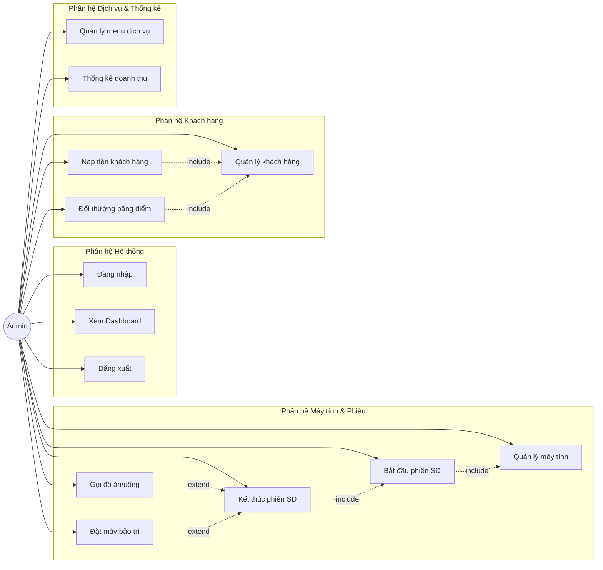
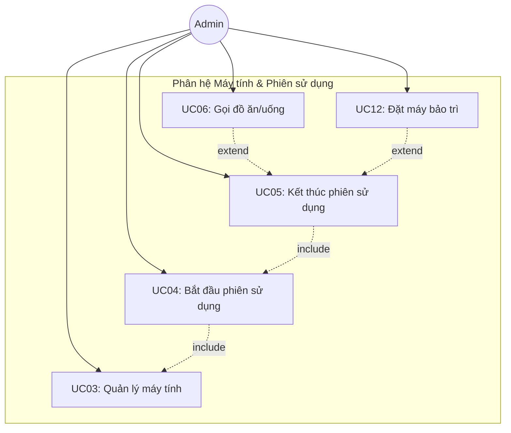
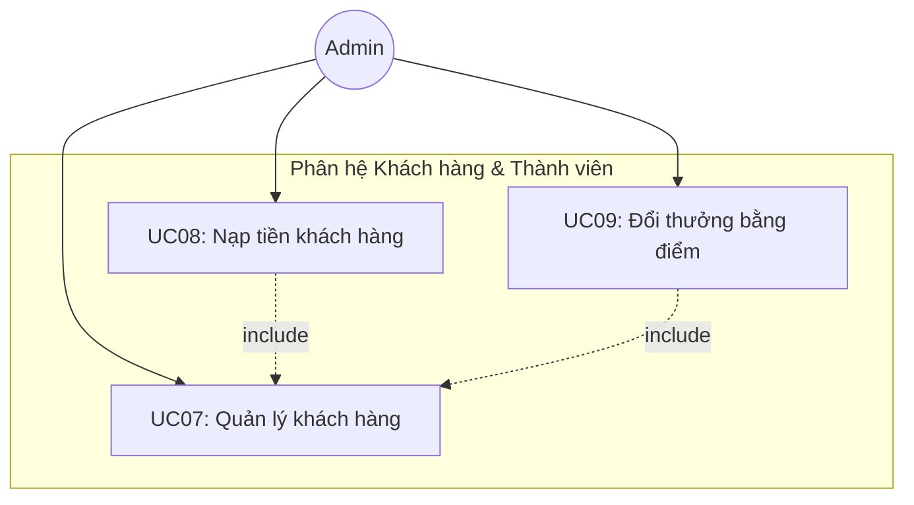
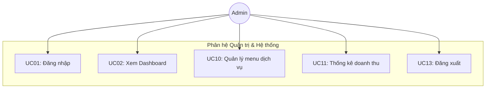

# ĐỀ TÀI: PHÂN TÍCH VÀ THIẾT KẾ HỆ THỐNG QUẢN LÝ QUÁN INTERNET — CYBERNET

---

## CHƯƠNG 1. PHÂN TÍCH VÀ THIẾT KẾ HỆ THỐNG

### 1.1. Phân tích yêu cầu hệ thống

#### 1.1.1. Yêu cầu chức năng

Hệ thống được thiết kế để bao hàm trọn vẹn vòng đời vận hành của một quán internet. Thay vì các công cụ đơn lẻ, hệ thống thiết lập sự liên kết chặt chẽ giữa **6 phân hệ**, đảm bảo dòng chảy dữ liệu luôn được thông suốt và giảm thiểu tối đa các sai sót do quản lý thủ công:

- **Phân hệ Đăng nhập & Xác thực:** Đây là điểm đầu vào của hệ thống. Cho phép nhân viên quản lý xác thực danh tính thông qua tài khoản admin/password, đảm bảo chỉ người có quyền mới truy cập được các chức năng quản lý.

- **Phân hệ Dashboard (Tổng quan):** Đóng vai trò là **Trung tâm Giám sát**, cung cấp cái nhìn tổng quan realtime về tình trạng quán: số máy trống, số máy đang sử dụng, doanh thu máy trong ngày, doanh thu dịch vụ trong ngày. Bảng phiên đang hoạt động hiển thị chi tiết thời gian và chi phí tạm tính.

- **Phân hệ Quản lý Máy tính:** Là **Trung tâm Vận hành** chính của hệ thống. Quản lý danh sách 20 máy tính (Thường + VIP) với 3 trạng thái (Trống, Đang dùng, Bảo trì). Cho phép thực hiện trọn vẹn vòng đời một phiên sử dụng: bắt đầu phiên → gọi đồ ăn/uống → kết thúc phiên & tính tiền tự động. Hỗ trợ lọc máy theo trạng thái và thêm máy mới.

- **Phân hệ Quản lý Khách hàng:** Đóng vai trò là **Hệ thống CRM** (Customer Relationship Management) của quán. Quản lý thông tin khách hàng thành viên với hệ thống nạp tiền, tích điểm tự động (1 giờ chơi = 1 điểm) và đổi thưởng bằng điểm. Hỗ trợ tìm kiếm khách theo tên/SĐT, CRUD đầy đủ.

- **Phân hệ Quản lý Dịch vụ Đồ ăn/Uống:** Quản lý menu đồ ăn/nước uống với phân loại (Đồ ăn, Nước uống), theo dõi tình trạng còn hàng/hết hàng, cấu hình số điểm cần để đổi thưởng. Đơn hàng được gắn chặt với phiên sử dụng máy, đảm bảo tính toàn vẹn khi tính tổng hóa đơn.

- **Phân hệ Thống kê Doanh thu:** Thiết lập **Hạ tầng Báo cáo** với biểu đồ cột custom vẽ bằng Graphics2D. Cho phép thống kê doanh thu theo khoảng ngày tùy chọn (Hôm nay, 7 ngày, 30 ngày), hiển thị tổng doanh thu, tổng phiên, trung bình/ngày. Bảng chi tiết doanh thu theo từng ngày.

- **Tính liên thông:** Hệ thống có khả năng **"Kế thừa dữ liệu"**. Khi một phiên sử dụng kết thúc, toàn bộ chi phí (tiền máy + tiền dịch vụ) được tự động tính toán, trừ vào tài khoản khách thành viên, cộng giờ chơi và tích điểm — loại bỏ hoàn toàn thao tác tính toán thủ công. Doanh thu ngay lập tức được cập nhật vào Dashboard và module Thống kê.

#### 1.1.2. Yêu cầu phi chức năng

Hệ thống được thiết kế không chỉ để thực hiện các chức năng nghiệp vụ mà còn phải đáp ứng các tiêu chuẩn kỹ thuật sau:

**- Tính Bảo mật (Security):**
- Xác thực: Đảm bảo chỉ người dùng hợp lệ (admin) mới có quyền truy cập hệ thống thông qua form đăng nhập.
- Kiểm tra kết nối CSDL: Hệ thống tự động kiểm tra kết nối database trước khi cho phép truy cập, hiển thị hướng dẫn sửa lỗi nếu thất bại.

**- Hiệu năng và Tốc độ (Performance):**
- Thời gian khởi động: Ứng dụng khởi động trong vòng ~2 giây bao gồm cả khởi tạo CSDL.
- Tải giao diện nhanh: Sử dụng CardLayout để chuyển đổi panel tức thì, không cần tải lại trang.
- Đồng hồ realtime: Cập nhật thời gian trên header mỗi giây (Timer 1000ms).
- Hiển thị lưới máy: Load 20 máy tính dạng grid trong < 0.5 giây.

**- Độ tin cậy và Tính toàn vẹn (Reliability & Integrity):**
- CSDL nhúng: Sử dụng H2 Database embedded với chế độ `AUTO_SERVER=TRUE`, tự động khởi tạo schema và dữ liệu mẫu khi chạy lần đầu.
- Toàn vẹn dữ liệu: Sử dụng khóa ngoại (Foreign Key) giữa các bảng, ràng buộc `ON DELETE SET NULL` và `ON DELETE CASCADE` để đảm bảo tính nhất quán.
- Kết nối Singleton: Lớp `KetNoiCSDL` áp dụng Singleton Pattern đảm bảo chỉ có duy nhất một kết nối CSDL trong toàn bộ ứng dụng.

**- Khả năng mở rộng và Bảo trì (Scalability & Maintainability):**
- Kiến trúc MVC + DAO: Mã nguồn được tổ chức theo mô hình MVC kết hợp DAO Pattern, tách biệt giao diện (View) — logic (Controller) — dữ liệu (Entity/DAO), giúp dễ dàng bảo trì và mở rộng.
- Đóng gói (Fat-JAR): Sử dụng Maven Shade Plugin để đóng gói toàn bộ dependencies vào 1 file JAR duy nhất (~5MB), triển khai dễ dàng.
- CSDL có thể mở rộng: H2 Database chạy ở chế độ `MODE=MySQL`, cho phép migrate sang MySQL thực tế khi mở rộng quy mô.

**- Tính khả dụng (Usability):**
- Giao diện Dark Mode: Sử dụng FlatLaf Dark Look and Feel kết hợp bảng màu tím-indigo thống nhất, tạo trải nghiệm chuyên nghiệp.
- Emoji Icons: Sử dụng Unicode emoji (🎮, 🖥️, 👥, ⏱, 🍔, 📈) thay vì ảnh, đảm bảo hiển thị trên mọi nền tảng.
- Sidebar điều hướng: 6 mục menu với hiệu ứng hover và active indicator, dễ dàng chuyển đổi chức năng.

---

### 1.2. Các tác nhân (Actors)

- **Admin (Quản trị viên quán):** Là tác nhân duy nhất có quyền đăng nhập vào hệ thống (tài khoản admin/admin). Admin thực hiện toàn bộ các nghiệp vụ quản lý quán bao gồm: Đăng nhập, Xem Dashboard tổng quan, Quản lý máy tính (thêm máy, lọc trạng thái), Bắt đầu/Kết thúc phiên sử dụng, Gọi đồ ăn/uống cho máy, Quản lý khách hàng (CRUD, nạp tiền, đổi thưởng), Quản lý menu dịch vụ, Thống kê doanh thu và Đăng xuất.

- **Khách hàng thành viên (Tác nhân thụ động):** Không trực tiếp tương tác với hệ thống. Thông tin khách hàng (tên, SĐT, số dư, giờ chơi, điểm) được Admin quản lý. Khách thành viên hưởng quyền lợi: nạp tiền trước, trừ tiền tự động, tích điểm theo giờ chơi và đổi điểm lấy đồ ăn/uống miễn phí.

- **Khách vãng lai (Tác nhân thụ động):** Khách đến quán không cần đăng ký thành viên. Admin có thể bắt đầu phiên cho khách vãng lai bằng cách nhập tên hoặc để mặc định "Khách vãng lai". Không được tích điểm, không trừ tiền tài khoản.

- **Hệ thống CSDL H2 (Tác nhân phụ):** Cơ sở dữ liệu nhúng H2 Database tự động khởi tạo schema và dữ liệu mẫu khi ứng dụng chạy lần đầu. Lưu trữ toàn bộ dữ liệu máy tính, khách hàng, phiên sử dụng, đơn hàng, menu.

---

### 1.3. Use case tổng quát và theo Phân hệ

#### 1.3.1. Sơ đồ Use Case tổng quát
Sơ đồ dưới đây thể hiện toàn bộ các chức năng (ca sử dụng) mà quản trị viên (Admin) có thể tương tác với hệ thống CyberNet.

#### 1.3.2. Sơ đồ Use Case phân hệ Máy tính & Phiên sử dụng
Tập trung vào các tương tác trực tiếp của Admin trên giao diện lưới máy tính, quản lý trạng thái máy và vòng đời một phiên sử dụng.

#### 1.3.3. Sơ đồ Use Case phân hệ Khách hàng & Thành viên
Mô tả các chức năng quản lý thông tin khách hàng thành viên, các nghiệp vụ tài chính (nạp tiền) và quyền lợi (tích điểm, đổi phần thưởng).

#### 1.3.4. Sơ đồ Use Case phân hệ Quản trị & Hệ thống
Bao gồm các chức năng cấu hình hệ thống, đăng nhập bảo mật, theo dõi dashboard tổng quan, quản lý danh mục dịch vụ cung cấp và thống kê báo cáo tài chính.

---

### 1.4. Use case chi tiết và đặc tả Use case

#### 1.4.1. UC01: Đăng nhập

| Thuộc tính | Mô tả |
|-----------|-------|
| **Tên Use Case** | Đăng nhập |
| **Mô tả** | Quản trị viên đăng nhập vào hệ thống để bắt đầu làm việc. |
| **Actor chính** | Admin |
| **Actor phụ** | Hệ thống CSDL H2 |
| **Tiền điều kiện** | Ứng dụng đã khởi động thành công và hiển thị giao diện đăng nhập. |
| **Hậu điều kiện** | Admin truy cập được vào giao diện quản trị chính, CSDL kết nối thành công. |

| | Luồng sự kiện chính |
|---|---|
| **Admin** | **Hệ thống** |
| 1. Khởi động ứng dụng | |
| | 2. Hiển thị màn hình đăng nhập (GiaoDienDangNhap) |
| 3. Nhập tên đăng nhập (mặc định: `admin`) và mật khẩu (mặc định: `admin`) | |
| 4. Nhấn nút "ĐĂNG NHẬP" | |
| | 5. Kiểm tra thông tin tài khoản có khớp khớp với cấu hình hệ thống không |
| | 6. Gọi kết nối database để kiểm tra tính sẵn sàng của dữ liệu |
| | 7. Ẩn form đăng nhập và khởi chạy giao diện điều khiển chính (GiaoDienChinh) |

| | Luồng sự kiện thay thế và ngoại lệ |
|---|---|
| **Tại bước 5:** | Nếu sai tài khoản hoặc mật khẩu → Hệ thống hiển thị hộp thoại cảnh báo: "Tên đăng nhập hoặc mật khẩu không chính xác!" và cho phép nhập lại. |
| **Tại bước 6:** | Nếu không kết nối được database nhúng H2 → Hệ thống hiển thị dialog thông báo lỗi kết nối CSDL và hướng dẫn khắc phục. |

---

#### 1.4.2. UC02: Xem Dashboard tổng quan

| Thuộc tính | Mô tả |
|-----------|-------|
| **Tên Use Case** | Xem Dashboard tổng quan |
| **Mô tả** | Admin theo dõi các chỉ số hoạt động thực tế theo thời gian thực (realtime) của quán. |
| **Actor chính** | Admin |
| **Actor phụ** | Không |
| **Tiền điều kiện** | Admin đăng nhập thành công vào hệ thống. |
| **Hậu điều kiện** | Hiển thị các số liệu thống kê doanh thu và máy tính chính xác tại thời điểm xem. |

| | Luồng sự kiện chính |
|---|---|
| **Admin** | **Hệ thống** |
| 1. Chọn menu "Dashboard" trên thanh sidebar điều hướng | |
| | 2. Thực hiện đếm số máy trống và số máy đang hoạt động từ bảng dữ liệu máy tính |
| | 3. Tính toán tổng doanh thu giờ chơi và doanh thu dịch vụ phát sinh trong ngày hôm nay |
| | 4. Lấy danh sách các phiên sử dụng máy tính đang chạy trong CSDL |
| | 5. Hiển thị 4 thẻ thông tin chỉ số: Máy Trống, Đang Sử Dụng, Doanh Thu Máy, Doanh Thu Dịch Vụ |
| | 6. Hiển thị bảng chi tiết các phiên đang chạy (Mã phiên, máy sử dụng, tên khách, thời gian bắt đầu, tiền tạm tính) |

---

#### 1.4.3. UC03: Quản lý máy tính

| Thuộc tính | Mô tả |
|-----------|-------|
| **Tên Use Case** | Quản lý máy tính |
| **Mô tả** | Xem danh sách máy tính dưới dạng sơ đồ lưới trực quan, lọc theo trạng thái và thêm máy tính mới. |
| **Actor chính** | Admin |
| **Actor phụ** | Không |
| **Tiền điều kiện** | Admin đăng nhập thành công và chọn phân hệ quản lý máy tính. |
| **Hậu điều kiện** | Dữ liệu máy tính được thêm hoặc lọc đúng theo yêu cầu. |

| | Luồng sự kiện chính |
|---|---|
| **Admin** | **Hệ thống** |
| 1. Chọn menu "Máy Tính" trên sidebar | |
| | 2. Lấy toàn bộ danh sách máy tính từ CSDL |
| | 3. Hiển thị lưới máy tính (card UI) với màu sắc hiển thị trạng thái (Xanh: Trống, Đỏ: Đang dùng, Vàng: Bảo trì) |
| 4. Nhấn nút "+ Thêm Máy" | |
| | 5. Hiển thị form thêm máy tính (Tên máy, Loại máy Thường/VIP, cấu hình) |
| 6. Nhập thông tin máy mới và nhấn "Lưu" | |
| | 7. Kiểm tra dữ liệu hợp lệ, thêm máy mới vào CSDL với trạng thái mặc định là "Trống" |
| | 8. Làm mới lưới hiển thị máy tính |

| | Luồng sự kiện thay thế và ngoại lệ |
|---|---|
| **Tại bước 3:** | Admin có thể chọn các nút lọc trạng thái (Tất cả, Trống, Đang dùng, Bảo trì) → Hệ thống truy vấn tương ứng và cập nhật lại lưới máy. |
| **Tại bước 7:** | Nếu tên máy bị trùng hoặc để trống → Hệ thống cảnh báo: "Tên máy không được để trống hoặc trùng lặp!" và yêu cầu nhập lại. |

---

#### 1.4.4. UC04: Bắt đầu phiên sử dụng

| Thuộc tính | Mô tả |
|-----------|-------|
| **Tên Use Case** | Bắt đầu phiên sử dụng |
| **Mô tả** | Kích hoạt phiên chơi máy tính cho một khách hàng (thành viên hoặc vãng lai). |
| **Actor chính** | Admin |
| **Actor phụ** | Không |
| **Tiền điều kiện** | Có máy tính ở trạng thái "Trống". |
| **Hậu điều kiện** | Phiên chơi được lưu vào CSDL, máy tính chuyển sang trạng thái "Đang dùng". |

| | Luồng sự kiện chính |
|---|---|
| **Admin** | **Hệ thống** |
| 1. Click vào một máy tính có trạng thái "Trống" trên lưới | |
| | 2. Hiển thị dialog "Bắt Đầu Phiên Sử Dụng" hiển thị tên máy, loại máy và đơn giá |
| 3. Chọn tài khoản Khách hàng thành viên từ dropdown (hoặc nhập tên Khách vãng lai) | |
| 4. Nhấn nút "▶ Bắt Đầu" | |
| | 5. Khởi tạo một đối tượng phiên chơi mới (gioBatDau = thời gian hiện tại) |
| | 6. Thực hiện INSERT bản ghi phiên chơi vào bảng `phien_su_dung` trong CSDL |
| | 7. Cập nhật trạng thái máy tính trong bảng `may_tinh` sang "Đang dùng" |
| | 8. Đóng dialog, làm mới lưới máy tính và thông báo bắt đầu thành công |

---

#### 1.4.5. UC05: Kết thúc phiên sử dụng

| Thuộc tính | Mô tả |
|-----------|-------|
| **Tên Use Case** | Kết thúc phiên sử dụng |
| **Mô tả** | Tính tiền giờ chơi, tiền dịch vụ, thanh toán hóa đơn và giải phóng máy về trạng thái trống hoặc bảo trì. |
| **Actor chính** | Admin |
| **Actor phụ** | Không |
| **Tiền điều kiện** | Máy tính được chọn đang ở trạng thái "Đang dùng" (có phiên chơi đang chạy). |
| **Hậu điều kiện** | Phiên chơi được cập nhật thời gian kết thúc và tổng tiền; số dư khách thành viên bị trừ; máy tính được giải phóng. |

| | Luồng sự kiện chính |
|---|---|
| **Admin** | **Hệ thống** |
| 1. Click vào máy tính đang ở trạng thái "Đang dùng" | |
| | 2. Truy vấn thông tin phiên chơi hiện tại của máy đó |
| | 3. Tính toán thời gian chơi thực tế (làm tròn đến 0.1 giờ) và tiền máy tương ứng |
| | 4. Tính toán tổng tiền các đơn đặt đồ ăn/nước uống đã gọi trong phiên |
| | 5. Hiển thị dialog thanh toán gồm: Tên khách, thời gian bắt đầu, thời gian sử dụng, tiền máy, tiền dịch vụ và tổng tiền thanh toán |
| 6. Nhấn nút "⏹ Kết Thúc" để hoàn tất | |
| | 7. Cập nhật thời gian kết thúc và tổng tiền vào bản ghi `phien_su_dung` |
| | 8. Nếu là Khách thành viên: Trừ tiền trực tiếp vào tài khoản, cộng tổng giờ chơi tích lũy và cộng điểm thưởng tương ứng (1 giờ chơi = 1 điểm) |
| | 9. Cập nhật trạng thái máy tính về "Trống" |
| | 10. Đóng dialog, làm mới lưới máy tính và hiển thị thông báo thanh toán thành công |

| | Luồng sự kiện thay thế và ngoại lệ |
|---|---|
| **Tại bước 6:** | Admin có thể chọn nút "Bảo Trì" thay vì "Kết Thúc" → Thực hiện thanh toán bình thường nhưng máy tính được đưa về trạng thái "Bảo trì". |
| **Tại bước 8:** | Nếu tài khoản Khách thành viên không đủ số dư để thanh toán → Hệ thống thông báo yêu cầu nạp thêm tiền hoặc chuyển sang thanh toán bằng tiền mặt trực tiếp. |

---

#### 1.4.6. UC06: Gọi đồ ăn/uống

| Thuộc tính | Mô tả |
|-----------|-------|
| **Tên Use Case** | Gọi đồ ăn/uống |
| **Mô tả** | Đặt các món ăn hoặc thức uống cho máy tính đang hoạt động, hóa đơn dịch vụ được tính chung khi kết thúc phiên chơi. |
| **Actor chính** | Admin |
| **Actor phụ** | Không |
| **Tiền điều kiện** | Máy tính được gọi món phải đang ở trạng thái "Đang dùng". |
| **Hậu điều kiện** | Đơn hàng dịch vụ được tạo và liên kết trực tiếp với mã phiên đang chạy. |

| | Luồng sự kiện chính |
|---|---|
| **Admin** | **Hệ thống** |
| 1. Click vào máy tính "Đang dùng", trong dialog thông tin nhấn nút "🍔 Gọi Món" | |
| | 2. Lấy danh sách các món ăn, nước uống còn hàng trong thực đơn |
| | 3. Hiển thị bảng menu gọi món (cho phép nhập số lượng) |
| 4. Chọn các món ăn/thức uống và điều chỉnh số lượng tương ứng | |
| 5. Nhấn nút "✓ Xác Nhận Đơn" | |
| | 6. Khởi tạo đơn hàng `don_hang` và các bản ghi chi tiết đơn hàng `chi_tiet_don_hang` |
| | 7. Lưu đơn hàng vào CSDL và gán liên kết với mã phiên chơi hiện tại |
| | 8. Cập nhật lại tổng tiền dịch vụ tạm tính của phiên chơi |

| | Luồng sự kiện thay thế và ngoại lệ |
|---|---|
| **Tại bước 5:** | Nếu Admin chưa chọn bất kỳ món nào hoặc nhập số lượng không hợp lệ (nhỏ hơn hoặc bằng 0) → Hệ thống hiển thị cảnh báo yêu cầu kiểm tra lại dữ liệu nhập. |

---

#### 1.4.7. UC07: Quản lý khách hàng

| Thuộc tính | Mô tả |
|-----------|-------|
| **Tên Use Case** | Quản lý khách hàng |
| **Mô tả** | Xem danh sách thành viên, thêm tài khoản mới, cập nhật thông tin hoặc xóa tài khoản khách hàng. |
| **Actor chính** | Admin |
| **Actor phụ** | Không |
| **Tiền điều kiện** | Admin đăng nhập thành công và chọn phân hệ Khách hàng. |
| **Hậu điều kiện** | Dữ liệu khách hàng trong database được cập nhật chính xác. |

| | Luồng sự kiện chính |
|---|---|
| **Admin** | **Hệ thống** |
| 1. Chọn menu "Khách Hàng" trên thanh điều hướng | |
| | 2. Lấy toàn bộ danh sách khách hàng từ CSDL và hiển thị lên bảng điều khiển |
| 3. Chọn thao tác thêm mới bằng cách nhấn "+ Thêm Khách" | |
| | 4. Hiển thị form nhập thông tin (Tên khách hàng, Số điện thoại, Số tiền nạp lần đầu) |
| 5. Nhập đầy đủ thông tin yêu cầu và nhấn "Tạo Khách Hàng" | |
| | 6. Kiểm tra tính hợp lệ của số điện thoại và số tiền nạp |
| | 7. Lưu thông tin thành viên mới vào bảng `khach_hang` |
| | 8. Cập nhật lại bảng hiển thị danh sách khách hàng |

| | Luồng sự kiện thay thế và ngoại lệ |
|---|---|
| **Thao tác sửa:** | Chọn 1 khách hàng → Nhấn "Sửa" → Chỉnh sửa Tên/SĐT → Lưu thông tin cập nhật vào CSDL. |
| **Thao tác xóa:** | Chọn 1 khách hàng → Nhấn "Xóa" → Hiển thị xác nhận xóa → Thực hiện xóa khách hàng khỏi database (nếu không vướng ràng buộc khóa ngoại). |
| **Tìm kiếm:** | Nhập tên hoặc SĐT vào ô tìm kiếm → Nhấn "Tìm" → Hệ thống hiển thị các kết quả trùng khớp. |

---

#### 1.4.8. UC08: Nạp tiền khách hàng

| Thuộc tính | Mô tả |
|-----------|-------|
| **Tên Use Case** | Nạp tiền khách hàng |
| **Mô tả** | Nạp thêm tiền vào tài khoản hội viên của khách hàng, hệ thống tự động quy đổi thành giờ chơi và điểm tích lũy. |
| **Actor chính** | Admin |
| **Actor phụ** | Không |
| **Tiền điều kiện** | Đã chọn một khách hàng thành viên trong danh sách. |
| **Hậu điều kiện** | Tài khoản khách hàng tăng số dư, tăng giờ chơi và điểm tích lũy trong database. |

| | Luồng sự kiện chính |
|---|---|
| **Admin** | **Hệ thống** |
| 1. Chọn khách hàng thành viên từ bảng và nhấn nút "💰 Nạp Tiền" | |
| | 2. Hiển thị dialog nạp tiền gồm thông tin khách hàng và ô nhập số tiền nạp |
| 3. Nhập số tiền cần nạp (Ví dụ: `50.000` VNĐ) | |
| | 4. Quy đổi thời gian chơi tăng thêm (50.000đ / 10.000đ = 5 giờ) và điểm thưởng tương ứng (+5 điểm), hiển thị xem trước (preview) trên giao diện |
| 5. Nhấn nút xác nhận "Nạp Tiền" | |
| | 6. Cập nhật số dư tài khoản, tổng giờ chơi và điểm tích lũy của khách hàng trong database |
| | 7. Đóng dialog, làm mới danh sách khách hàng và hiển thị thông báo thành công |

| | Luồng sự kiện thay thế và ngoại lệ |
|---|---|
| **Tại bước 3:** | Nếu nhập số tiền không phải là số hoặc số tiền nạp nhỏ hơn hoặc bằng 0 → Hệ thống thông báo lỗi: "Số tiền nạp không hợp lệ!" và không cho xác nhận. |

---

#### 1.4.9. UC09: Đổi thưởng bằng điểm

| Thuộc tính | Mô tả |
|-----------|-------|
| **Tên Use Case** | Đổi thưởng bằng điểm |
| **Mô tả** | Khách hàng thành viên sử dụng điểm tích lũy (⭐) để đổi lấy đồ ăn hoặc thức uống miễn phí trong thực đơn hỗ trợ đổi thưởng. |
| **Actor chính** | Admin |
| **Actor phụ** | Không |
| **Tiền điều kiện** | Khách hàng được chọn có điểm tích lũy lớn hơn 0 và đã chọn món quà đổi thưởng hợp lệ. |
| **Hậu điều kiện** | Điểm tích lũy của khách hàng bị trừ, hệ thống ghi nhận lịch sử đổi thưởng vào database. |

| | Luồng sự kiện chính |
|---|---|
| **Admin** | **Hệ thống** |
| 1. Chọn khách hàng thành viên và nhấn nút "🎁 Đổi Thưởng" | |
| | 2. Hiển thị dialog đổi thưởng có số điểm hiện tại của khách và danh sách thực đơn hỗ trợ đổi thưởng (các món có cấu hình điểm đổi > 0) |
| 3. Chọn các món ăn/nước uống muốn đổi và điều chỉnh số lượng | |
| | 4. Tự động tính tổng điểm cần dùng và hiển thị điểm còn lại sau khi đổi |
| 5. Nhấn nút "Đổi Thưởng" | |
| | 6. Kiểm tra xem điểm tích lũy hiện có của khách hàng có đủ để thực hiện giao dịch hay không |
| | 7. Lưu các bản ghi lịch sử đổi thưởng vào bảng `lich_su_doi_thuong` |
| | 8. Thực hiện trừ điểm tích lũy tương ứng trong bảng `khach_hang` |
| | 9. Làm mới thông tin giao diện khách hàng và thông báo đổi thưởng thành công |

| | Luồng sự kiện thay thế và ngoại lệ |
|---|---|
| **Tại bước 6:** | Nếu tổng số điểm cần đổi lớn hơn số điểm tích lũy hiện có của khách hàng → Hệ thống hiển thị thông báo lỗi: "Không đủ điểm để thực hiện đổi thưởng!" và từ chối giao dịch. |

---

#### 1.4.10. UC10: Quản lý menu dịch vụ

| Thuộc tính | Mô tả |
|-----------|-------|
| **Tên Use Case** | Quản lý menu dịch vụ |
| **Mô tả** | Admin quản lý danh sách các món ăn, nước uống phục vụ tại quán (CRUD thực đơn). |
| **Actor chính** | Admin |
| **Actor phụ** | Không |
| **Tiền điều kiện** | Admin đăng nhập thành công và lựa chọn phân hệ Dịch vụ. |
| **Hậu điều kiện** | Danh sách thực đơn trong database được cập nhật (thêm/sửa/xóa món ăn). |

| | Luồng sự kiện chính |
|---|---|
| **Admin** | **Hệ thống** |
| 1. Chọn menu "Dịch Vụ" trên sidebar điều hướng | |
| | 2. Truy vấn danh sách các dịch vụ ăn uống từ bảng `do_an_uong` |
| | 3. Hiển thị bảng menu (Tên món, Phân loại, Đơn giá, Điểm đổi thưởng, Tình trạng còn hàng) |
| 4. Thực hiện các thao tác Thêm món / Sửa món / Xóa món | |
| | 5. Hiển thị form nhập liệu tương ứng với thao tác được chọn |
| 6. Điền thông tin món ăn và nhấn "Lưu" | |
| | 7. Kiểm tra dữ liệu hợp lệ (tên không trống, giá bán > 0) và lưu vào database |
| | 8. Làm mới bảng hiển thị thực đơn dịch vụ |

---

#### 1.4.11. UC11: Thống kê doanh thu

| Thuộc tính | Mô tả |
|-----------|-------|
| **Tên Use Case** | Thống kê doanh thu |
| **Mô tả** | Xem báo cáo tài chính tổng hợp về doanh thu giờ chơi và doanh thu dịch vụ theo khoảng thời gian tùy chọn dưới dạng biểu đồ và bảng số liệu. |
| **Actor chính** | Admin |
| **Actor phụ** | Không |
| **Tiền điều kiện** | Admin đăng nhập thành công và lựa chọn phân hệ Thống kê. |
| **Hậu điều kiện** | Hiển thị biểu đồ doanh thu và bảng tổng hợp số liệu chính xác theo khoảng ngày được chọn. |

| | Luồng sự kiện chính |
|---|---|
| **Admin** | **Hệ thống** |
| 1. Chọn menu "Thống Kê" trên thanh điều hướng | |
| | 2. Hiển thị giao diện bộ lọc thống kê (Từ ngày, Đến ngày) và các nút chọn nhanh (7 ngày qua, 30 ngày qua, Hôm nay) |
| 3. Chọn khoảng thời gian thống kê và nhấn nút "🔍 Xem thống kê" | |
| | 4. Thực hiện truy vấn tổng tiền máy và tiền dịch vụ từ các phiên chơi đã kết thúc trong khoảng thời gian đã chọn |
| | 5. Tổng hợp dữ liệu doanh thu theo từng ngày |
| | 6. Vẽ biểu đồ cột trực quan hiển thị doanh thu tăng trưởng theo thời gian sử dụng Graphics2D |
| | 7. Hiển thị bảng tổng hợp chi tiết (Ngày, tổng số phiên hoạt động, doanh thu) và các thẻ chỉ số (Tổng doanh thu, Tổng số phiên, Doanh thu trung bình/ngày) |

| | Luồng sự kiện thay thế và ngoại lệ |
|---|---|
| **Tại bước 3:** | Nếu ngày bắt đầu được chọn lớn hơn ngày kết thúc → Hệ thống thông báo lỗi: "Khoảng ngày thống kê không hợp lệ!" và yêu cầu chọn lại. |

---

#### 1.4.12. UC12: Đặt máy bảo trì

| Thuộc tính | Mô tả |
|-----------|-------|
| **Tên Use Case** | Đặt máy bảo trì |
| **Mô tả** | Đưa một máy tính vào trạng thái bảo trì hoặc khóa máy do sự cố phần cứng/phần mềm. |
| **Actor chính** | Admin |
| **Actor phụ** | Không |
| **Tiền điều kiện** | Máy tính được chọn đang ở trạng thái "Trống" hoặc đang thanh toán phiên chơi. |
| **Hậu điều kiện** | Trạng thái máy tính được cập nhật thành "Bảo trì" trong database, không cho phép mở phiên chơi mới trên máy này. |

| | Luồng sự kiện chính |
|---|---|
| **Admin** | **Hệ thống** |
| 1. Click vào máy tính đang hoạt động hoặc trống trên lưới | |
| | 2. Trong dialog thông tin máy, nhấn nút "Bảo Trì" |
| 3. Xác nhận chuyển trạng thái máy tính sang bảo trì | |
| | 4. Cập nhật trạng thái máy tính thành "Bảo trì" trong CSDL |
| | 5. Đóng dialog, làm mới lưới máy tính (card máy chuyển sang viền màu Vàng và có nhãn trạng thái "Bảo trì") |

---

#### 1.4.13. UC13: Đăng xuất

| Thuộc tính | Mô tả |
|-----------|-------|
| **Tên Use Case** | Đăng xuất |
| **Mô tả** | Thoát khỏi phiên làm việc hiện tại và đóng ứng dụng an toàn. |
| **Actor chính** | Admin |
| **Actor phụ** | Không |
| **Tiền điều kiện** | Ứng dụng đang hoạt động ở màn hình điều khiển chính. |
| **Hậu điều kiện** | Ứng dụng được giải phóng bộ nhớ và đóng hoàn toàn. |

| | Luồng sự kiện chính |
|---|---|
| **Admin** | **Hệ thống** |
| 1. Click vào nút "Đăng Xuất" ở góc cuối thanh sidebar | |
| | 2. Hiển thị hộp thoại hỏi xác nhận: "Bạn có chắc chắn muốn đăng xuất và đóng ứng dụng?" |
| 3. Chọn "Yes" | |
| | 4. Thực hiện đóng kết nối CSDL hiện tại để đảm bảo an toàn dữ liệu |
| | 5. Giải phóng tài nguyên giao diện (dispose) và thoát chương trình (System.exit) |

| | Luồng sự kiện thay thế và ngoại lệ |
|---|---|
| **Tại bước 3:** | Nếu chọn "No" → Hệ thống đóng dialog xác nhận và giữ nguyên trạng thái giao diện chính để tiếp tục làm việc. |
