# CHƯƠNG 3. PHÂN TÍCH HỆ THỐNG

---

## 3.1. Khảo sát hiện trạng

### 3.1.1. Quy trình nghiệp vụ hiện tại
Tại các quán internet có quy mô nhỏ và vừa chưa áp dụng các phần mềm quản lý chuyên nghiệp, quy trình vận hành thủ công diễn ra như sau:
1. **Khách đến chơi:** Khách hàng đến quầy gặp nhân viên quản lý. Nhân viên ghi chép tên khách, số máy được phân phối và giờ bắt đầu vào sổ theo dõi. Nhân viên đi đến máy tính của khách và bật công tắc mở máy thủ công (hoặc mở máy thông qua một phần mềm điều khiển đơn giản không liên kết với hệ thống tài chính).
2. **Gọi dịch vụ (Đồ ăn, thức uống):** Trong quá trình sử dụng máy, khách hàng đi tới quầy hoặc gọi nhân viên để đặt đồ ăn/nước uống. Nhân viên ghi chép đơn hàng ra giấy, chuẩn bị đồ ăn và mang đến máy cho khách. Đơn hàng được giữ lại quầy để cộng tiền khi khách thanh toán.
3. **Thanh toán & Kết thúc:** Khách hàng ra quầy báo máy nghỉ. Nhân viên đối chiếu giờ bắt đầu và giờ kết thúc chơi để tính tiền máy (sử dụng máy tính cầm tay để tính số giờ nhân với đơn giá). Sau đó cộng thêm tiền các phiếu gọi dịch vụ ăn uống tương ứng để ra tổng hóa đơn thanh toán. Khách hàng trả tiền mặt, nhân viên gạch tên khách trong sổ theo dõi và tắt máy thủ công.
4. **Báo cáo doanh thu:** Cuối ngày làm việc, chủ quán hoặc nhân viên thực hiện cộng dồn toàn bộ số tiền máy và tiền dịch vụ đã ghi nhận trong sổ để tính tổng doanh thu trong ngày, ghi chép vào sổ quỹ để theo dõi.

### 3.1.2. Các vấn đề, hạn chế
Từ quy trình khảo sát thực tế trên, hệ thống thủ công bộc lộ nhiều hạn chế nghiêm trọng:
- **Sai sót trong tính tiền:** Việc tính toán tiền giờ thủ công bằng máy tính cầm tay dễ xảy ra sai sót, đặc biệt khi lượng khách ra vào đông hoặc thời gian chơi lẻ (ví dụ: 1 giờ 37 phút).
- **Khó quản lý trạng thái máy:** Nhân viên khó theo dõi trực quan máy nào đang trống, máy nào đang hoạt động hoặc máy nào bị lỗi (bảo trì) khi quy mô phòng máy tăng từ 20 máy trở lên.
- **Thất thoát doanh thu dịch vụ:** Các đơn gọi đồ ăn/thức uống ghi chép bằng giấy dễ bị thất lạc, ghi thiếu hoặc nhân viên quên cộng vào hóa đơn thanh toán khi khách ra về.
- **Thiếu tính gắn kết khách hàng:** Không quản lý được thông tin khách hàng thân thiết, không có cơ chế nạp tiền trước, tích điểm thành viên hay chính sách ưu đãi đổi thưởng để giữ chân khách hàng.
- **Báo cáo thống kê chậm trễ và thiếu chính xác:** Việc tổng hợp doanh thu cuối ngày bằng sổ sách mất thời gian, dễ nhầm lẫn và không thể cung cấp biểu đồ so sánh xu hướng doanh thu theo tuần, tháng để chủ quán đưa ra quyết định kinh doanh.

---

## 3.2. Phân tích yêu cầu

### 3.2.1. Yêu cầu nghiệp vụ
Hệ thống quản lý quán internet CyberNet cần đáp ứng các yêu cầu nghiệp vụ thực tế sau:
- **Phân loại máy và đơn giá:** Quản lý tối thiểu 20 máy tính được phân thành 2 loại: máy Thường (giá mặc định 10.000đ/giờ) và máy VIP (giá mặc định 15.000đ/giờ) để tối ưu hóa nguồn thu.
- **Quản lý khách hàng linh hoạt:** Hỗ trợ cả Khách vãng lai (không cần tài khoản, thanh toán sau) và Khách thành viên (nạp tiền trước vào tài khoản để trừ dần, hỗ trợ tích lũy điểm thưởng).
- **Tự động hóa tính tiền:** Hệ thống tự động tính chi phí chơi dựa trên thời gian thực sử dụng (làm tròn đến 0.1 giờ), tự động cộng tiền dịch vụ để xuất hóa đơn tổng hợp.
- **Cơ chế tích điểm và đổi thưởng:** Khách thành viên khi chơi sẽ được tích lũy điểm thưởng (1 giờ chơi = 1 điểm). Điểm này dùng để đổi lấy các dịch vụ ăn uống miễn phí có cấu hình điểm đổi trong menu.
- **Liên thông dữ liệu:** Khi kết thúc phiên chơi, doanh thu phải tự động cập nhật lên hệ thống báo cáo và bảng điều khiển tổng quan (Dashboard) thời gian thực.

### 3.2.2. Yêu cầu chức năng

| STT | Yêu cầu chức năng | Mô tả chi tiết | Độ ưu tiên |
|-----|-------------------|----------------|-------------|
| YC01 | Đăng nhập hệ thống | Nhân viên quản lý đăng nhập bằng tài khoản admin để bảo mật dữ liệu. | Cao |
| YC02 | Xem Dashboard tổng quan | Theo dõi trực quan số máy trống, đang sử dụng, doanh thu trong ngày và danh sách phiên đang chạy. | Cao |
| YC03 | Quản lý máy tính | Xem danh sách máy dưới dạng lưới, thêm máy mới, sửa cấu hình. | Cao |
| YC04 | Bắt đầu phiên chơi | Click chọn máy trống → chọn khách hàng → kích hoạt tính giờ. | Cao |
| YC05 | Kết thúc phiên chơi | Tính tiền tự động, trừ tiền tài khoản thành viên, cộng điểm, giải phóng máy. | Cao |
| YC06 | Gọi đồ ăn / nước uống | Chọn món từ thực đơn, nhập số lượng và gán đơn hàng vào phiên chơi đang chạy của máy. | Cao |
| YC07 | Quản lý khách hàng | Quản lý danh sách thành viên (CRUD), tìm kiếm theo tên hoặc số điện thoại. | Cao |
| YC08 | Nạp tiền tài khoản | Nạp tiền vào tài khoản hội viên, tự động quy đổi thành giờ chơi và điểm thưởng. | Cao |
| YC09 | Đổi thưởng bằng điểm | Dùng điểm tích lũy của thành viên đổi lấy đồ ăn uống miễn phí. | Trung bình |
| YC10 | Quản lý menu dịch vụ | Quản lý danh mục đồ ăn, nước uống, đơn giá, điểm đổi thưởng và tình trạng còn hàng. | Trung bình |
| YC11 | Thống kê doanh thu | Thống kê doanh thu theo khoảng ngày, vẽ biểu đồ cột trực quan, liệt kê chi tiết giao dịch. | Trung bình |
| YC12 | Đặt máy bảo trì | Chuyển trạng thái máy tính sang bảo trì khi có sự cố kỹ thuật. | Thấp |
| YC13 | Đăng xuất | Thoát khỏi phiên làm việc an toàn, đóng kết nối cơ sở dữ liệu. | Cao |

### 3.2.3. Yêu cầu phi chức năng
- **Bảo mật:** Giao diện quản lý chỉ có admin truy cập được. Cơ sở dữ liệu H2 lưu trữ an toàn dưới dạng file cục bộ có mật khẩu bảo vệ kết nối.
- **Hiệu năng:** Khởi động ứng dụng trong vòng < 2 giây. Tải danh sách máy và thực hiện các thao tác chuyển đổi panel giao diện mượt mà (dưới 300ms) nhờ cơ chế CardLayout.
- **Độ tin cậy:** Áp dụng Singleton Pattern cho kết nối CSDL giúp ngăn ngừa xung đột dữ liệu. Sử dụng Database Transactions để đảm bảo tính toàn vẹn khi lưu trữ thông tin phiên chơi và thanh toán trừ tiền khách hàng.
- **Khả năng mở rộng:** Kiến trúc chia rõ ràng MVC (Model - View - Controller) kết hợp DAO Pattern giúp dễ dàng thay thế CSDL H2 bằng MySQL khi phát triển thành chuỗi phòng máy lớn.
- **Tính khả dụng:** Giao diện thiết kế Dark Mode sang trọng, giảm mỏi mắt cho nhân viên trực máy. Các trạng thái máy có màu sắc viền phân biệt rõ ràng, hỗ trợ emoji dễ nhận diện.

---

## 3.3. Mô hình ca sử dụng (Use Case Model)

### 3.3.1. Danh sách Use Case
Hệ thống CyberNet bao gồm 13 ca sử dụng (Use Case) chính dành cho tác nhân Quản lý (Admin):

| STT | Mã Use Case | Tên Use Case | Tác nhân chính | Tác nhân phụ | Mô tả |
|-----|-------------|--------------|----------------|--------------|-------|
| 1 | UC01 | Đăng nhập | Admin | CSDL H2 | Xác thực tài khoản Admin để truy cập hệ thống. |
| 2 | UC02 | Xem Dashboard | Admin | Không | Giám sát các chỉ số vận hành và doanh thu realtime. |
| 3 | UC03 | Quản lý máy tính | Admin | Không | Xem danh sách máy dạng lưới, thêm máy mới vào hệ thống. |
| 4 | UC04 | Bắt đầu phiên | Admin | Không | Kích hoạt phiên chơi mới tại máy trống cho khách hàng. |
| 5 | UC05 | Kết thúc phiên | Admin | Không | Tính hóa đơn, trừ tiền tài khoản thành viên, giải phóng máy. |
| 6 | UC06 | Gọi đồ ăn/uống | Admin | Không | Gọi thêm món ăn, đồ uống gắn liền với phiên chơi. |
| 7 | UC07 | Quản lý khách hàng | Admin | Không | Quản lý thông tin tài khoản thành viên (CRUD). |
| 8 | UC08 | Nạp tiền | Admin | Không | Nạp tiền vào tài khoản hội viên và cộng điểm, giờ chơi. |
| 9 | UC09 | Đổi thưởng | Admin | Không | Khách dùng điểm tích lũy đổi đồ ăn/nước uống miễn phí. |
| 10 | UC10 | Quản lý menu dịch vụ| Admin | Không | CRUD thực đơn dịch vụ ăn uống của quán. |
| 11 | UC11 | Thống kê doanh thu | Admin | Không | Xem báo cáo tài chính và biểu đồ doanh thu theo ngày. |
| 12 | UC12 | Đặt máy bảo trì | Admin | Không | Chuyển máy sang trạng thái bảo trì khi hỏng hóc. |
| 13 | UC13 | Đăng xuất | Admin | Không | Thoát khỏi hệ thống và đóng kết nối CSDL an toàn. |

### 3.3.2. Biểu đồ Use Case tổng quát

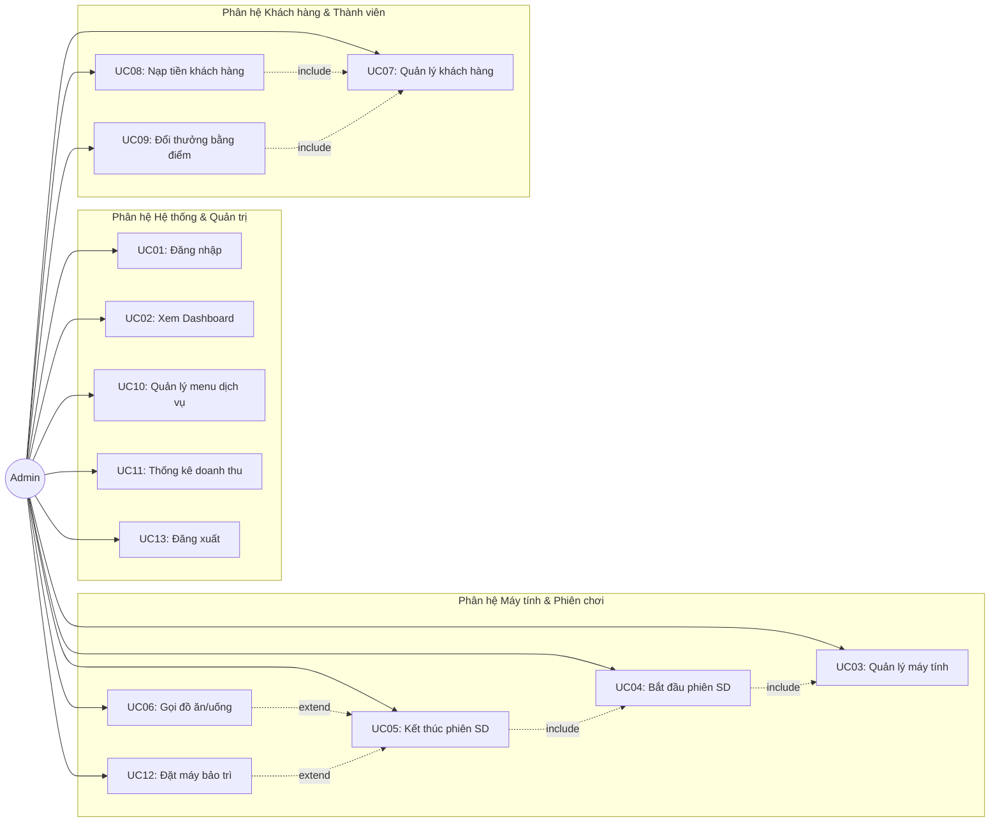

### 3.3.3. Biểu đồ Use Case chi tiết theo Phân hệ

#### Phân hệ Máy tính & Phiên sử dụng
Biểu đồ mô tả chi tiết các ca sử dụng liên quan đến quản lý trạng thái máy và vòng đời một phiên chơi của khách hàng tại phòng máy.

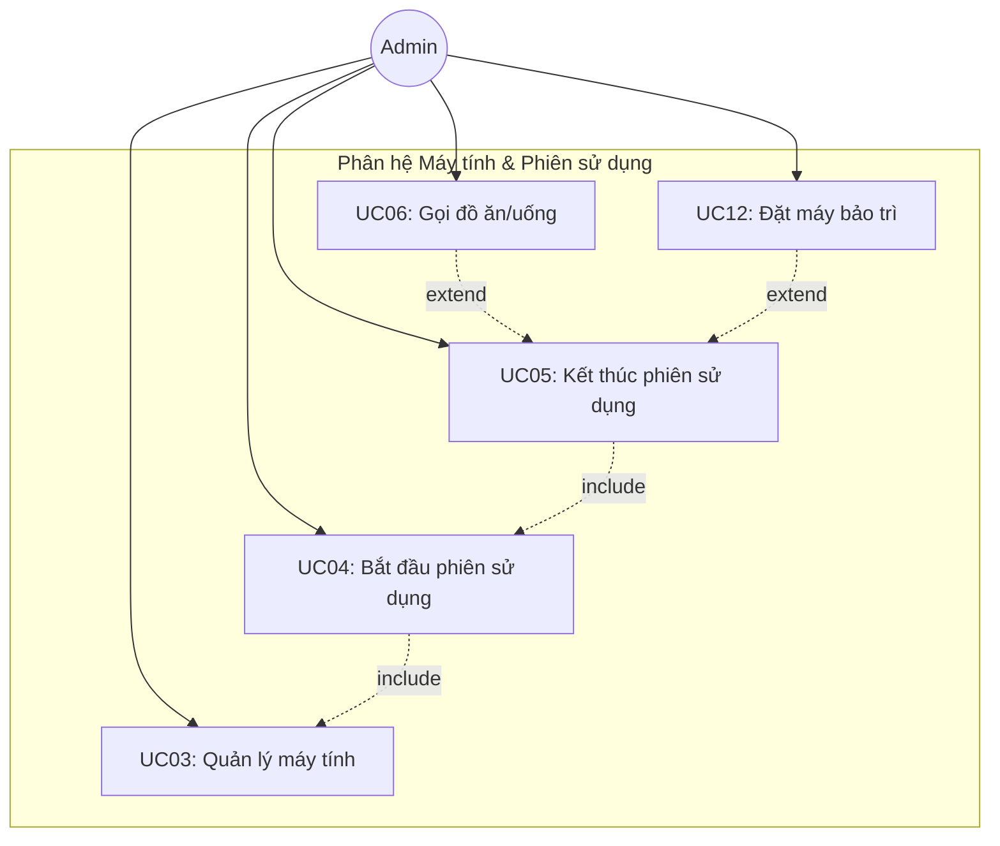

#### Phân hệ Khách hàng & Thành viên
Biểu đồ mô tả chi tiết các tương tác quản lý thông tin khách hàng, luồng tiền nạp và đổi điểm lấy dịch vụ miễn phí.

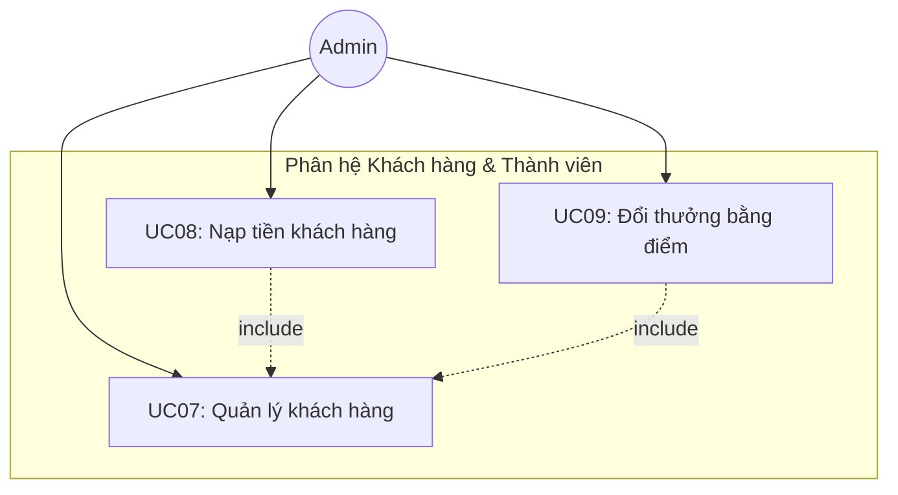

#### Phân hệ Quản trị & Hệ thống
Biểu đồ thể hiện các tác vụ của Admin liên quan tới bảo mật, cấu hình thực đơn dịch vụ và báo cáo tài chính của quán game.

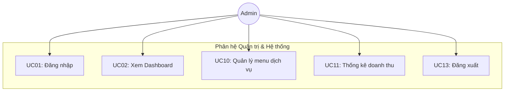

### 3.3.4. Đặc tả các Use Case chi tiết

#### UC01: Đăng nhập
- **Tên Use Case:** Đăng nhập
- **Mô tả:** Admin đăng nhập tài khoản vào hệ thống để bắt đầu phiên làm việc.
- **Actor chính:** Admin
- **Actor phụ:** Hệ thống CSDL H2
- **Tiền điều kiện:** Ứng dụng đã khởi động và hiển thị màn hình đăng nhập.
- **Hậu điều kiện:** Admin đăng nhập thành công, hệ thống chuyển sang giao diện quản trị chính.
- **Luồng sự kiện chính:**
  1. Hệ thống hiển thị form đăng nhập `GiaoDienDangNhap`.
  2. Admin nhập Tên đăng nhập và Mật khẩu (mặc định: admin/admin).
  3. Admin nhấn nút "ĐĂNG NHẬP" (hoặc bấm Enter).
  4. Hệ thống kiểm tra tài khoản, xác thực thông tin chính xác.
  5. Hệ thống gọi `KetNoiCSDL.kiemTraKetNoi()` để kiểm tra kết nối database.
  6. Hệ thống đóng form đăng nhập, khởi tạo và hiển thị `GiaoDienChinh` với màn hình Dashboard.
- **Luồng sự kiện thay thế:**
  - *Tại bước 4:* Nếu sai tài khoản hoặc mật khẩu, hệ thống hiển thị thông báo lỗi "Tên đăng nhập hoặc mật khẩu không chính xác!" và đưa con trỏ về ô đăng nhập để nhập lại.
  - *Tại bước 5:* Nếu mất kết nối database nhúng H2, hệ thống hiển thị hộp thoại báo lỗi và hướng dẫn khởi động lại database trước khi quay lại màn hình đăng nhập.

#### UC02: Xem Dashboard tổng quan
- **Tên Use Case:** Xem Dashboard tổng quan
- **Mô tả:** Admin theo dõi nhanh các chỉ số hoạt động thời gian thực của quán game.
- **Actor chính:** Admin
- **Actor phụ:** Không
- **Tiền điều kiện:** Admin đăng nhập thành công.
- **Hậu điều kiện:** Hiển thị dữ liệu chính xác tại thời điểm xem.
- **Luồng sự kiện chính:**
  1. Admin chọn menu "Dashboard" trên sidebar.
  2. Hệ thống truy vấn CSDL để đếm số máy tính có trạng thái "Trống" và "Đang dùng".
  3. Hệ thống truy vấn tổng doanh thu máy chơi và doanh thu dịch vụ trong ngày hôm nay.
  4. Hệ thống tải danh sách các phiên sử dụng đang hoạt động (`trang_thai = 'Đang chạy'`).
  5. Hệ thống hiển thị 4 thẻ thống kê: Máy Trống, Đang dùng, Doanh thu máy, Doanh thu dịch vụ.
  6. Hệ thống hiển thị bảng chi tiết các phiên đang chạy (gồm máy, tên khách, thời gian bắt đầu, thời gian sử dụng và tiền tạm tính).

#### UC03: Quản lý máy tính
- **Tên Use Case:** Quản lý máy tính
- **Mô tả:** Admin xem sơ đồ lưới các máy, thêm máy chơi hoặc sửa thông tin máy chơi.
- **Actor chính:** Admin
- **Actor phụ:** Không
- **Tiền điều kiện:** Admin đăng nhập thành công.
- **Hậu điều kiện:** CSDL máy tính được cập nhật.
- **Luồng sự kiện chính:**
  1. Admin chọn menu "Máy Tính" trên sidebar.
  2. Hệ thống truy vấn toàn bộ danh sách máy và hiển thị dạng lưới các card máy tính.
  3. Admin chọn "+ Thêm Máy".
  4. Hệ thống hiển thị form nhập thông tin máy mới (Tên máy, loại máy Thường/VIP, cấu hình).
  5. Admin nhập đầy đủ thông tin và nhấn "Lưu".
  6. Hệ thống kiểm tra dữ liệu hợp lệ, thực hiện thêm bản ghi mới vào CSDL với trạng thái mặc định "Trống".
  7. Làm mới lưới máy tính để hiển thị máy chơi mới thêm.
- **Luồng sự kiện thay thế:**
  - *Tại bước 2:* Admin có thể click chọn nút lọc để lọc danh sách hiển thị theo trạng thái: Tất cả, Trống, Đang dùng, Bảo trì.
  - *Tại bước 6:* Nếu tên máy đã tồn tại hoặc bỏ trống, hệ thống cảnh báo và yêu cầu sửa lại thông tin.

#### UC04: Bắt đầu phiên chơi
- **Tên Use Case:** Bắt đầu phiên sử dụng
- **Mô tả:** Admin khởi tạo một phiên chơi mới cho khách hàng tại một máy tính đang trống.
- **Actor chính:** Admin
- **Actor phụ:** Không
- **Tiền điều kiện:** Máy tính được chọn phải ở trạng thái "Trống".
- **Hậu điều kiện:** Phiên chơi mới được tạo, máy tính chuyển sang trạng thái "Đang dùng".
- **Luồng sự kiện chính:**
  1. Admin click vào card máy tính đang có trạng thái "Trống" (màu xanh).
  2. Hệ thống gọi `KhachHangDAO.layTatCa()` để lấy danh sách thành viên.
  3. Hệ thống hiển thị dialog "Bắt Đầu Phiên Sử Dụng" với thông tin máy và dropdown danh sách khách hàng.
  4. Admin chọn tài khoản Khách thành viên từ danh sách (hoặc nhập tên Khách vãng lai).
  5. Admin nhấn nút "▶ Bắt Đầu".
  6. Hệ thống tạo đối tượng `PhienSuDung` mới, gán thời gian bắt đầu bằng thời gian hiện tại.
  7. Hệ thống INSERT phiên chơi mới vào bảng `phien_su_dung` trong CSDL.
  8. Hệ thống gọi `MayTinhDAO.capNhatTrangThai(maMay, "Đang dùng")` để đổi màu máy tính sang Đỏ.
  9. Hệ thống đóng dialog, làm mới giao diện sơ đồ máy.

#### UC05: Kết thúc phiên chơi
- **Tên Use Case:** Kết thúc phiên sử dụng
- **Mô tả:** Tính tiền giờ, tiền dịch vụ, trừ tiền tài khoản khách hoặc thu tiền mặt, giải phóng máy.
- **Actor chính:** Admin
- **Actor phụ:** Không
- **Tiền điều kiện:** Máy tính được chọn đang ở trạng thái "Đang dùng".
- **Hậu điều kiện:** Phiên chơi được lưu trạng thái kết thúc, tài khoản khách thành viên bị trừ tiền, máy chơi trở về trạng thái "Trống".
- **Luồng sự kiện chính:**
  1. Admin click vào card máy tính đang "Đang dùng" (màu đỏ).
  2. Hệ thống truy vấn CSDL để lấy thông tin phiên chơi đang hoạt động của máy đó.
  3. Hệ thống tính thời gian chơi thực tế và tiền máy (thời gian chơi lẻ làm tròn đến 0.1 giờ nhân đơn giá).
  4. Hệ thống tính tổng tiền dịch vụ ăn uống thuộc phiên chơi này.
  5. Hệ thống hiển thị dialog thanh toán chi tiết: Tên khách, thời gian bắt đầu, tiền giờ chơi, tiền dịch vụ, tổng tiền phải thanh toán.
  6. Admin nhấn nút "⏹ Kết Thúc".
  7. Hệ thống cập nhật thời gian kết thúc, tổng tiền chơi và đổi trạng thái phiên chơi thành "Đã kết thúc" trong CSDL.
  8. Nếu là Khách thành viên: Hệ thống trừ tiền trực tiếp vào tài khoản khách, cộng thêm số giờ chơi tích lũy và điểm tích lũy tương ứng.
  9. Hệ thống cập nhật trạng thái máy tính về lại "Trống".
  10. Hệ thống đóng dialog, làm mới màn hình và thông báo thanh toán thành công.
- **Luồng sự kiện thay thế:**
  - *Tại bước 6:* Admin có thể chọn nút "Bảo Trì" thay vì "Kết Thúc" → Phiên chơi vẫn được thanh toán bình thường nhưng máy được đưa về trạng thái "Bảo trì" thay vì "Trống".
  - *Tại bước 8:* Nếu tài khoản khách thành viên không đủ số dư để thanh toán → Hệ thống cảnh báo và yêu cầu admin nạp thêm tiền cho khách hoặc chuyển sang thu tiền mặt trực tiếp.

#### UC06: Gọi đồ ăn/uống
- **Tên Use Case:** Gọi đồ ăn/uống
- **Mô tả:** Admin đặt dịch vụ đồ ăn, đồ uống cho một máy đang sử dụng.
- **Actor chính:** Admin
- **Actor phụ:** Không
- **Tiền điều kiện:** Máy tính được chọn phải đang ở trạng thái "Đang dùng".
- **Hậu điều kiện:** Đơn hàng được tạo thành công và liên kết với phiên chơi hiện tại của máy.
- **Luồng sự kiện chính:**
  1. Admin click vào card máy đang "Đang dùng" và chọn nút "🍔 Gọi Món".
  2. Hệ thống truy vấn CSDL lấy danh sách các món dịch vụ còn hàng.
  3. Hệ thống hiển thị bảng thực đơn (tên món, phân loại, đơn giá, số lượng còn).
  4. Admin tích chọn các món khách gọi và nhập số lượng tương ứng.
  5. Admin nhấn nút "✓ Xác Nhận Đơn".
  6. Hệ thống tạo đơn hàng mới `don_hang` và các bản ghi chi tiết đơn hàng `chi_tiet_don_hang`.
  7. Hệ thống INSERT đơn hàng vào database, tự động liên kết với mã phiên đang chạy của máy đó.
  8. Hệ thống thông báo gọi món thành công và đóng dialog.

#### UC07: Quản lý khách hàng
- **Tên Use Case:** Quản lý khách hàng
- **Mô tả:** Admin thực hiện xem danh sách, thêm, sửa đổi thông tin hoặc xóa tài khoản khách hàng thành viên.
- **Actor chính:** Admin
- **Actor phụ:** Không
- **Tiền điều kiện:** Admin đăng nhập thành công.
- **Hậu điều kiện:** Thông tin tài khoản khách hàng được cập nhật chính xác trong CSDL.
- **Luồng sự kiện chính:**
  1. Admin chọn menu "Khách Hàng" trên sidebar.
  2. Hệ thống tải danh sách toàn bộ khách hàng và hiển thị lên bảng.
  3. Admin chọn "+ Thêm Khách".
  4. Hệ thống hiển thị form nhập: Tên khách hàng, Số điện thoại, Số tiền nạp ban đầu.
  5. Admin điền thông tin và nhấn "Tạo Khách Hàng".
  6. Hệ thống kiểm tra tên không được trống, SĐT hợp lệ và số tiền nạp ban đầu > 0.
  7. Hệ thống tự động tính giờ chơi ban đầu và điểm tương ứng (10.000đ = 1 giờ = 1 điểm).
  8. Hệ thống lưu tài khoản mới vào CSDL, tải lại bảng khách hàng.
- **Luồng sự kiện thay thế:**
  - *Tại bước 3:* Admin có thể chọn một khách hàng và nhấn "Sửa" để cập nhật thông tin tên/SĐT, hoặc nhấn "Xóa" để xóa tài khoản khỏi CSDL.
  - *Tại bước 6:* Nếu số tiền nạp ≤ 0 hoặc định dạng SĐT không đúng, hệ thống cảnh báo và yêu cầu chỉnh sửa lại.

#### UC08: Nạp tiền
- **Tên Use Case:** Nạp tiền khách hàng
- **Mô tả:** Admin nạp thêm tiền chơi vào tài khoản khách thành viên, hệ thống tự động quy đổi thành giờ chơi và điểm thưởng.
- **Actor chính:** Admin
- **Actor phụ:** Không
- **Tiền điều kiện:** Admin chọn một tài khoản khách hàng trong danh sách.
- **Hậu điều kiện:** Số dư tài khoản, giờ chơi và điểm tích lũy của khách hàng được cộng thêm tương ứng.
- **Luồng sự kiện chính:**
  1. Admin chọn khách hàng cần nạp tiền trên bảng và nhấn nút "💰 Nạp Tiền".
  2. Hệ thống hiển thị dialog nạp tiền chứa thông tin hiện tại của khách và ô nhập số tiền nạp.
  3. Admin nhập số tiền cần nạp.
  4. Hệ thống tự động tính toán số giờ chơi được cộng thêm và điểm thưởng thưởng tích lũy thêm, hiển thị preview trên giao diện.
  5. Admin nhấn nút xác nhận "Nạp Tiền".
  6. Hệ thống thực hiện câu lệnh UPDATE cộng dồn số dư, giờ chơi, điểm vào CSDL.
  7. Hệ thống thông báo nạp tiền thành công, đóng dialog và tải lại danh sách khách hàng.

#### UC09: Đổi thưởng
- **Tên Use Case:** Đổi thưởng bằng điểm
- **Mô tả:** Khách hàng sử dụng điểm tích lũy chơi game để đổi lấy các món ăn/nước uống miễn phí.
- **Actor chính:** Admin
- **Actor phụ:** Không
- **Tiền điều kiện:** Khách hàng thành viên có điểm tích lũy lớn hơn 0.
- **Hậu điều kiện:** Điểm tích lũy bị trừ, hệ thống ghi nhận lịch sử đổi quà.
- **Luồng sự kiện chính:**
  1. Admin chọn khách hàng và nhấn nút "🎁 Đổi Thưởng".
  2. Hệ thống hiển thị dialog đổi thưởng chứa số điểm hiện có của khách và bảng danh sách món ăn/nước uống hỗ trợ đổi thưởng (có cấu hình số điểm đổi > 0).
  3. Admin tích chọn các phần quà khách muốn đổi và số lượng.
  4. Hệ thống tự động tính tổng số điểm cần dùng và số điểm còn lại của khách.
  5. Admin nhấn nút "Đổi Thưởng".
  6. Hệ thống kiểm tra điểm tích lũy của khách có đủ để đổi hay không.
  7. Hệ thống lưu lịch sử giao dịch vào bảng `lich_su_doi_thuong`.
  8. Hệ thống UPDATE trừ số điểm tích lũy của khách hàng trong CSDL.
  9. Hệ thống thông báo đổi thưởng thành công và cập nhật lại bảng danh sách khách hàng.
- **Luồng sự kiện thay thế:**
  - *Tại bước 6:* Nếu điểm tích lũy hiện có nhỏ hơn tổng số điểm cần đổi, hệ thống hiển thị cảnh báo "Khách hàng không đủ điểm để đổi thưởng!" và từ chối giao dịch.

#### UC10: Quản lý menu dịch vụ
- **Tên Use Case:** Quản lý menu dịch vụ
- **Mô tả:** Admin quản lý thực đơn đồ ăn, đồ uống phục vụ tại quán game (CRUD).
- **Actor chính:** Admin
- **Actor phụ:** Không
- **Tiền điều kiện:** Admin đăng nhập thành công.
- **Hậu điều kiện:** Danh mục thực đơn trong CSDL được cập nhật.
- **Luồng sự kiện chính:**
  1. Admin chọn menu "Dịch Vụ" trên sidebar.
  2. Hệ thống tải thực đơn từ CSDL hiển thị lên bảng.
  3. Admin chọn Thêm món / Sửa món / Xóa món.
  4. Hệ thống hiển thị form nhập tương ứng (Tên món, đơn giá, phân loại Đồ ăn/Nước uống, điểm đổi thưởng, trạng thái còn hàng/hết hàng).
  5. Admin điền thông tin và nhấn "Lưu".
  6. Hệ thống xác thực dữ liệu hợp lệ và ghi thông tin vào CSDL.
  7. Làm mới bảng hiển thị thực đơn dịch vụ.

#### UC11: Thống kê doanh thu
- **Tên Use Case:** Thống kê doanh thu
- **Mô tả:** Admin xem doanh thu giờ chơi, dịch vụ và biểu đồ tăng trưởng theo khoảng thời gian.
- **Actor chính:** Admin
- **Actor phụ:** Không
- **Tiền điều kiện:** Hệ thống có ghi nhận dữ liệu phiên chơi đã kết thúc.
- **Hậu điều kiện:** Biểu đồ doanh thu và bảng số liệu thống kê được hiển thị chính xác.
- **Luồng sự kiện chính:**
  1. Admin chọn menu "Thống Kê" trên sidebar.
  2. Hệ thống hiển thị giao diện gồm 2 bộ chọn ngày (Từ ngày, Đến ngày) và các nút thống kê nhanh.
  3. Admin chọn khoảng thời gian cần xem và nhấn nút "🔍 Xem thống kê".
  4. Hệ thống truy vấn CSDL để lấy tổng doanh thu máy và tổng doanh thu dịch vụ trong khoảng ngày được chọn.
  5. Hệ thống tính toán doanh thu tổng, tổng số phiên hoạt động và doanh thu trung bình mỗi ngày.
  6. Hệ thống sử dụng đối tượng Graphics2D để vẽ biểu đồ cột doanh thu trực quan lên panel hiển thị.
  7. Hệ thống hiển thị bảng chi tiết doanh thu theo từng ngày trong khoảng thời gian đã lọc.
- **Luồng sự kiện thay thế:**
  - *Tại bước 3:* Nếu ngày bắt đầu lớn hơn ngày kết thúc, hệ thống hiển thị cảnh báo lỗi "Khoảng ngày thống kê không hợp lệ!" và yêu cầu chọn lại.

#### UC12: Đặt máy bảo trì
- **Tên Use Case:** Đặt máy bảo trì
- **Mô tả:** Khóa máy chơi tính khi có sự cố kỹ thuật.
- **Actor chính:** Admin
- **Actor phụ:** Không
- **Tiền điều kiện:** Máy tính được chọn phải ở trạng thái "Trống" hoặc đang kết thúc phiên chơi.
- **Hậu điều kiện:** Trạng thái máy được cập nhật thành "Bảo trì" trong database.
- **Luồng sự kiện chính:**
  1. Admin click vào card máy tính trống (hoặc khi đang trong dialog kết thúc phiên sử dụng).
  2. Admin nhấn nút "Bảo Trì" (hoặc chọn trạng thái bảo trì).
  3. Hệ thống UPDATE trạng thái máy tính thành "Bảo trì" trong bảng `may_tinh` của CSDL.
  4. Hệ thống làm mới lưới giao diện, đổi màu card máy tính sang Vàng (Bảo trì) và vô hiệu hóa chức năng bắt đầu phiên trên máy đó.

#### UC13: Đăng xuất
- **Tên Use Case:** Đăng xuất
- **Mô tả:** Admin đóng phiên làm việc hiện tại và đóng ứng dụng an toàn.
- **Actor chính:** Admin
- **Actor phụ:** Không
- **Tiền điều kiện:** Ứng dụng đang hoạt động ở giao diện quản trị chính.
- **Hậu điều kiện:** Giải phóng tài nguyên phần mềm và tắt hoàn toàn ứng dụng.
- **Luồng sự kiện chính:**
  1. Admin click nút "Đăng Xuất" nằm ở dưới cùng thanh sidebar.
  2. Hệ thống hiển thị dialog hỏi xác nhận: "Bạn có chắc chắn muốn đăng xuất và đóng ứng dụng?".
  3. Admin nhấn "Yes" để xác nhận.
  4. Hệ thống thực hiện ngắt kết nối an toàn với cơ sở dữ liệu nhúng H2 để tránh lỗi hỏng file dữ liệu.
  5. Hệ thống gọi phương thức `dispose()` để giải phóng giao diện và gọi `System.exit(0)` để kết thúc ứng dụng.

---

## 3.4. Phân tích hành vi và cấu trúc hệ thống

### 3.4.1. Biểu đồ hoạt động (Activity Diagram)

#### 1. Luồng Bắt đầu phiên chơi (UC04)

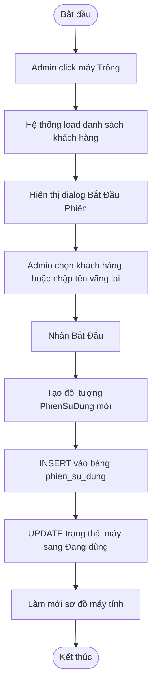

#### 2. Luồng Gọi đồ ăn/uống (UC06)

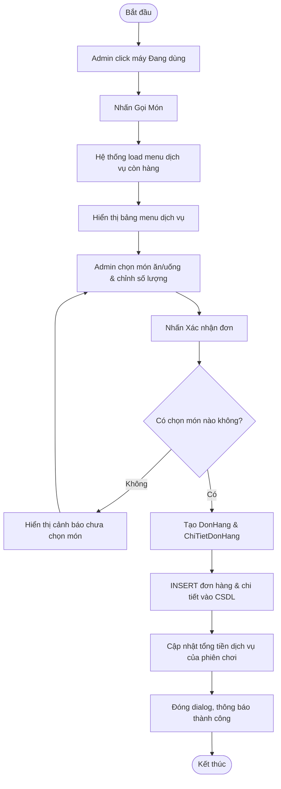

#### 3. Luồng Kết thúc phiên chơi & Thanh toán (UC05)

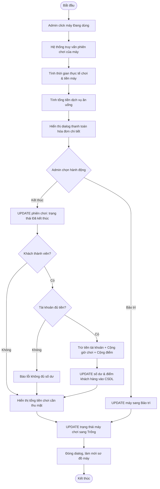

#### 4. Luồng Đổi thưởng bằng điểm (UC09)

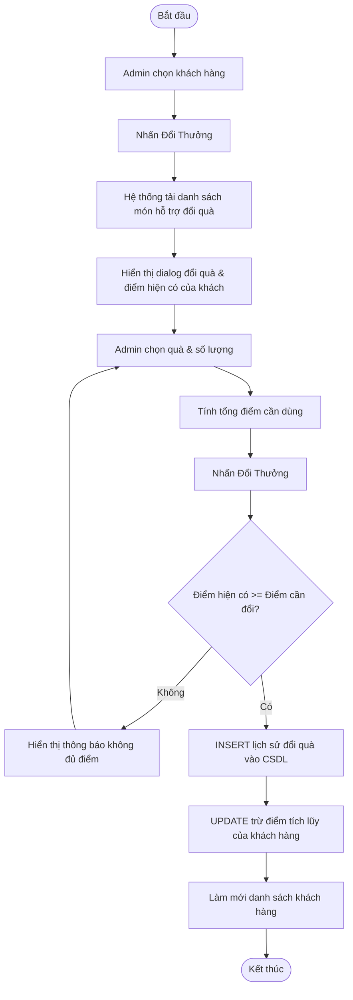

---

### 3.4.2. Biểu đồ tuần tự (Sequence Diagram)

#### 1. Đăng nhập (UC01)
Trình diễn tương tác tuần tự của quá trình kiểm tra tài khoản bảo mật và thiết lập giao diện làm việc chính.

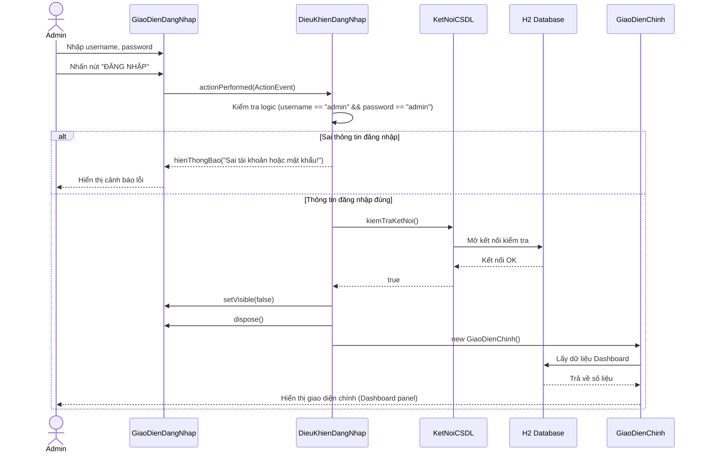

#### 2. Bắt đầu phiên chơi (UC04)
Trình diễn luồng tuần tự lấy danh sách khách hàng, tạo phiên chơi và cập nhật trạng thái hoạt động của máy chơi lên cơ sở dữ liệu.

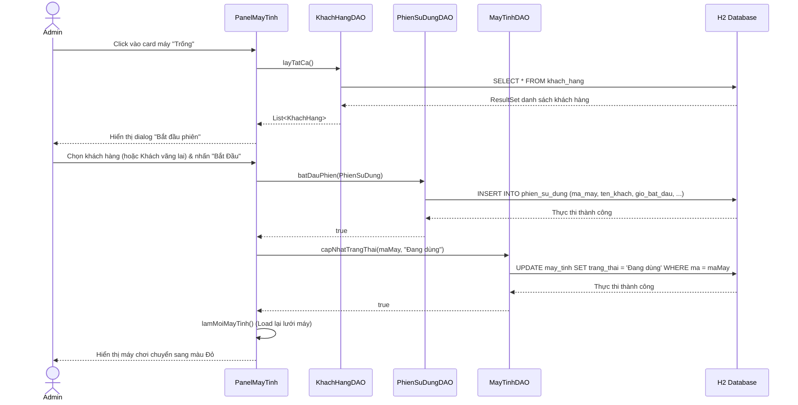

#### 3. Gọi đồ ăn/uống (UC06)
Mô tả tuần tự các bước đặt dịch vụ món ăn thức uống gắn với phiên chơi đang chạy trên máy tính.

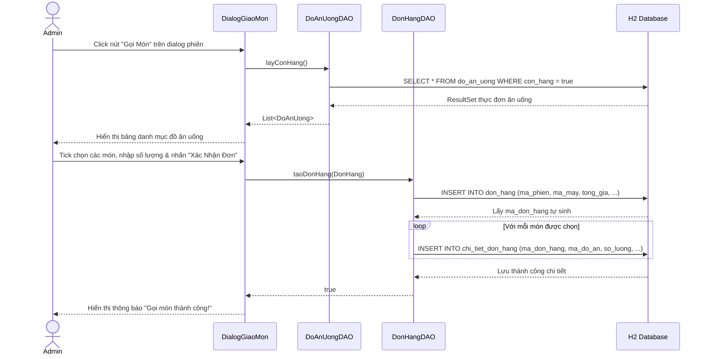

#### 4. Kết thúc phiên & Thanh toán (UC05)
Tuần tự luồng xử lý tính tiền giờ, tiền dịch vụ, trừ tiền số dư tài khoản hội viên và trả máy về trạng thái trống.

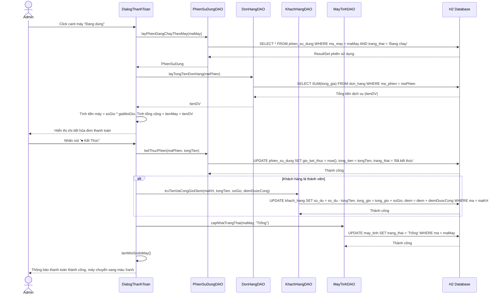

#### 5. Nạp tiền khách hàng (UC08)
Mô tả tương tác tuần tự giữa Admin, giao diện, DAO lớp xử lý và CSDL để nạp tiền vào tài khoản hội viên.

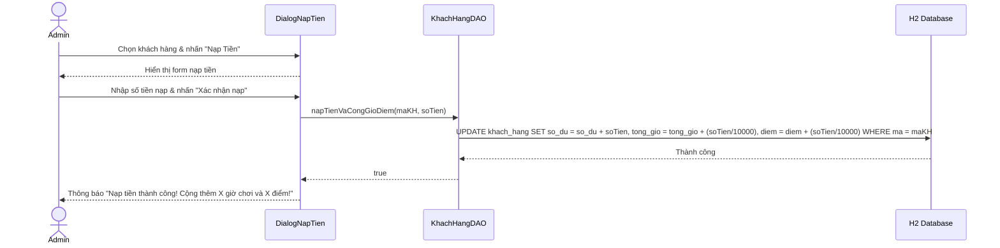

#### 6. Đổi thưởng bằng điểm (UC09)
Mô tả tuần tự luồng đổi điểm lấy quà, lưu lịch sử đổi quà và trừ điểm thành viên.

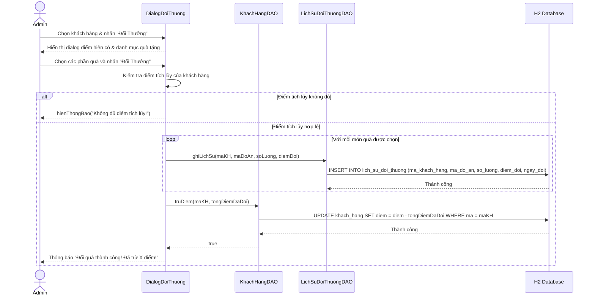

---

### 3.4.3. Biểu đồ lớp phân tích (Class Diagram)
Biểu đồ lớp dưới đây thể hiện các thực thể dữ liệu (Entities) chính trong hệ thống và mối liên kết quan hệ logic giữa chúng.

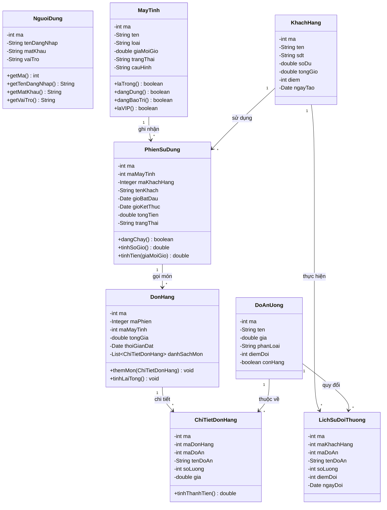

---

## 3.5. Kết luận chương
Chương 3 đã tiến hành khảo sát chi tiết hiện trạng quy trình nghiệp vụ thủ công của quán internet, phân tích và đưa ra giải pháp số hóa toàn diện thông qua hệ thống **CyberNet**. 
Thông qua mô hình ca sử dụng (Use Case Model), 13 chức năng và mối tương tác của Admin đã được phân rã rõ ràng qua các biểu đồ phân hệ và bảng đặc tả chi tiết.
Đồng thời, hành vi động của hệ thống được làm rõ qua các biểu đồ hoạt động (Activity Diagrams) và biểu đồ tuần tự (Sequence Diagrams) cho 6 nghiệp vụ cốt lõi, cùng biểu đồ cấu trúc tĩnh Class Diagram. Đây là cơ sở dữ liệu phân tích vững chắc phục vụ cho việc thiết kế kiến trúc phần mềm, cơ sở dữ liệu và xây dựng giao diện chi tiết ở Chương tiếp theo.
