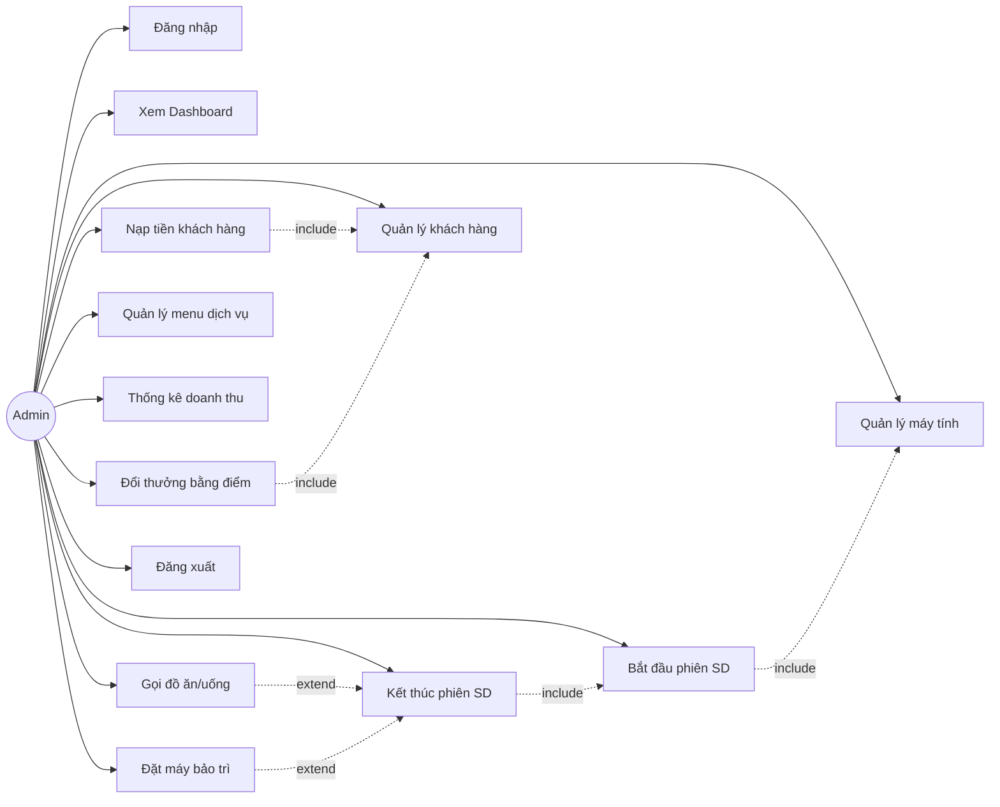

# ĐỀ TÀI: PHÂN TÍCH VÀ THIẾT KẾ HỆ THỐNG QUẢN LÝ QUÁN INTERNET — CYBERNET

---

## CHƯƠNG 1. PHÂN TÍCH VÀ THIẾT KẾ HỆ THỐNG

### 1.1. Phân tích yêu cầu hệ thống

#### 1.1.1. Yêu cầu chức năng

Hệ thống được thiết kế để bao hàm trọn vẹn vòng đời vận hành của một quán internet. Thay vì các công cụ đơn lẻ, hệ thống thiết lập sự liên kết chặt chẽ giữa **6 phân hệ**, đảm bảo dòng chảy dữ liệu luôn được thông suốt và giảm thiểu tối đa các sai sót do quản lý thủ công:

- **Phân hệ Đăng nhập & Xác thực:** Đây là điểm đầu vào của hệ thống. Cho phép nhân viên quản lý xác thực danh tính thông qua tài khoản admin/password, đảm bảo chỉ người có quyền mới truy cập được các chức năng quản lý.

- **Phân hệ Dashboard (Tổng quan):** Đóng vai trò là **Trung tâm Giám sát**, cung cấp cái nhìn tổng quan realtime về tình trạng quán: số máy trống, số máy đang sử dụng, doanh thu máy trong ngày, doanh thu dịch vụ trong ngày. Bảng phiên đang hoạt động hiển thị chi tiết thời gian và chi phí tạm tính.

- **Phân hệ Quản lý Máy tính:** Là **Trung tâm Vận hành** chính của hệ thống. Quản lý danh sách 20 máy tính (Thường + VIP) với 3 trạng thái (Trống, Đang dùng, Bảo trì). Cho phép thực hiện trọn vẹn vòng đời một phiên sử dụng: bắt đầu phiên → gọi đồ ăn/uống → kết thúc phiên & tính tiền tự động. Hỗ trợ lọc máy theo trạng thái và thêm máy mới.

- **Phân hệ Quản lý Khách hàng:** Đóng vai trò là **Hệ thống CRM** (Customer Relationship Management) của quán. Quản lý thông tin khách hàng thành viên với hệ thống nạp tiền, tích điểm tự động (1 giờ chơi = 1 điểm) và đổi thưởng bằng điểm. Hỗ trợ tìm kiếm khách theo tên/SĐT, CRUD đầy đủ.

- **Phân hệ Quản lý Dịch vụ Đồ ăn/Uống:** Quản lý menu đồ ăn/nước uống với phân loại (Đồ ăn, Nước uống), theo dõi tình trạng còn hàng/hết hàng, cấu hình số điểm cần để đổi thưởng. Đơn hàng được gắn chặt với phiên sử dụng máy, đảm bảo tính toàn vẹn khi tính tổng hóa đơn.

- **Phân hệ Thống kê Doanh thu:** Thiết lập **Hạ tầng Báo cáo** với biểu đồ cột custom vẽ bằng Graphics2D. Cho phép thống kê doanh thu theo khoảng ngày tùy chọn (Hôm nay, 7 ngày, 30 ngày), hiển thị tổng doanh thu, tổng phiên, trung bình/ngày. Bảng chi tiết doanh thu theo từng ngày.

- **Tính liên thông:** Hệ thống có khả năng **"Kế thừa dữ liệu"**. Khi một phiên sử dụng kết thúc, toàn bộ chi phí (tiền máy + tiền dịch vụ) được tự động tính toán, trừ vào tài khoản khách thành viên, cộng giờ chơi và tích điểm — loại bỏ hoàn toàn thao tác tính toán thủ công. Doanh thu ngay lập tức được cập nhật vào Dashboard và module Thống kê.

#### 1.1.2. Yêu cầu phi chức năng

Hệ thống được thiết kế không chỉ để thực hiện các chức năng nghiệp vụ mà còn phải đáp ứng các tiêu chuẩn kỹ thuật sau:

**- Tính Bảo mật (Security):**
- Xác thực: Đảm bảo chỉ người dùng hợp lệ (admin) mới có quyền truy cập hệ thống thông qua form đăng nhập.
- Kiểm tra kết nối CSDL: Hệ thống tự động kiểm tra kết nối database trước khi cho phép truy cập, hiển thị hướng dẫn sửa lỗi nếu thất bại.

**- Hiệu năng và Tốc độ (Performance):**
- Thời gian khởi động: Ứng dụng khởi động trong vòng ~2 giây bao gồm cả khởi tạo CSDL.
- Tải giao diện nhanh: Sử dụng CardLayout để chuyển đổi panel tức thì, không cần tải lại trang.
- Đồng hồ realtime: Cập nhật thời gian trên header mỗi giây (Timer 1000ms).
- Hiển thị lưới máy: Load 20 máy tính dạng grid trong < 0.5 giây.

**- Độ tin cậy và Tính toàn vẹn (Reliability & Integrity):**
- CSDL nhúng: Sử dụng H2 Database embedded với chế độ `AUTO_SERVER=TRUE`, tự động khởi tạo schema và dữ liệu mẫu khi chạy lần đầu.
- Toàn vẹn dữ liệu: Sử dụng khóa ngoại (Foreign Key) giữa các bảng, ràng buộc `ON DELETE SET NULL` và `ON DELETE CASCADE` để đảm bảo tính nhất quán.
- Kết nối Singleton: Lớp `KetNoiCSDL` áp dụng Singleton Pattern đảm bảo chỉ có duy nhất một kết nối CSDL trong toàn bộ ứng dụng.

**- Khả năng mở rộng và Bảo trì (Scalability & Maintainability):**
- Kiến trúc MVC + DAO: Mã nguồn được tổ chức theo mô hình MVC kết hợp DAO Pattern, tách biệt giao diện (View) — logic (Controller) — dữ liệu (Entity/DAO), giúp dễ dàng bảo trì và mở rộng.
- Đóng gói (Fat-JAR): Sử dụng Maven Shade Plugin để đóng gói toàn bộ dependencies vào 1 file JAR duy nhất (~5MB), triển khai dễ dàng.
- CSDL có thể mở rộng: H2 Database chạy ở chế độ `MODE=MySQL`, cho phép migrate sang MySQL thực tế khi mở rộng quy mô.

**- Tính khả dụng (Usability):**
- Giao diện Dark Mode: Sử dụng FlatLaf Dark Look and Feel kết hợp bảng màu tím-indigo thống nhất, tạo trải nghiệm chuyên nghiệp.
- Emoji Icons: Sử dụng Unicode emoji (🎮, 🖥️, 👥, ⏱, 🍔, 📈) thay vì ảnh, đảm bảo hiển thị trên mọi nền tảng.
- Sidebar điều hướng: 6 mục menu với hiệu ứng hover và active indicator, dễ dàng chuyển đổi chức năng.

---

### 1.2. Các tác nhân (Actors)

- **Admin (Quản trị viên quán):** Là tác nhân duy nhất có quyền đăng nhập vào hệ thống (tài khoản admin/admin). Admin thực hiện toàn bộ các nghiệp vụ quản lý quán bao gồm: Đăng nhập, Xem Dashboard tổng quan, Quản lý máy tính (thêm máy, lọc trạng thái), Bắt đầu/Kết thúc phiên sử dụng, Gọi đồ ăn/uống cho máy, Quản lý khách hàng (CRUD, nạp tiền, đổi thưởng), Quản lý menu dịch vụ, Thống kê doanh thu và Đăng xuất.

- **Khách hàng thành viên (Tác nhân thụ động):** Không trực tiếp tương tác với hệ thống. Thông tin khách hàng (tên, SĐT, số dư, giờ chơi, điểm) được Admin quản lý. Khách thành viên hưởng quyền lợi: nạp tiền trước, trừ tiền tự động, tích điểm theo giờ chơi và đổi điểm lấy đồ ăn/uống miễn phí.

- **Khách vãng lai (Tác nhân thụ động):** Khách đến quán không cần đăng ký thành viên. Admin có thể bắt đầu phiên cho khách vãng lai bằng cách nhập tên hoặc để mặc định "Khách vãng lai". Không được tích điểm, không trừ tiền tài khoản.

- **Hệ thống CSDL H2 (Tác nhân phụ):** Cơ sở dữ liệu nhúng H2 Database tự động khởi tạo schema và dữ liệu mẫu khi ứng dụng chạy lần đầu. Lưu trữ toàn bộ dữ liệu máy tính, khách hàng, phiên sử dụng, đơn hàng, menu.

---

### 1.3. Use case tổng quát

---

### 1.4. Use case chi tiết và đặc tả Use case

#### 1.4.1. Đăng nhập

| Thuộc tính | Mô tả |
|-----------|-------|
| **Tên Use Case** | Đăng nhập |
| **Mô tả** | Nhân viên quản lý thực hiện đăng nhập để truy cập hệ thống CyberNet. |
| **Actor chính** | Admin |
| **Actor phụ** | Hệ thống CSDL H2 |
| **Tiền điều kiện** | Phải có tài khoản hợp lệ trên hệ thống (mặc định: admin/admin). |
| **Hậu điều kiện** | Admin đăng nhập thành công, hiển thị Dashboard với đầy đủ chức năng. |

| | Luồng sự kiện chính |
|---|---|
| **Admin** | **Hệ thống** |
| 1. Khởi động ứng dụng | |
| | 2. Hiển thị màn hình đăng nhập (GiaoDienDangNhap) với gradient nền tím, card bo góc |
| 3. Nhập tên đăng nhập và mật khẩu | |
| 4. Nhấn nút "ĐĂNG NHẬP" hoặc phím Enter | |
| | 5. Kiểm tra: username == "admin" && password == "admin" |
| | 6. Gọi `KetNoiCSDL.kiemTraKetNoi()` kiểm tra kết nối CSDL |
| | 7. Ẩn form đăng nhập, tạo `GiaoDienChinh` và hiển thị Dashboard |

| | Luồng sự kiện thay thế |
|---|---|
| | 5.1. Sai username hoặc password → Hiển thị: "Tên đăng nhập hoặc mật khẩu không đúng!" |
| | 6.1. Không kết nối được CSDL → Hiển thị dialog hướng dẫn: "Không thể kết nối database! Kiểm tra MySQL." kèm hướng dẫn chi tiết |
| | 6.2. Quay về bước 3 |

---

#### 1.4.2. Xem Dashboard tổng quan

| Thuộc tính | Mô tả |
|-----------|-------|
| **Tên Use Case** | Xem Dashboard tổng quan |
| **Mô tả** | Admin xem các chỉ số realtime: máy trống, đang dùng, doanh thu máy, doanh thu dịch vụ và bảng phiên đang hoạt động. |
| **Actor chính** | Admin |
| **Actor phụ** | Không |
| **Tiền điều kiện** | Admin đã đăng nhập thành công. |
| **Hậu điều kiện** | Dashboard hiển thị đúng dữ liệu realtime. |

| | Luồng sự kiện chính |
|---|---|
| **Admin** | **Hệ thống** |
| 1. Chọn mục "Dashboard" trên sidebar | |
| | 2. Gọi `MayTinhDAO.demTheoTrangThai("Trống")` và `demTheoTrangThai("Đang dùng")` |
| | 3. Gọi `PhienSuDungDAO.layDoanhThuHomNay()` và `DonHangDAO.layDoanhThuDVHomNay()` |
| | 4. Hiển thị 4 thẻ thống kê: 🟢 Máy Trống, 🔴 Đang Dùng, 💰 Doanh Thu Máy, 🍔 Doanh Thu DV |
| | 5. Gọi `PhienSuDungDAO.layPhienDangChay()` |
| | 6. Hiển thị bảng phiên hoạt động: Mã, Máy, Khách hàng, Bắt đầu, Thời gian (Xh Xxp), Chi phí |

---

#### 1.4.3. Bắt đầu phiên sử dụng

| Thuộc tính | Mô tả |
|-----------|-------|
| **Tên Use Case** | Bắt đầu phiên sử dụng |
| **Mô tả** | Admin chọn máy trống, chọn khách hàng và bắt đầu tính giờ sử dụng. |
| **Actor chính** | Admin |
| **Actor phụ** | Không |
| **Tiền điều kiện** | Có ít nhất 1 máy tính ở trạng thái "Trống". |
| **Hậu điều kiện** | Phiên sử dụng được tạo, máy chuyển sang "Đang dùng", đồng hồ bắt đầu tính. |

| | Luồng sự kiện chính |
|---|---|
| **Admin** | **Hệ thống** |
| 1. Click vào thẻ máy tính có trạng thái "Trống" (viền xanh) | |
| | 2. Gọi `KhachHangDAO.layTatCa()` lấy danh sách khách thành viên |
| | 3. Hiển thị dialog "Bắt Đầu Phiên": tên máy, loại (Thường/VIP), giá/giờ, dropdown chọn khách, ô nhập tên |
| 4. Chọn khách hàng từ dropdown HOẶC nhập tên khách vãng lai | |
| 5. Nhấn nút "▶ Bắt Đầu" | |
| | 6. Tạo `PhienSuDung` mới (maMayTinh, tenKhach, maKhachHang, gioBatDau = now()) |
| | 7. Gọi `PhienSuDungDAO.batDauPhien(phien)` → INSERT vào CSDL |
| | 8. Gọi `MayTinhDAO.capNhatTrangThai(maMay, "Đang dùng")` |
| | 9. Làm mới lưới máy tính, hiển thị thông báo "Đã bắt đầu phiên!" |

| | Luồng sự kiện thay thế |
|---|---|
| | 4.1. Không chọn khách và không nhập tên → tự động đặt tenKhach = "Khách vãng lai" |

---

#### 1.4.4. Kết thúc phiên sử dụng

| Thuộc tính | Mô tả |
|-----------|-------|
| **Tên Use Case** | Kết thúc phiên sử dụng |
| **Mô tả** | Admin kết thúc phiên, hệ thống tự động tính tổng chi phí (tiền máy + tiền dịch vụ), trừ tiền và cộng điểm cho khách thành viên. |
| **Actor chính** | Admin |
| **Actor phụ** | Không |
| **Tiền điều kiện** | Có phiên đang chạy trên máy tính (trạng thái "Đang dùng"). |
| **Hậu điều kiện** | Phiên kết thúc, tiền được trừ, điểm được cộng, máy trở về "Trống". |

| | Luồng sự kiện chính |
|---|---|
| **Admin** | **Hệ thống** |
| 1. Click vào thẻ máy tính "Đang dùng" (viền đỏ) | |
| | 2. Gọi `PhienSuDungDAO.layPhienDangChayTheoMay(maMay)` |
| | 3. Tính: `soGio = tinhSoGio()`, `tienMay = tinhTien(giaMoiGio)` |
| | 4. Gọi `DonHangDAO.layTongTienDonHang(maPhien)` → tiền dịch vụ |
| | 5. Hiển thị dialog: khách, bắt đầu, thời gian (Xh Xxp Xxs), giá/giờ, tiền máy, tiền DV, **TỔNG** |
| 6. Nhấn "⏹ Kết Thúc" | |
| | 7. Gọi `PhienSuDungDAO.ketThucPhien(maPhien, tongTien)` |
| | 8. Gọi `MayTinhDAO.capNhatTrangThai(maMay, "Trống")` |
| | 9. Nếu khách thành viên: `KhachHangDAO.truTien()`, `congGio()`, `congDiem()` |
| | 10. Hiển thị: "Phiên kết thúc! Tổng: XX đ. Điểm tích lũy: +X ⭐" |

| | Luồng sự kiện thay thế |
|---|---|
| 6a. Nhấn "🔧 Bảo Trì" thay vì "Kết Thúc" | |
| | 6a.1. Thực hiện tương tự bước 7–10 nhưng máy chuyển về "Bảo trì" thay vì "Trống" |
| 6b. Nhấn "🍔 Gọi Món" | |
| | 6b.1. Đóng dialog hiện tại, mở dialog Gọi Món (xem UC 1.4.5) |

---

#### 1.4.5. Gọi đồ ăn/uống

| Thuộc tính | Mô tả |
|-----------|-------|
| **Tên Use Case** | Gọi đồ ăn/uống |
| **Mô tả** | Admin đặt đồ ăn/uống cho máy đang sử dụng, đơn hàng gắn với phiên hiện tại. |
| **Actor chính** | Admin |
| **Actor phụ** | Không |
| **Tiền điều kiện** | Máy tính đang có phiên sử dụng hoạt động. |
| **Hậu điều kiện** | Đơn hàng được lưu, tổng tiền DV được cộng vào phiên khi kết thúc. |

| | Luồng sự kiện chính |
|---|---|
| **Admin** | **Hệ thống** |
| 1. Nhấn "🍔 Gọi Món" trong dialog phiên | |
| | 2. Gọi `DoAnUongDAO.layConHang()` lấy menu |
| | 3. Hiển thị bảng menu: Chọn (checkbox), Tên, Giá, SL (editable), Loại |
| 4. Tick chọn các món cần đặt, chỉnh số lượng | |
| 5. Nhấn "✓ Xác Nhận Đơn" | |
| | 6. Tạo `DonHang` + danh sách `ChiTietDonHang`, gọi `tinhLaiTong()` |
| | 7. Gọi `DonHangDAO.taoDonHang(donHang)` → INSERT vào CSDL |
| | 8. Hiển thị: "Đã đặt X món! Tổng: XX đ" |

| | Luồng sự kiện thay thế |
|---|---|
| | 6.1. Không tick chọn món nào → Hiển thị: "Chưa chọn món nào!" |
| | 6.2. Quay lại bước 4 |

---

#### 1.4.6. Quản lý khách hàng

| Thuộc tính | Mô tả |
|-----------|-------|
| **Tên Use Case** | Quản lý khách hàng |
| **Mô tả** | Admin xem danh sách, thêm mới, sửa, xóa và tìm kiếm khách hàng thành viên. |
| **Actor chính** | Admin |
| **Actor phụ** | Không |
| **Tiền điều kiện** | Đã đăng nhập vào hệ thống. |
| **Hậu điều kiện** | Dữ liệu khách hàng được cập nhật chính xác vào CSDL. |

| | Luồng sự kiện chính |
|---|---|
| **Admin** | **Hệ thống** |
| 1. Chọn mục "Khách Hàng" trên sidebar | |
| | 2. Gọi `KhachHangDAO.layTatCa()`, hiển thị bảng: Mã, Tên, SĐT, Số dư, Tổng giờ, Điểm ⭐ |
| 3. Nhấn "+ Thêm Khách" | |
| | 4. Hiển thị dialog: Tên (*), SĐT, Số tiền nạp ban đầu (*), preview giờ chơi + điểm |
| 5. Điền thông tin, nhấn "✓ Tạo Khách Hàng" | |
| | 6. Kiểm tra: tên không trống, số tiền > 0 |
| | 7. Tính: giờ = tiền / 10.000đ, điểm = (int) giờ |
| | 8. Gọi `KhachHangDAO.them(kh)`, tải lại danh sách |

| | Luồng sự kiện thay thế |
|---|---|
| 3a. Nhập từ khóa tìm kiếm → Nhấn "🔍 Tìm" | |
| | 3a.1. Gọi `KhachHangDAO.timKiem(tuKhoa)`, hiển thị kết quả |
| 3b. Chọn 1 khách → Nhấn "✏️ Sửa" | |
| | 3b.1. Hiển thị form cập nhật Tên + SĐT, lưu vào CSDL |
| 3c. Chọn 1 khách → Nhấn "🗑 Xóa" | |
| | 3c.1. Hiển thị xác nhận → Gọi `KhachHangDAO.xoa(ma)` |
| | 6.1. Tên trống → "Nhập tên khách hàng!" |
| | 6.2. Tiền ≤ 0 → "Khách mới cần nạp tiền! Nhập số tiền > 0." |

---

#### 1.4.7. Nạp tiền khách hàng

| Thuộc tính | Mô tả |
|-----------|-------|
| **Tên Use Case** | Nạp tiền khách hàng |
| **Mô tả** | Admin nạp tiền vào tài khoản khách, hệ thống tự động cộng giờ chơi và điểm tích lũy tương ứng. |
| **Actor chính** | Admin |
| **Actor phụ** | Không |
| **Tiền điều kiện** | Đã chọn 1 khách hàng trong danh sách. |
| **Hậu điều kiện** | Số dư tăng, giờ chơi tăng, điểm tích lũy tăng tương ứng. |

| | Luồng sự kiện chính |
|---|---|
| **Admin** | **Hệ thống** |
| 1. Chọn khách hàng → Nhấn "💰 Nạp Tiền" | |
| | 2. Hiển thị dialog: thông tin khách (tên, số dư, điểm, giờ chơi), form nhập số tiền |
| 3. Nhập số tiền → Live preview hiển thị: "⏱ + X.X giờ chơi mới \| ⭐ + X điểm" | |
| 4. Nhấn "💰 Nạp Tiền" | |
| | 5. Gọi `KhachHangDAO.napTienVaCongGioDiem(ma, soTien)` |
| | 6. Tải lại danh sách, hiển thị: "Đã nạp XX đ! Cộng thêm X.X giờ + X ⭐" |

| | Luồng sự kiện thay thế |
|---|---|
| | 5.1. Số tiền ≤ 0 → "Số tiền phải lớn hơn 0!" |
| | 5.2. Định dạng sai → "Số tiền không hợp lệ!" |

---

#### 1.4.8. Đổi thưởng bằng điểm

| Thuộc tính | Mô tả |
|-----------|-------|
| **Tên Use Case** | Đổi thưởng bằng điểm |
| **Mô tả** | Khách dùng điểm tích lũy để đổi lấy đồ ăn/uống miễn phí. Admin thực hiện thao tác. |
| **Actor chính** | Admin |
| **Actor phụ** | Không |
| **Tiền điều kiện** | Khách có điểm > 0, menu có món hỗ trợ đổi thưởng (diemDoi > 0). |
| **Hậu điều kiện** | Điểm bị trừ, lịch sử đổi thưởng được ghi nhận vào bảng `lich_su_doi_thuong`. |

| | Luồng sự kiện chính |
|---|---|
| **Admin** | **Hệ thống** |
| 1. Chọn khách → Nhấn "🎁 Đổi Thưởng" | |
| | 2. Hiển thị: "⭐ Điểm hiện có: X điểm" + bảng phần thưởng (Chọn, Tên, Giá, Điểm cần, Loại) |
| 3. Tick chọn các phần thưởng mong muốn | |
| 4. Nhấn "✓ Đổi Thưởng" | |
| | 5. Tính tổng điểm cần, hiển thị xác nhận: danh sách món + tổng điểm + điểm còn lại |
| 6. Nhấn "Yes" xác nhận | |
| | 7. Gọi `LichSuDoiThuongDAO.ghiLichSu()` cho mỗi món |
| | 8. Gọi `KhachHangDAO.truDiem(maKH, tongDiemCan)` |
| | 9. Hiển thị: "Đổi thưởng thành công! Đã trừ X ⭐" |

| | Luồng sự kiện thay thế |
|---|---|
| | 5.1. Không chọn phần thưởng nào → "Chưa chọn phần thưởng nào!" |
| | 5.2. Tổng điểm cần > điểm hiện có → "Không đủ điểm! Cần: X ⭐, Hiện có: Y ⭐" |

---

#### 1.4.9. Quản lý menu dịch vụ

| Thuộc tính | Mô tả |
|-----------|-------|
| **Tên Use Case** | Quản lý menu dịch vụ |
| **Mô tả** | Admin xem, thêm, sửa, xóa các món ăn/uống trong menu quán. |
| **Actor chính** | Admin |
| **Actor phụ** | Không |
| **Tiền điều kiện** | Đã đăng nhập vào hệ thống. |
| **Hậu điều kiện** | Menu dịch vụ được cập nhật. |

| | Luồng sự kiện chính |
|---|---|
| **Admin** | **Hệ thống** |
| 1. Chọn mục "Dịch Vụ" trên sidebar | |
| | 2. Gọi `DoAnUongDAO.layTatCa()`, hiển thị danh sách menu |
| 3. Chọn Thêm/Sửa/Xóa món | |
| | 4. Hiển thị form nhập: Tên, Giá, Phân loại (Đồ ăn/Nước uống), Điểm đổi, Còn hàng |
| 5. Điền thông tin, nhấn "Lưu" | |
| | 6. Kiểm tra dữ liệu, lưu vào CSDL và tải lại danh sách |

---

#### 1.4.10. Thống kê doanh thu

| Thuộc tính | Mô tả |
|-----------|-------|
| **Tên Use Case** | Thống kê doanh thu |
| **Mô tả** | Admin xem thống kê doanh thu theo khoảng ngày với biểu đồ cột và bảng chi tiết. |
| **Actor chính** | Admin |
| **Actor phụ** | Không |
| **Tiền điều kiện** | Có dữ liệu phiên sử dụng đã kết thúc trong CSDL. |
| **Hậu điều kiện** | Biểu đồ và bảng thống kê hiển thị chính xác. |

| | Luồng sự kiện chính |
|---|---|
| **Admin** | **Hệ thống** |
| 1. Chọn mục "Thống Kê" trên sidebar | |
| | 2. Hiển thị: 2 JDateChooser (Từ ngày, Đến ngày), nút "🔍 Xem thống kê", nút nhanh (7 ngày, 30 ngày, Hôm nay) |
| 3. Chọn khoảng ngày, nhấn "🔍 Xem thống kê" | |
| | 4. Gọi `PhienSuDungDAO.layDoanhThuTheoTungNgay(tuNgay, denNgay)` |
| | 5. Tính: tổng doanh thu, tổng phiên, trung bình/ngày |
| | 6. Hiển thị 3 thẻ tóm tắt (Tổng DT, Tổng Phiên, TB/Ngày) |
| | 7. Vẽ biểu đồ cột gradient (Graphics2D): mỗi cột = 1 ngày, giá trị trên cột, ngày dưới trục x |
| | 8. Hiển thị bảng chi tiết: Ngày, Doanh thu (đ), Số phiên |

| | Luồng sự kiện thay thế |
|---|---|
| | 2a. Chưa chọn ngày → "Chọn ngày bắt đầu và kết thúc!" |
| | 4a. Không có dữ liệu → Biểu đồ hiển thị: "Chọn khoảng thời gian và nhấn 'Xem thống kê'" |

---

#### 1.4.11. Quản lý máy tính

| Thuộc tính | Mô tả |
|-----------|-------|
| **Tên Use Case** | Quản lý máy tính |
| **Mô tả** | Admin xem danh sách máy dạng lưới, lọc theo trạng thái và thêm máy mới. |
| **Actor chính** | Admin |
| **Actor phụ** | Không |
| **Tiền điều kiện** | Đã đăng nhập vào hệ thống. |
| **Hậu điều kiện** | Danh sách máy tính được cập nhật. |

| | Luồng sự kiện chính |
|---|---|
| **Admin** | **Hệ thống** |
| 1. Chọn mục "Máy Tính" trên sidebar | |
| | 2. Gọi `MayTinhDAO.layTatCa()`, hiển thị grid 5 cột: mỗi máy là card (icon 🖥️, tên, loại, trạng thái) với viền màu (xanh=Trống, đỏ=Đang dùng, vàng=Bảo trì) |
| 3. Nhấn "+ Thêm Máy" | |
| | 4. Hiển thị dialog: Tên máy, Loại (Thường/VIP), Giá/giờ (tự động: Thường=10K, VIP=15K), Cấu hình |
| 5. Điền thông tin, nhấn "Lưu" | |
| | 6. Gọi `MayTinhDAO.them(mt)`, làm mới lưới máy |

| | Luồng sự kiện thay thế |
|---|---|
| 3a. Nhấn nút lọc (Tất cả / Trống / Đang dùng / Bảo trì) | |
| | 3a.1. Gọi `MayTinhDAO.layTheoTrangThai(trangThai)`, hiển thị kết quả lọc |
| | 6.1. Tên máy trống → "Nhập tên máy!" |
| | 6.2. Giá không hợp lệ → "Giá không hợp lệ!" |

---

#### 1.4.12. Đăng xuất

| Thuộc tính | Mô tả |
|-----------|-------|
| **Tên Use Case** | Đăng xuất |
| **Mô tả** | Admin thoát khỏi hệ thống CyberNet. |
| **Actor chính** | Admin |
| **Actor phụ** | Không |
| **Tiền điều kiện** | Admin đang đăng nhập trong hệ thống. |
| **Hậu điều kiện** | Ứng dụng đóng hoàn toàn (System.exit). |

| | Luồng sự kiện chính |
|---|---|
| **Admin** | **Hệ thống** |
| 1. Nhấn "🚪 Đăng Xuất" trên sidebar | |
| | 2. Hiển thị dialog xác nhận: "Bạn có muốn đăng xuất?" |
| 3. Nhấn "Yes" | |
| | 4. Gọi `dispose()` và `System.exit(0)` |

| | Luồng sự kiện thay thế |
|---|---|
| 3a. Nhấn "No" | |
| | 3a.1. Đóng dialog xác nhận, quay lại giao diện chính |
